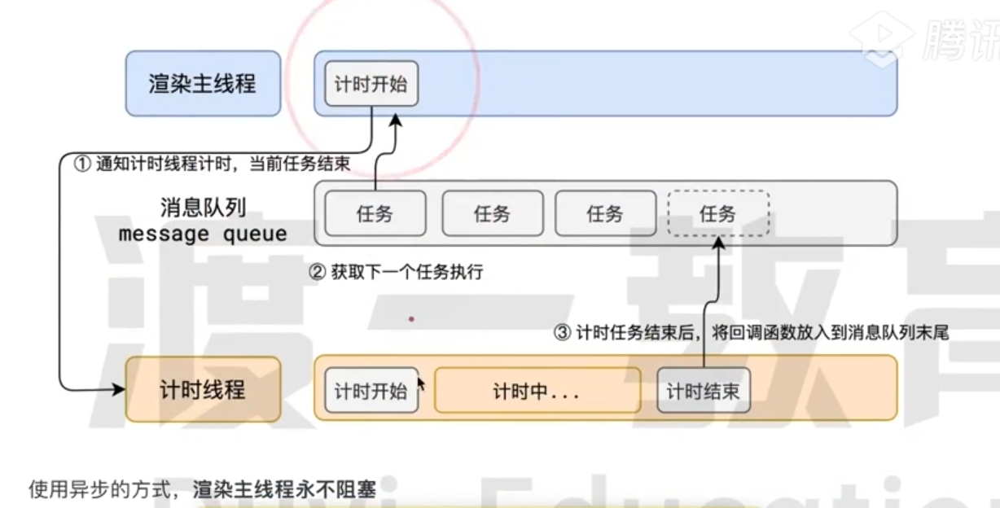

## 前置知识

了解事件循环，需要做一下铺垫，了解事件循环设计的原因。

### 进程模型和线程模型

程序运行需要内存空间，这个内存空间是专属于这个程序的。一个进程就会分配一个专属空间，因此一个程序至少是一个进程（因为至少都要有程序运行的空间）。进程之间是相互隔离的，软件A崩溃不会影响到软件B。

有了进程之后程序可以运行了，但是谁来运行程序？进程只是分配了空间，因此由线程来充当这个执行者。因此一个进程至少需要一个线程来干活执行代码。这个伴随着进程启动的线程就是主线程，除了主线程，进程中可以启动更多的其他线程。线程之间是共享进程的内存空间的

### 浏览器中的进程模型和线程模型

浏览器是一个多进程、多线程的软件。现代浏览器是一个巨复杂的系统，因此需要多进程来隔离运行环境，开辟多个独立的内存空间。进程在浏览器中的存在形式大致是这样的。

#### 浏览器进程：

主要负责浏览器自身的UI展示（标签页，搜索框，菜单栏等）和UI交互（点击，拖拽，鼠标、键盘响应等）子进程管理(
其他进程通过浏览器进程创建)

#### 网络进程：

负责浏览器的网络通信，网络资源的加载

#### 渲染进程：一个标签页就是一个单独的渲染进程

渲染进行会创建一个单独的线程来执行渲染任务，这个线程是渲染主线程。前端写的js、css、html都通过渲染主线程来执行（这是为什么js是单线程语言的根本原因）。而事件循环也发生在渲染主线程中。

## 浏览器的渲染主线程

渲染主线程可谓最繁忙的线程之一，在浏览器中，他需要完成：

- 解析html
- 解析css
- 计算样式
- 布局(计算元素几何信息)
- 处理图层
- 每秒60次渲染
- 执行全局js代码
- 执行事件处理函数
- 执行计时器回调函数
- ...

### 主线程的工作模式

主线程是好同志，是很忙的。问题在于怎么忙？因为浏览器上发生的情况太多了，如果你还在渲染页面，但是我发生了点击事件，此时应该怎么办？你还在计算样式，但是计时器的回调函数来了，你又怎么办？

解决办法：统统排队（任务队列）


**所以！渲染主线程工作方式的本质！ = 死循环 + 不断获取任务队列中的任务执行**

### 什么是异步？

有一个问题，`setTimeout(fn, 10)`，`网络通信fetch(fun)`，`addListener(fun)`，`setInterval(fun, 10)`
。这些都是非立即执行的。如果渲染主线程在碰到这些情况时，渲染同步执行，那么主线程会大量时间处于阻塞状态（只等待，不干活）。这和渲染主线程的身份显然是不符的。


因此浏览器选择使用异步来处理这些情况



## js为什么会阻碍渲染？

如下代码中，点击按钮点击后，页面会卡死，2s后，文本变为"clicked"。

```javascript
const h1 = document.getElementById('h1');
const btn = document.getElementById('btn');

function delay(duration) {
    const now = Date.now();
    while (Date.now() - now < duration) {
    }
}

btn.addEventListener('click', () => {
    h1.text = 'clicked';
    delay(2000);
})
```

上面代码的执行过程如下：

1. 执行js全局代码
2. 执行到btn.addEventListener时将这个函数交给交互线程监听点击事件，当点击时，把回调函数包装成任务，放入任务队列
3. 继续执行js全局代码，执行完毕后等带点击事件发生
4. 发生点击后从任务队列中取出任务，执行回调函数，先修改h1的文本（只是修改，js全局代码还没执行完，不会切换到渲染任务）。然后死循环2s。2s后回调任务执行完毕，执行熏染任务，页面渲染出新的文本

## 任务队列的优先级

任务本身没有优先级，但是任务队列有优先级。

微队列 > 交互队列（鼠标、键盘等） > 延时队列（setTimeout等）

```javascript
const fun = () => {
    console.log('do fun');
}
Promise.resolve.then(fun);//这里的fun会被执行放入微队列中，下一次事件循环时优先执行

//MutationObserver.observe监控的函数也会优先放入微队列中
```

### 事件循环的例子分析

```javascript
function a() {
    console.log(1);
    Promise.resolve().then(function () {
        console.log(2);
    });
}

setTimeout(function () {
    console.log(3);
}, 0);

Promise.resolve().then(a);

console.log(5)

//执行结果：5 1 2 3
```

执行过程分析：

1. 执行全局代码，定义函数a
2. setTimeout将函数放入延时队列
3. Promise.resolve().then(a);将函数a放入微队列
4. 打印5，全局代码执行完毕
5. 从任务队列中获取任务执行，优先获取微队列中的任务，因此拿到a函数并执行
6. 执行a函数，打印1，将console.log(2)放入微队列，本次js代码执行完毕，继续从任务队列中获取任务执行
7. 此时微队列中依然存在任务，因此继续从微队列中获取任务执行，因此打印2，本次js代码执行完毕，继续从任务队列中获取任务执行
8. 此时微队列中没有任务，交互队列中没有任务，延时队列中有任务，取出执行，打印3

