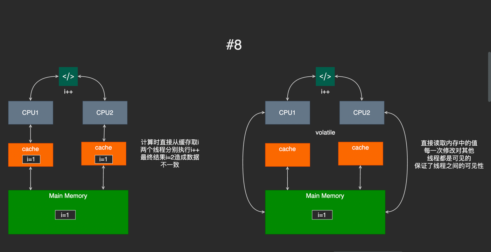

> 现在，你的脑子里什么东西都没有，所有关于Java多线程的东西已经全部忘记了，OK，可以从头开始了~

> 计算机中的几乎所有概念和模型设计，都来源于现实生活的经验，并在此基础上抽象得出。

## 前因

了解线程前必须说一说进程模型。进程和我们平时使用的软件是密切相关的。 让我们来做一个比喻。现在，你是一个农场主，你需要在你的农场内开辟土地，种植农作物。这个过程，你会怎么完成？

当然是第一步，圈地，翻地，腾一块空间出来。然后上去播种等等。这个过程其实和计算机中软件的启动过程类似。

当你打开计算机或者手机上的一个软件是，操作系统会给这个软件开辟一个内存空间出来（类似上面的圈地，翻地），你的软件只能在这块空间内运行，不能使用空间外资源，这样可以保证软件之间的相互隔离。这是一个进程，到此他，只开辟了一块空间。没有具体干活（播种）

播种需要一个具体的人来操作，这个人就是线程。

因此，一个软件必须启动至少一个进程，但是只开辟空间不够，因此，还需要启动至少一个线程。 结合上面的例子，可以很自然的理解，进程和线程都是可以有多个的。

操作系统扮演者农场主的角色，他可以管理土地（内存，进程），也可以使唤工人（线程）。Java中的线程也是如此，他的线程是向操作系统申请得到的。

## Java中的线程

```xmind preview
./xmind/多线程学习路线.xmind
```

## 并发与并行

- 并发：多个线程在同一时间段内同时进行
- 并行：多个线程在同一时间点上同时运行

并行一般需要多cpu或多内核支持


## 线程状态

- **新建（New）**：线程刚被创建，还没有调用start()方法，处于新建状态。
- **就绪（Runnable）**：线程已经调用start()方法，但还没有运行，处于就绪状态。
- **运行（Running）**：启动后的线程获取了时间片的执行权，处于运行状态。
- **阻塞（Blocked）**：线程在等待某个事件（如：I/O操作）发生，处于阻塞状态。
- **等待（Waiting）**：线程在等待另一个线程执行完毕，处于等待状态。
- **终止（Terminated）**：线程已经执行完毕，处于终止状态。


## 线程上下文切换

线程上下文切换是线程调度的一个过程，适当的调度可以提高线程的效率，但是线程上下文切换的代价也不低。不能无脑的增加线程数量。

以下几种情况下会发生线程上下文切换：

- 线程主动让出CPU：比如调用sleep()，wait()方法
- 线程获得的时间片用完：此时操作系统会选择其他线程来运行
- 线程被阻塞：比如调用了I/O操作，等待I/O操作完成

## 线程死锁

线程死锁表现为，多个线程争抢某一资源S，而S被其他线程保持且不释放；导致所有线程都无限等待下去；进行整个进程处于无限阻塞的状态；


产生线程死锁需要全部满足以下4个条件

- 共享资源互斥：多个线程同时访问同一资源，但只能有一个线程对资源进行操作
- 请求保持：线程拥有资源且保持这个状态不变
- 不可剥夺：其他线程不可强制剥夺线程占有的资源
- 循环等待：线程之间形成保持自己资源又请求其他线程资源的循环状态

因为线程死锁需要上面四个条件同时满足，因此要破坏线程的死锁，只需要破坏其中一个条件即可。

## 线程优先级

线程的优先级用数字表示，范围1~10。优先级高的线程自然容易优先执行。注意：这里说的是容易，所以并不是优先级高的就一定优先执行，有时候并不是这样的。只是优先级高就更加容易先执行。

使用下面两种方法获取或者改变优先级

- getPriority() : 获得当前线程的优先级
- setPriority(int) ：设置线程的优先级

如下代码演示了线程优先级的启动，记住一点，线程的优先级一定是要先设置，再启动，否则无效。

```java
public class ThreadPriority implements Runnable {
    @Override
    public void run() {
        System.out.println(Thread.currentThread().getName() + "启动——>" + Thread.currentThread().getPriority());
    }

    public static void main(String[] args) {
        ThreadPriority threadPriority = new ThreadPriority();
        Thread t1 = new Thread(threadPriority, "线程1");
        Thread t2 = new Thread(threadPriority, "线程2");
        Thread t3 = new Thread(threadPriority, "线程3");
        Thread t4 = new Thread(threadPriority, "线程4");

        System.out.println(Thread.currentThread().getName() + "启动——>" + Thread.currentThread().getPriority());

        t1.setPriority(2);
        t1.start();

        t2.setPriority(Thread.MAX_PRIORITY);
        t2.start();

        t3.setPriority(6);
        t3.start();

        t4.setPriority(8);
        t4.start();
    }
}
```

## volatile关键字

#### CPU内存模型

cpu缓存是为了解决cpu的计算于内存的读取速度不匹配的问题，中间加入缓存以此提高运行效率



#### volatile的作用

- 使变量在多线程之间的操作中变得可见
- 防止jvm对编译后的代码进行指令重排

#### synchronized与volatile

synchronized 关键字和 volatile 关键字是两个互补的存在，而不是对立的存在！

- volatile 关键字是线程同步的轻量级实现，所以 volatile 性能肯定比synchronized关键字要好 。但是 volatile 关键字只能用于变量而
  synchronized 关键字可以修饰方法以及代码块
- volatile 关键字能保证数据的可见性，但不能保证数据的原子性。synchronized 关键字两者都能保证
- volatile关键字主要用于解决变量在多个线程之间的可见性，而 synchronized 关键字解决的是多个线程之间访问资源的同步性

## 线程相关方法

| 方法               | 描述                    |
|------------------|-----------------------|
| setPriority(int) | 更改线程优先级               |
| sleep(long)      | 让当前线程休眠指定秒数           |
| join()           | 等待该线程停止               |
| yield()          | 停止当前正在执行的线程对象，并执行其他线程 |
| interrupt()      | 中断线程                  |
| isAlive()        | 测试线程是否处于活动状态          |

#### yield方法

礼让线程，就是让当前正在执行的线程暂停，但不阻塞，当前线程从运行状态转为就绪状态，所有的线程重回统一起跑线，让CPU重新分配资源。

注意：礼让线程不一定成功，因为都是统一起跑线，所以原来礼让的线程可能又再次获得资源进入运行状态。完全取决于CPU的调度

比如说，A、B两个线程，A处于运行，B处于就绪。现在A礼让线程，两者都回到就绪状态。此时CPU重新分配资源，可能还是A得到资源进入运行，这时就礼让失败了。如果B此时得到资源，那么B就进入了运行。此时礼让成功。

如下代码演示了线程礼让（主要就是礼让方法的演示）

```java
public class ThreadYield implements Runnable {
    @Override
    public void run() {
        System.out.println(Thread.currentThread().getName() + "开始");
        //线程礼让
        Thread.yield();
        System.out.println(Thread.currentThread().getName() + "结束");
    }

    public static void main(String[] args) {
        ThreadYield threadYield = new ThreadYield();
        new Thread(threadYield, "a").start();
        new Thread(threadYield, "b").start();
    }
}
```

#### join方法

join合并线程，必须等插入进来的这个线程执行完毕后其他线程才能执行。和插队一个原理。

```java
public class ThreadJoin implements Runnable {
    @Override
    public void run() {
        for (int i = 0; i < 100; i++) {
            System.out.println("*心*悦*会*员*来*了，通*通*闪*开*" + i);
        }
    }

    public static void main(String[] args) throws Exception {
        ThreadJoin threadJoin = new ThreadJoin();
        Thread thread = new Thread(threadJoin);
        thread.start();
        for (int i = 0; i < 200; i++) {
            if (i == 100) {
                thread.join();
            }
            System.out.println("主线程默默执行" + i);
        }
    }
}
```

#### 线程的阻塞状态与等待状态，sleep和wait方法的区别与联系

1. 阻塞状态 vs 等待状态

阻塞状态（Blocked）：

- 线程正在等待获取一个锁，以进入或重新进入同步块/方法。
- 当另一个线程释放该锁时，处于阻塞状态的线程才能继续执行。
- 常见于使用synchronized关键字时。

等待状态（Waiting）：

- 线程正在等待其他线程执行特定操作。
- 通过调用Object.wait()、Thread.join()或LockSupport.park()方法进入此状态。
- 需要其他线程调用notify()/notifyAll()或特定的唤醒操作来结束等待状态。

2. wait() vs sleep()

wait()方法：

- 是Object类的方法，必须在同步块或同步方法中调用。
- 调用wait()会释放当前持有的锁。
- 需要通过notify()/notifyAll()来唤醒。
- 通常用于线程间的协作通信。
- 线程进入WAITING状态。

sleep()方法：

- 是Thread类的静态方法，可以在任何地方调用。
- 调用sleep()不会释放当前持有的锁。
- 在指定时间后自动唤醒，除非被中断。
- 通常用于暂停执行一段时间，不用于线程间通信。
- 线程进入TIMED_WAITING状态。

示例来说明区别：

```java
// 使用wait()
synchronized(obj) {
    while(condition) {
        obj.wait(); // 释放锁，等待其他线程notify
    }
}

// 使用sleep()
synchronized(obj) {
    Thread.sleep(1000); // 不释放锁，只是暂停执行
}
```

## ThreadLocal

## 其他

#### 编发编程的3大特性

1. 原子性：一次操作或者多次操作，要么所有的操作全部都得到执行并且不会受到任何因素的干扰而中断，要么都不执行。synchronized
   可以保证代码片段的原子性。
2. 有序性：代码执行执行的先后顺序，即使指令重排后其同一段指令不管执行多少次，结果都是一致的
3. 可见性：当一个线程对共享变量进行了修改，那么另外的线程都是立即可以看到修改后的最新值。volatile 关键字可以保证共享变量的可见性。

#### 锁升级过程

[详细请看此链接](https://www.cnblogs.com/wuqinglong/p/9945618.html)
