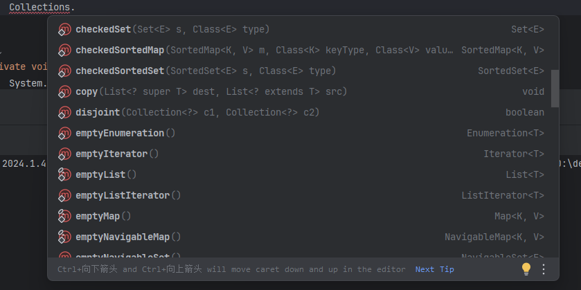
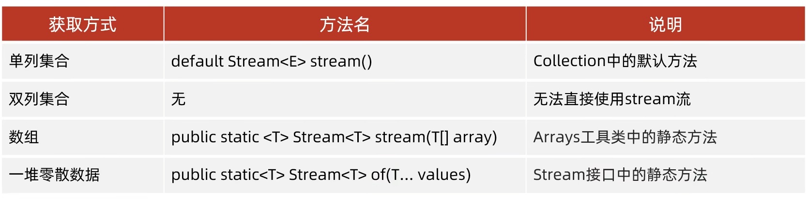

## List

List要求数据逻辑上是线性存储的，因此它具有如下特征（这是List结构的共有特征）。

- 数据存储是有序的，顺序和插入顺序一致
- 数据可以重复

**ArrayList**

底层数据结构为数组。查询效率奇高。插入、删除操作需要移动元素。效率较低

**LinkedList（效率不太高）**

底层数据结构为双向链表。查询时候需要遍历链表。因此效率较低。理论上插入时仅需变动指针即可，效率应该较高才对。但是插入前需要先找到插入位置，
因此需要遍历链表找到插入的位置，所以效率其实不太高。

## Set

Set是一类不允许有重复元素的集合，因此不会有重复元素是Set容器的特征。其本质原因是因为其底层使用的Map作为数据结构

**HashSet**

HashSet底层使用HashMap作为数据结构。元素是无序的，因为HashMap用的hash表。

**LinkedHashSet**

LinkedHashSet底层使用LinkedHashMap作为数据结构。元素是有序的，因为在HashMap的数据结构上加了一层双向链表确保元素有序

**TreeSet**

TreeSet底层使用TreeMap作为数据结构。元素是有序的，因为TreeMap的数据结构是红黑树。红黑树本质是二叉树，其本身就要求元素有序

## Map

Map的存储形式决定了其不允许有重复的元素，如果存储相同的key，后面的key会覆盖前面的

**HashMap**

HashMap的数据结构为hash算法+数组（Hash表）。在1.8中出现hash冲突的元素会在hash命中的位置形成链表结构。当链表长度超过8时，链表会转换为红黑树结构。
HashMap的初始容量（数组大小）为16，当容量达到阈值（默认为0.75，也即是达到75%）时，容器会自动扩容，扩容为原来的两倍。其过程是创建一个新的数组，将原来数组中的所有元素重新散列到新数组中。因此使用HashMap时，如果提前设置好容量可以避免不必要的重新散列过程和创建新的数组

**LinkedHashMap**

LinkedHashMap在HashMap的基础上添加了双向链表结构，因此元素是有序的

**TreeMap**

TreeMap的数据结构为红黑树。红黑树是一种自平衡的二叉树，其本身就具有排序的功能。因此TreeMap是有序的

**HashTable**

HashTable是线程安全的，因为他的操作方法都加了synchronized关键字，因此线程安全。但是效率会降低很多。其底层数据结构是hash表。当hash冲突时会在冲突位置形成链表。因为是hash表。所以元素是无序存储的
HashTable的key和value都不允许为null。

> 以上的容器除了HashTable，其他容器都是线程不安全的。线程安全问题主要在于多线程同时读写、或者写写容器内的元素。容易导致数据丢失，
> 或者元素覆盖的问题。[参考连接](https://www.cnblogs.com/xiaohuochai/p/5709193.html)

## 工具类

Java自带容器的工具类请参考java.util.Collections



### 创建不可变集合

不可变集合创建后只能查询，不能增删改

在Java中创建不可变集合（也称为只读集合）有几种方法。以下是一些常见的方法：

1. **使用 `Collections.unmodifiable` 方法**：
   ```java
   List<String> list = new ArrayList<>();
   list.add("A");
   list.add("B");
   list.add("C");
   List<String> unmodifiableList = Collections.unmodifiableList(list);
   ```

   类似地，你可以创建不可变的 `Set` 和 `Map`：
   ```java
   Set<String> set = new HashSet<>();
   set.add("A");
   set.add("B");
   set.add("C");
   Set<String> unmodifiableSet = Collections.unmodifiableSet(set);

   Map<String, String> map = new HashMap<>();
   map.put("key1", "value1");
   map.put("key2", "value2");
   Map<String, String> unmodifiableMap = Collections.unmodifiableMap(map);
   ```

2. **使用 Java 9 引入的工厂方法**：
   Java 9 引入了一些新的工厂方法，可以更方便地创建不可变集合：
   ```java
   List<String> list = List.of("A", "B", "C");
   Set<String> set = Set.of("A", "B", "C");
   Map<String, String> map = Map.of("key1", "value1", "key2", "value2");
   ```

3. **使用 Guava 库**：
   如果你使用 Google 的 Guava 库，它提供了一些方便的方法来创建不可变集合：
   ```java
   List<String> list = ImmutableList.of("A", "B", "C");
   Set<String> set = ImmutableSet.of("A", "B", "C");
   Map<String, String> map = ImmutableMap.of("key1", "value1", "key2", "value2");
   ```

## Stream流

#### 获取Stream流



#### 中间操作

#### 终止操作
