# 一、JVM内存划分

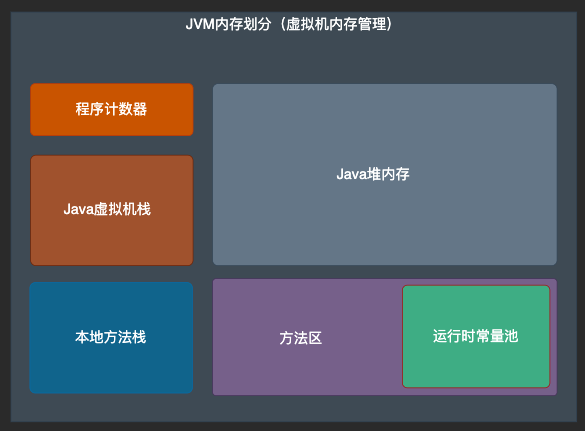

## 1.1 程序计数器：

- 功能说明：可理解为线程执行字节码指令的行号指示器，标识了程序目前运行到哪一行指令了，其下面一行指令获取也需要依赖计数器
- 特征说明：由于java多线程是快速切换时间片实现的，因此一个时间点只能有一个线程执行指令；故线程切换之前需要保存当前线程已经执行的位置方便后续恢复；因此程序计数器是一个线程拥有一个，是线程私有的；

## 1.2 虚拟机栈

- 功能说明：用于存放虚拟机执行方法时产生的局部变量表、方法出口等信息；方法调用开始，产生一个栈帧入栈，方法调用结束；栈帧出栈；
- 特征说明：线程私有；故每一个线程调用方法都会有个单独的虚拟机栈内存空间；
- 核心部分：虚拟机栈中核心的内容为局部变量表；其维护了方法中的局部变量（基本数据类型或引用数据类型）；而局部变量表的具体表现形式和内存分配的粒度细化为局部变量槽（long、double占用两个变量槽，其余占用一个）

## 1.3 本地方法栈

- 功能说明：本地方法栈与虚拟机栈十分类似；其区别在于本地方法栈服务与native方法；而虚拟机栈服务与普通java方法的调用；

## 1.4 Java堆

- 功能说明：唯一功能，存放java对象
- 特征说明：java虚拟机管理的最大的一块内存；线程之间共享；虚拟机启动时创建，虚拟机关闭时销毁；由于对象需要进行垃圾回收，因此堆内存往往在垃圾收集器的管理下；

## 1.5 方法区

- 功能说明：用于存储已被虚拟机加载的类型信息、常量、静态变量等
- 特征说明：线程共享

### 1.5.1 运行时常量池

- 功能说明：用于存放Class文件中定义的常量及其符号引用；类加载之后类中定义的这些常量，将会放到方法区中的运行时常量池中；
- 特征说明：运行时常量池是方法区的一部分；

# 二、java对象探究

## 2.1 对象的创建过程

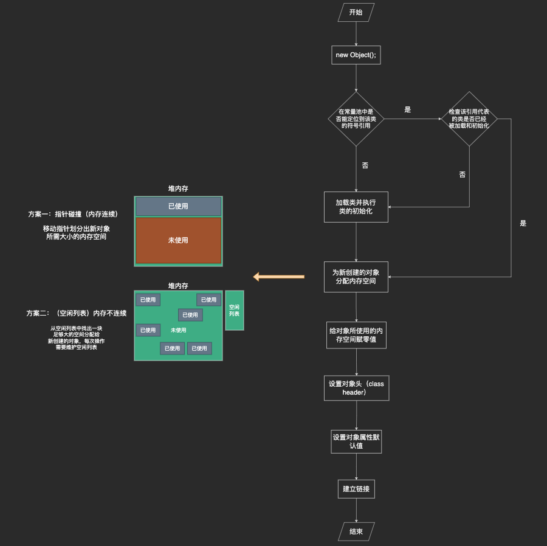

1. 执行new Object();
2. 常量池中查找对应类型的符号引用，没有则执行类加载过程
3. 如有符号引用则检查对应类型是否进行过类加载和初始化，没有则县执行初始化
4. 为创建新对象分配内存堆内存空间
    1. 堆内存空间连续--采用指针碰撞方式分配
    2. 堆内存不连续--采用空闲列表方式分配

### 2.1.1 内存分配的线程同步问题

- 产生原因：创建对象并给对象分配内存是一个相当频繁的操作；在多线程的情况下这是线程不安全的；
- 解决方案：
    - 方案一：CAS+失败重试
    - 方案二：使用线程缓冲，提前给线程分配一块内存区域，各线程在自己的缓冲区（TLAB）域内进行对象内存分配；缓冲用完后分配新的缓冲时进行线程同步；

## 2.2 对象的内存布局

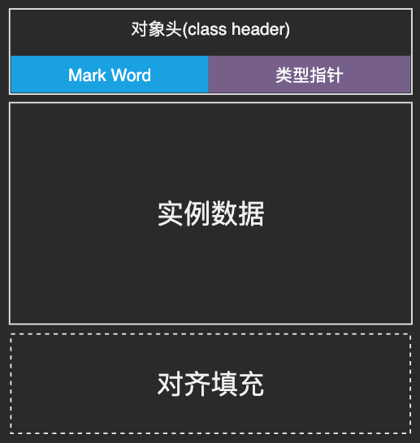

### 2.2.1 对象头（class header）

对象头是java实例对象中很小的一部分存储内容，其下包含两部分信息：

1. 第一类：Mark Word；存储对象自身运行时数据（hashcode、GC分代年龄、锁的状态位等）

   > HotSpot虚拟机的Mark Word存储内容分配方案：

|存储内容|标志位|状态|
|---|---|---|
|对象hashcode、分代年龄|01|未锁定|
|指向锁记录的指针|00|轻量级锁定|
|指向重量级锁的指针|10|重量级锁定|
|空，不需要记录信息|11|GC标识位|
|偏向线程Id、偏向时间戳、对象分代年龄|01|可偏向|

2. 第二类：类型指针；指向对象的类型元数据；虚拟机通过这个指针来确定对象是那个类的实例；

### 2.2.2 实例数据

- 功能说明：存储实例对象的具体业务数据
- 特征说明：相同长度的自定会被分配到一起存放

### 2.2.3 对齐填充

- 功能说明：无具体功能，虚拟机要求java对象大小必须是8字节的整数倍，故需没满足此要求

## 2.3 对象访问定位

访问方式的实现分为2种：

- 句柄访问：通过在java堆中维护句柄池实现；java栈中reference指向句柄池，句柄池负责具体对象指针；
- 直接指针：java栈的reference直接指向对象的地址；时间消耗上更短；

# 三、 OutOfMemoryErr异常

## 3.1 堆溢出

1. 确认是内存泄漏还是内存溢出
    1. 内存泄漏：本应被GC回收的对象没有被回收，导致内存撑满
    2. 内存溢出：对象确实都是需要存活的；可以查看虚拟机内存上限是否太小；或是代码设计不合理导致内存消耗过大；
        1. 对象生命周期过长
        2. 对象被持有时间过长
        3. 存储结构设计不合理
        4. 运行时内存消耗太大

> 虚拟机堆参数：-Xms -Xmx 此两个参数设置相同时可禁止堆内存自动扩展

### 3.1.1 代码示例

```java
public class OutOfMemoryErrDemo {

    static class OutOfMemoryObj {
    }

    /**
     * -Xms10m -Xmx10m
     */
    public static void main(String[] args) {
        ArrayList<OutOfMemoryObj> outOfMemoryObjs = new ArrayList<>();
        while (true) {
            System.out.println("adding");
            outOfMemoryObjs.add(new OutOfMemoryObj());
        }
    }
}
```

## 3.2 虚拟机栈和本地方法栈溢出

> 虚拟机本地方法栈参数 -Xoss；虚拟机栈参数：-Xss； HotSpot实现中不区分虚拟机栈和本地方法栈，统一通过 -Xss调整

### 3.2.1 线程请求最大栈深度达到虚拟机允许最大上限-StackOverFlowError

#### 3.2.1.1 代码示例

```java
public class JavaVMStackSOF {
    private int stackLength = 0;

    public void stackLeak() {
        stackLength++;
        stackLeak();
    }

    /**
     * -Xss 160k
     */
    public static void main(String[] args) {
        JavaVMStackSOF sof = new JavaVMStackSOF();
        try {
            sof.stackLeak();
        } catch (Throwable e) {
            System.out.println("stack length:" + sof.stackLength);
            throw e;
        }
    }
}
```

### 3.2.2 虚拟机栈允许动态扩展情况下申请不到更多内存-OutOfMemoryError

> HotSpot虚拟机栈不允许动态扩展

#### 3.2.2.1 代码示例

```java
public class JavaVMStackSOF {
    private int stackLength = 0;

    public void stackLeak() {
        long unused1, unused2, unused3, unused4, unused5,
                unused6, unused7, unused8, unused9, unused10,
                unused11, unused12, unused13, unused14, unused15,
                unused16, unused17, unused18, unused19, unused20,
                unused21, unused22, unused23, unused24, unused25,
                unused26, unused27, unused28, unused29, unused30,
                unused31, unused32, unused33, unused34, unused35,
                unused36, unused37, unused38, unused39, unused40,
                unused41, unused42, unused43, unused44, unused45,
                unused46, unused47, unused48, unused49, unused50,
                unused51, unused52, unused53, unused54, unused55,
                unused56, unused57, unused58, unused59, unused60,
                unused61, unused62, unused63, unused64, unused65,
                unused66, unused67, unused68, unused69, unused70,
                unused71, unused72, unused73, unused74, unused75,
                unused76, unused77, unused78, unused79, unused80,
                unused81, unused82, unused83, unused84, unused85,
                unused86, unused87, unused88, unused89, unused90,
                unused91, unused92, unused93, unused94, unused95,
                unused96, unused97, unused98, unused99, unused100;
        stackLength++;
        stackLeak();
        unused1 = unused2 = unused3 = unused4 = unused5 =
                unused6 = unused7 = unused8 = unused9 = unused10 =
                        unused11 = unused12 = unused13 = unused14 = unused15 =
                                unused16 = unused17 = unused18 = unused19 = unused20 =
                                        unused21 = unused22 = unused23 = unused24 = unused25 =
                                                unused26 = unused27 = unused28 = unused29 = unused30 =
                                                        unused31 = unused32 = unused33 = unused34 = unused35 =
                                                                unused36 = unused37 = unused38 = unused39 = unused40 =
                                                                        unused41 = unused42 = unused43 = unused44 = unused45 =
                                                                                unused46 = unused47 = unused48 = unused49 = unused50 =
                                                                                        unused51 = unused52 = unused53 = unused54 = unused55 =
                                                                                                unused56 = unused57 = unused58 = unused59 = unused60 =
                                                                                                        unused61 = unused62 = unused63 = unused64 = unused65 =
                                                                                                                unused66 = unused67 = unused68 = unused69 = unused70 =
                                                                                                                        unused71 = unused72 = unused73 = unused74 = unused75 =
                                                                                                                                unused76 = unused77 = unused78 = unused79 = unused80 =
                                                                                                                                        unused81 = unused82 = unused83 = unused84 = unused85 =
                                                                                                                                                unused86 = unused87 = unused88 = unused89 = unused90 =
                                                                                                                                                        unused91 = unused92 = unused93 = unused94 = unused95 =
                                                                                                                                                                unused96 = unused97 = unused98 = unused99 = unused100 = 0;

    }

    public static void main(String[] args) {
        JavaVMStackSOF sof = new JavaVMStackSOF();
        try {
            sof.stackLeak();
        } catch (Throwable e) {
            System.out.println("stack length:" + sof.stackLength);
            throw e;
        }
    }
}
```

## 3.3 方法区、运行时常量池溢出

在jdk1.6中，java方法区被描述为java堆的一个逻辑布局；其实现为java堆中的永久代区域；在java1.8开始HotSpot虚拟机彻底抛去永久代；使用元空间实现了方法区；

测试方法区内存溢出的基本思路：通过动态产生类，进而填充方法区，使其达到最大值；借助CGlib框架可以实现该测试；

### 3.3.1 jdk8支持如下虚拟机参数

1. -XX:MaxMetaspaceSize= ：设置元空间最大值，默认-1（即不限制，或只受物理内存限制）
2. -XX:MetaspaceSize= ：设置元空间初始空间大小，以字节为单位；达到该值就会触发垃圾回收进行类型卸载；同时收集器对该值进行调整，若果释放了较大内存，则适当调小该值；反之在不超过-XX:
   MaxMetaspaceSize时，则适当调大该值；
3. -XX:MinMetaspaceFreeRatio= : 作用是在垃圾回收后，控制最小的元空间剩余容量的百分比，可以减少元空间不足导致的垃圾收集器频繁工作
4. -XX:MaxMetaspaceFreeRatio= ：作用是在垃圾回收后，控制最大的元空间剩余容量的百分比

### 3.3.2 代码实现

```java
public class JavaMethodAreaOOM {
    /**
     * -XX:PermSize=10M -XX:MaxPermSize=10M；此参数适用与jdk1.6;1.8中不再支持
     */
    public static void main(String[] args) {
        while (true) {
            Enhancer enhancer = new Enhancer();
            enhancer.setSuperclass(OOMObject.class);
            enhancer.setUseCache(false);
            enhancer.setCallback(new MethodInterceptor() {
                @Override
                public Object intercept(Object o, Method method, Object[] objects, MethodProxy methodProxy) throws Throwable {
                    return methodProxy.invoke(o, args);
                }
            });
        }
    }

    static class OOMObject {
    }
}
```

# 四、垃圾回收器与内存分配策略

## 4.1 总揽

垃圾回收主要考虑3件事情

1. 那些内存需要被回收
2. 什么时候被回收
3. 回收的方式

### 4.1.1 java中各内存区域的垃圾回收

1. 程序计数器、虚拟机栈、本地方法栈都是线程私有的；栈中的栈帧所需内存大小在编译时期即可获得；而这三个区域的垃圾回收基本随着方法、线程的执行结束或销毁而进行回收；
2. 在java堆、方法区中的垃圾回收则有着很多的不确定性（主要是判定那些内存是需要进行回收的不好准确的判断）

## 4.2 如何判断java对象是否存活

### 4.2.1 引用计数法 （java未使用该算法）

引用计数算法的核心思想是：

1. 在对象中有单独一块内存存放引用计数器
2. 当有一个地方引用该对象时，计数器+1
3. 当引用失效时，计数器-1
4. 任意时刻，计数器为0的对象就是不可能再被使用的对象

优点：算法思想简单，高效 缺点：无法处理复杂场景的垃圾回收，比如：对象A、B之间相互引用时

#### 4.2.1.1 代码示例

```java
/*** testGC()方法执行后，objA和objB会不会被GC呢？ * @author zzm */
public class ReferenceCountingGC {
    public Object instance = null;
    private static final int _1MB = 1024 * 1024;
    /*** 这个成员属性的唯一意义就是占点内存，以便能在GC日志中看清楚是否有回收过 */
    private byte[] bigSize = new byte[2 * _1MB];

    public static void testGC() {
        ReferenceCountingGC objA = new ReferenceCountingGC();
        ReferenceCountingGC objB = new ReferenceCountingGC();
        objA.instance = objB;
        objB.instance = objA;
        objA = null;
        objB = null; // 假设在这行发生GC，objA和objB是否能被回收？ 
        System.gc();
    }
}
```

### 4.2.2 可达性分析算法

#### 4.2.2.1 算法思想

1. 通过GC root作为起始节点
2. 从这个节点开始，根据引用关系向下搜索；（搜索过程产生的路径称为引用链）
3. 如果某个对象到GC root节点无法连通，则称之为不可达；这种对象是可回收的

#### 4.2.2.2 图例

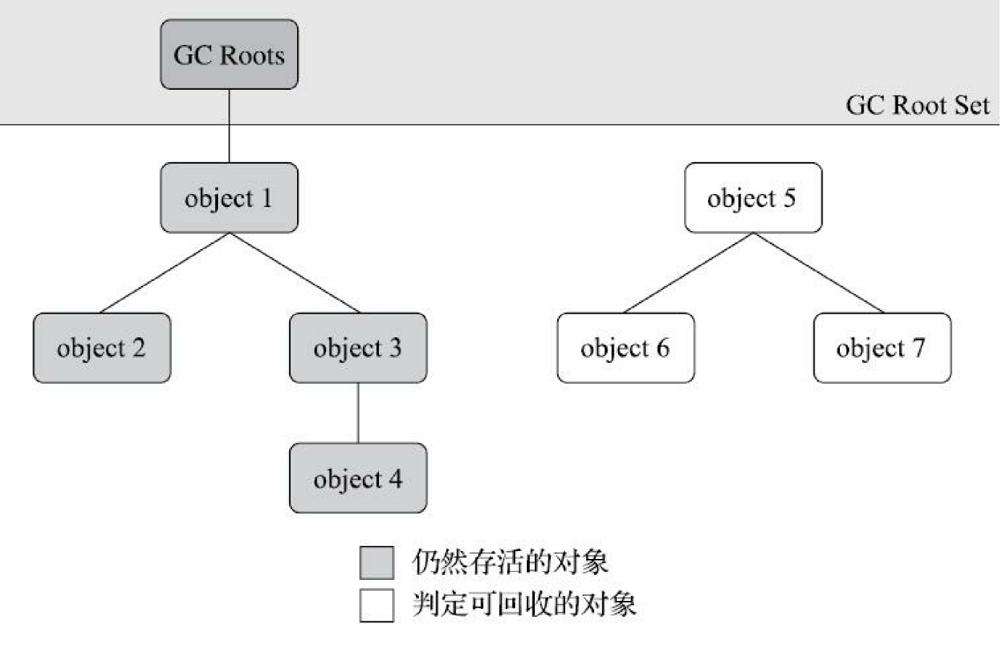

#### 4.2.2.3 可作为GC root节点的对象

1. 在虚拟机栈（栈帧中的本地变量表）中引用的对象，譬如各个线程被调用的方法堆栈中使用到的 参数、局部变量、临时变量等
2. 在方法区中类静态属性引用的对象，譬如Java类的引用类型静态变量
3. 在方法区中常量引用的对象，譬如字符串常量池（String Table）里的引用
4. 在本地方法栈中JNI（即通常所说的Native方法）引用的对象
5. Java虚拟机内部的引用，如基本数据类型对应的Class对象，一些常驻的异常对象（比如 NullPointException、OutOfMemoryError）等，还有系统类加载器
6. 所有被同步锁（synchronized关键字）持有的对象
7. 反映Java虚拟机内部情况的JMXBean、JVMTI中注册的回调、本地代码缓存等
8. 除了这些固定的GC Roots集合以外，根据用户所选用的垃圾收集器以及当前回收的内存区域不 同，还可以有其他对象“临时性”地加入，共同构成完整GC Roots集合。

### 4.2.3 对象的引用

#### 4.2.3.1 强引用

Java对象的强引用是指在程序代码中直接引用对象。如下代码就是一个强引用。如果一个对象是被强引用的，即使内存不足，Java虚拟机也不会回收该对象。除非显示的释放该引用或者超出该对象的作用范围

```java
class Demo {
    public void method() {
        //obj引用了一个Object对象，这个引用就是强引用
        {
            Object obj = new Object();
            //直接赋值null，该引用就被显式的释放了，这个对象就可以被回收
            obj = null;
        }
        //到这里，obj指向的对象已经超过了作用范围，该对象也可以被回收
    }

    public static void main(String[] args) {
        Object obj1 = new Object();   // 创建一个对象并赋值给 obj1
        Object obj2 = obj1;           // 强引用 obj1，将其赋值给 obj2
        obj1 = null;                  // 显式将 obj1 的引用设置为 null，但 obj2 引用仍然存在
        System.gc();                  // 垃圾回收器不会回收 obj2 引用的对象
        System.out.println(obj2);     // 输出 obj2 引用的对象，它不会被回收
    }
}


```

#### 4.2.3.2 软引用

Java中软引用是一种较弱的引用类型，当一个对象被软引用时。该对象就可能被垃圾回收。当内存不足时，软引用的对象就被尽可能多的回收

```java
public class SoftReferenceExample {
    public static void main(String[] args) {
        Object obj = new Object(); // 创建一个对象
        SoftReference<Object> softRef = new SoftReference<>(obj); // 创建一个软引用
        obj = null; // 将 obj 置为 null，只有软引用指向该对象
        // 可以通过 softRef.get() 方法获取软引用所引用的对象
        // 在系统内存不足时，垃圾回收器可能会回收软引用所引用的对象
    }
}

//另外一种软引用的创建方式
public class MySoftReference<T> extends SoftReference<T> {
    // 构造函数
    public MySoftReference(T referent) {
        super(referent);
    }

    // 覆盖 get() 方法
    @Override
    public T get() {
        T obj = super.get();
        // 对 obj 进行一些操作
        return obj;
    }
}

```

软引用通常用于缓存数据或对象池中的对象，因为这些对象通常需要经常使用，但又不是必需的。在缓存或对象池中， 如果一个对象长时间不被使用，它可能就可以被垃圾回收器回收了。因此，在编写代码时，需要根据具体场景来选择适当的引用类型，
以优化应用程序的性能和内存使用情况。

#### 4.2.3.3 弱引用

Java 中的弱引用是一种比软引用更弱的引用类型，它可以让对象更容易被垃圾回收器回收。如果一个对象只被弱引用所引用，那么当垃圾回收器扫描到这个对象时，它会被回收。弱引用通常用于缓存、映射等场景，可以有效避免内存泄漏问题

```java
public class MyCache<K, V> {
    private Map<K, WeakReference<V>> cache = new HashMap<>();

    public void put(K key, V value) {
        cache.put(key, new WeakReference<>(value));
    }

    public V get(K key) {
        WeakReference<V> weakRef = cache.get(key);
        if (weakRef != null) {
            return weakRef.get();
        } else {
            return null;
        }
    }
}

```

#### 4.2.3.4 虚引用

虚引用通常被用于在一个对象被垃圾回收器回收时收到一个系统通知。虚引用与引用队列（ReferenceQueue）结合使用，当虚引用所引用的对象被垃圾回收器回收时，该虚引用就会被加入到引用队列中。通过检查引用队列中是否包含虚引用，我们可以得知对象何时被垃圾回收器回收了。

```java
public class PhantomReferenceDemo {
    public static void main(String[] args) {
        Object obj = new Object();
        ReferenceQueue<Object> refQueue = new ReferenceQueue<>();
        PhantomReference<Object> phantomRef = new PhantomReference<>(obj, refQueue);
        obj = null; // 解除强引用
        System.gc(); // 强制进行垃圾回收
        try {
            // 等待虚引用被放入引用队列
            Reference<? extends Object> ref = refQueue.remove();
            if (ref instanceof PhantomReference) {
                System.out.println("Object has been collected by GC");
            }
        } catch (InterruptedException e) {
            e.printStackTrace();
        }
    }
}
```

        ### 4.2.4回收堆（对象生存还是死亡？）

        对象到GC root的不可达只是对象被回收的前提条件之一，对象要真正达到可被回收的状态，需要2次标记过程；

        1.经过可达性算法分析后，若对象与GC root不可达，则第一次被标记
        2.第一次标记后进入筛选，筛选条件为是否有必要执行对象的finalize()方法
        3.若finalize()没有被复写，或finalize()已经被虚拟机执行过；则没有必要执行；这部分对象基本就会被最终回收
        4.反之判定为有必要执行finalize()，则这些对象会被放入名为F-Queue的队列中，虚拟机会单独建立一个线程去执行这些对象的finalize()方法；这是对象被救活的最后时机，如果在finalize()
        方法执行过程中，对象被建立了新的引用；则这个对象会被从"即将回收"的状态中移除；反之对象就会被真正回收

        #### 4.2.4.1代码示例

        ```java

public class FinalizeEscapeGC { public static FinalizeEscapeGC SAVE_HOOK = null;

    public void isAlive() {
        System.out.println("yes, i am still alive :)");
    }

    @Override
    protected void finalize() throws Throwable {
        super.finalize();
        System.out.println("finalize method executed!");
        FinalizeEscapeGC.SAVE_HOOK = this;
    }

    public static void main(String[] args) throws Throwable {
        SAVE_HOOK = new FinalizeEscapeGC(); //对象第一次成功拯救自己
        SAVE_HOOK = null;
        System.gc();
        // 因为Finalizer方法优先级很低，暂停0.5秒，以等待它
        Thread.sleep(500);
        if (SAVE_HOOK != null) {
            SAVE_HOOK.isAlive();
        } else {
            System.out.println("no, i am dead :(");
        }
        // 下面这段代码与上面的完全相同，但是这次自救却失败了
        SAVE_HOOK = null;

        System.gc();
        // 因为Finalizer方法优先级很低，暂停0.5秒，以等待它
        Thread.sleep(500);
        if (SAVE_HOOK != null) {
            SAVE_HOOK.isAlive();
        } else {
            System.out.println("no, i am dead :(");
        }
    }

}

```

代码运行结果显示第2次对象自救失败了，这是因为任何一个对象的finalize()方法都只会被系统自动调用一次，如果对象面临 下一次回收，它的finalize()方法不会被再次执行，因此第二段代码的自救行动失败了

### 4.2.4 回收方法区

方法区的回收主要有两部分内容：

- 废弃的常量：当一个字符串常量没有被任何字符串对应所引用；同时也没有被虚拟机引用；则下次回收时，虚拟机判断有必要的情况下就会将这个常量清理出常量池
- 不再使用的类型：判断一个类型是否属于"不再被使用的类"条件相对苛刻；条件如下：
    - 该类的所有实例都已经被回收；（java堆中不存在任何该类及其派生子类的实例）
    - 加载该类的类加载器已经被回收，这个条件除非是经过精心设计的可替换类加载器的场景，如 OSGi、JSP的重加载等，否则通常是很难达成的
    - 该类对应的java.lang.Class对象没有在任何地方被引用，无法在任何地方通过反射访问该类的方法 注：满足以上3个条件的类型允许被收集器回收，但仅是"被允许"；最终是否被回收，虚拟机提供了参数控制

## 4.3 垃圾收集算法

### 4.3.1 分代收集理论

分代收集理论建立在分代收集假说基础上：

1. 弱分代假说（Weak Generational Hypothesis）：绝大多数对象都是朝生夕灭的。
2. 强分代假说（Strong Generational Hypothesis）：熬过越多次垃圾收集过程的对象就越难以消亡。

基于分代收集理论将堆内存划分为多个不通的区域；将堆中对象按照其存活时间等纬度进行划分，并分别存放到对应的堆内存中；不同的分区分配不同的垃圾收集算以达到时间、空间效率的平衡；

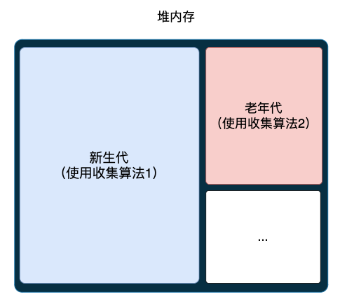

#### 4.3.1.1 跨代引用的问题及解决方案

基于上述2条理论的分代收集并不完整；比如；现在进行一次只局限于新生代区域内的收集（Minor GC），但新生代中的对象是完全有可 能被老年代所引用的，为了找出该区域中的存活对象，不得不在固定的GC Roots之外，再额外遍历整
个老年代中所有对象来确保可达性分析结果的正确性，反过来也是一样[3]。遍历整个老年代所有对象 的方案虽然理论上可行，但无疑会为内存回收带来很大的性能负担。为了解决这个问题，就需要对分 代收集理论添加第三条经验法则：

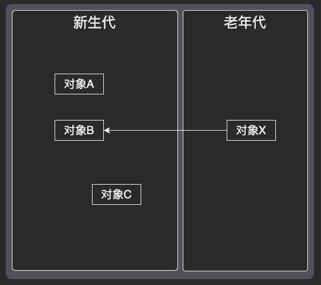

图中要针对新生代收集时，为了垃圾收集的转确性，在判断对象B是否可以回收时需要遍历老年代的所有对象才能找到对象X引用了对象B；这样的消耗太大； 为了解决这个问题；引入如下理论：

- 跨代引用假说（Intergenerational Reference Hypothesis）：跨代引用相对于同代引用来说仅占极少数

#### 4.3.1.2 标记清除算法

整个过程为：

1. 标记需要回收的对象（或反向标记不需要回收的对象）
2. GC回收被标记的对象（或反向回收没有被标记的对象）

主要缺点为：

1. 如果现在100个对象90个都是要被回收的，那标记和回收过程的开销都是比较大的
2. 标记回收后没有内存整理，导致回收后的内存都比较碎片化，不便再次利用

#### 4.3.1.3 标记复制算法

为什么是8：1：1的分配？

主要缺点：

1. 内存对半分的情况下会浪费一般内存；故需要根据实际情况；合理划分空闲区域的内存大小
   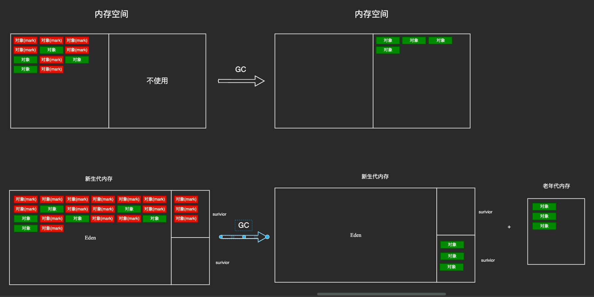

# Class文件的结构

## 特征描述

Class文件是一组以8个字节为基础单位的二进制流，各个数据项目严格按照顺序紧凑地排列在文 件之中，中间没有添加任何分隔符，这使得整个Class文件中存储的内容几乎全部是程序运行的必要数
据，没有空隙存在。当遇到需要占用8个字节以上空间的数据项时，则会按照高位在前的方式分割 成若干个8个字节进行存储

根据《Java虚拟机规范》的规定，Class文件格式采用一种类似于C语言结构体的伪结构来存储数 据，这种伪结构中只有两种数据类型

- 无符号数：无符号数属于基本的数据类型，_**以u1、u2、u4、u8来分别代表1个字节、2个字节、4个字节和8个字节的无符号数**_，无符号数可以用来描述数字、索引引用、数量值或者按照UTF-8编码构成字符串值
- 表：由多个无符号数或者其他表作为数据项构成的复合数据类型，为了便于区分，所有表的命名 都习惯性地以“_
  info”结尾。表用于描述有层次关系的复合结构的数据，整个Class文件本质上也可以视作是一张表；这张表由如下截图所示的数据项按严格顺序排列构成

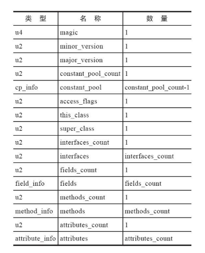

### class文件的严格性

Class的结构不像XM L等描述语言，由于它没有任何分隔符 号，所以在表6-1中的数据项，无论是顺序还是数量，甚至于数据存储的字节序(Byte Ordering，Class 文件中字节序为Big-Endian)
这样的细节，都是被严格限定的，哪个字节代表什么含义，长度是多少， 先后顺序如何，全部都不允许改变

## 魔数

标识u4（占4个字节） 每个Class文件的头4个字节被称为魔数(M agic Number)，它的唯一作用是确定这个文件是否为 一个能被虚拟机接受的Class文件。不仅是Class文件，很多文件格式标准中都有使用魔数来进行身份识
别的习惯，譬如图片格式，如GIF或者JPEG等在文件头中都存有魔数。使用魔数而不是扩展名来进行 识别主要是基于安全考虑，因为文件扩展名可以随意改动

## 次版本号

标识u2（占2个字节）

## 主版本号

标识u2（占2个字节）

## 常量池

常量池以表的方式构成（具体占位多少需要根据表中的实际内容而定）

常量池可以比喻为Class文件里的资源仓库，它是Class 文件结构中与其他项目关联最多的数据，通常也是占用Class文件空间最大的数据项目之一，另外，它 还是在Class文件中第一个出现的表类型数据项目

注：由于常量池中常量的数量是不固定的，所以在常量池的入口需要放置一项u2类型的数据，代表常 量池容量计数值(constant_pool_count)。与Java中语言习惯不同，这个容量计数是从1而不是0开始的。Class文件结构中只有
常量池的容量计数是从1开始，对于其他集合类型，包括接口索引集合、字段表集合、方法表集合等的 容量计数都与一般习惯相同，是从0开始。

### 常量池存放的内容

- 字面量(Literal)：接近于Java语言层面的常量概念，如文本字符串、被声明为final的常量值等
- 和符号引用(Symbolic References)：
    - 被模块导出或者开放的包(Package)
    - 类和接口的全限定名(Fully Qualified Name)
    - 字段的名称和描述符(Descriptor)
    - 方法的名称和描述符
    - 方法句柄和方法类型(Method Handle、Method Type、Invoke Dynamic)
    - 动态调用点和动态常量

常量池中每一项常量都是一个表，一共17类

这17类表都有一个共同的特点，表结构起始的第一位是个u1类型的标志位(tag，取值见表6-3中标志列)，代表着当前常量属于哪种常量类型。17种常量类型所代表的具体含义如表6-3所示

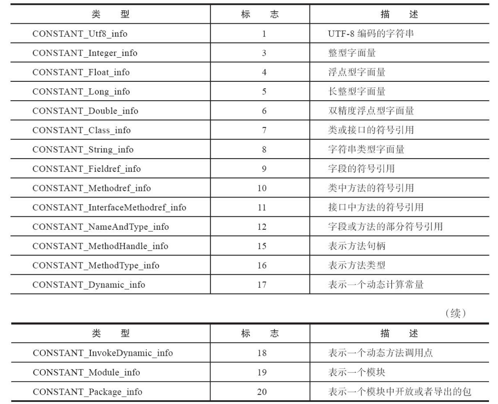

## 访问标志

常量池结束之后，紧接着的2个字节代表访问标志(access_flags)，这个标志用于识别一些类或者接口层次的访问信息，包括:这个Class是类还是接口;是否定义为public类型;是否定义为abstract
类型;如果是类的话，是否被声明为final

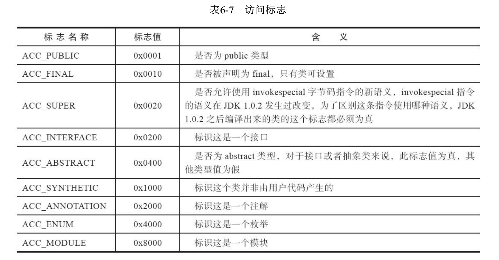

## 类索引、父类索引与接口索引集合

Class文件中由这三项数据来确定该类型的继承关系

- 类索引(this_class)（2字节）：用于确定这个类的全限定名,指向一个类型为CONSTANT_Class_info的类描述符常量

- 父类索引(super_class)（2字节）：用于确定这个类的父类的全限定名,指向一个类型为CONSTANT_Class_info的类描述符常量

- 接口索引集合(interfaces)（一组u2类型的数据的集合）：用来描述这个类实现了哪些接口，这些被实现的接口将按implements关键字(如果这个Class文件表示的是一个接口，则应当是extends关键字)
  后的接口顺序从左到右排列在接口索引集合中

## 字段表集合

描述接口或者类中声明的变量。Java语言中的“字段”(Field)包括类级变 量以及实例级变量，但不包括在方法内部声明的局部变量

### 字段修饰符的语法规则：

字段可以包括的修饰符有:

- 字段的作用域(public、private、protected修饰符)
- 是实例变量还是类变量(static修饰符)
- 可变性(final)
- 并发可见性(volatile修饰符，是否强制从主内存读写)
- 可否被序列化(transient修饰符)
- 字段数据类型(基本类型、对象、数组)
- 字段名称。

注意：除了字段名称引用常量池中的常量，其他的都是布尔标识位

### 字段表说明

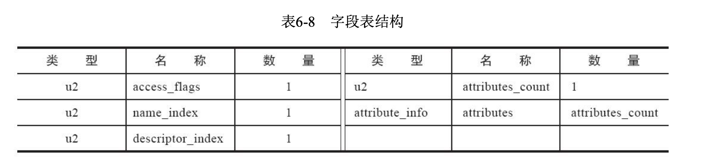

#### 字段修饰符 access_flags

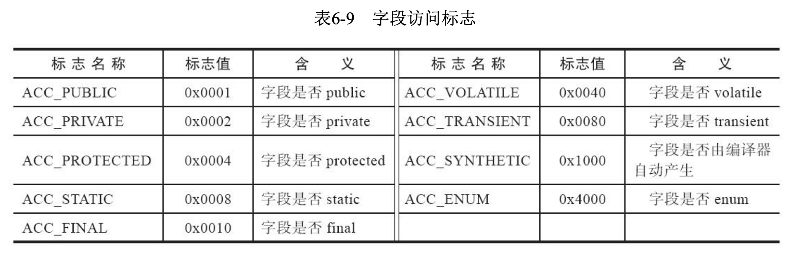

由于语法规则的约束，ACC_PUBLIC、ACC_PRIVATE、ACC_PROTECTED三个标志最 多只能选择其一，ACC_FINAL、ACC_VOLATILE不能同时选择。接口之中的字段必须有
ACC_PUBLIC、ACC_STATIC、ACC_FINAL标志，这些都是由Java本身的语言规则所导致的。

> 方法和字段的描述符：描述符的作用是用来描述字段 的数据类型、方法的参数列表(包括数量、类型以及顺序)和返回值。根据描述符规则，基本数据类 型(by te、char、double、float、int、long、short、boolean)以及代表无返回值的void类型都用一个大 写字符来表示，而对象类型则用字符L加对象的全限定名来表示
> 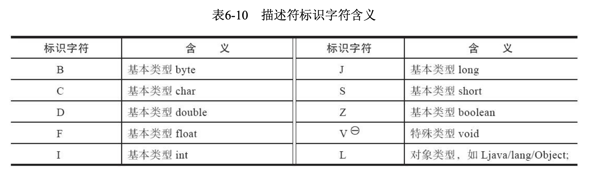
>
> 对于数组类型，每一维度将使用一个前置的“ [”字符来描述，如一个定义为“ java.lang.St ring[][]”类型 的二维数组将被记录成“ [[Ljava/lang/St ring;”，一个整型数组“ int []”将被记录成“ [I”
>
> 用描述符来描述方法时，按照先参数列表、后返回值的顺序描述，参数列表按照参数的严格顺序 放在一组小括号“()”之内。如方法void inc()的描述符为“()V”，方法java.lang.String toString()的描述符 为“()Ljava/lang/String;”，方法int indexOf(char[]source，int sourceOffset，int sourceCount，char[]target， int targetOffset，int targetCount，int fromIndex)的描述符为“([CII[CIII)I”

#### name_index（字段的简单名称）

索引值（对常量池的引用）

#### descriptor_index(字段的描述符)

索引值（对常量池的引用）

## 方法表集合

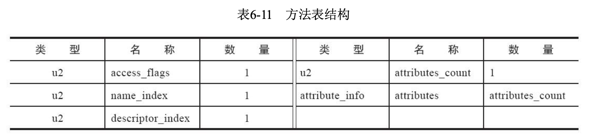
因为volatile关键字和transient关键字不能修饰方法，所以方法表的访问标志中没有了ACC_VOLATILE标志和ACC_TRANSIENT标志。与之相对，synchronized、native、strictfp和abstract关键字可以修饰方法，方法表的访问标志中也相应地增加了ACC_SYNCHRONIZED、ACC_NATIVE、ACC_STRICTFP和ACC_ABSTRACT标志。对于方法表，所有标志位及其取值可参见表6-12。

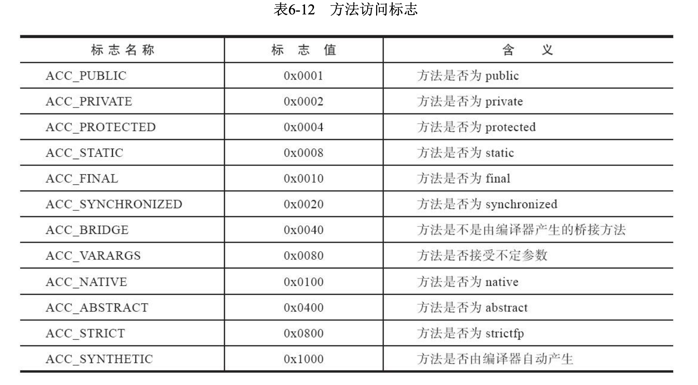

## 属性表集合

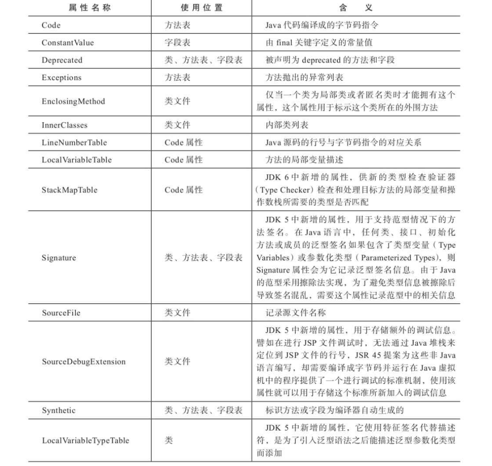
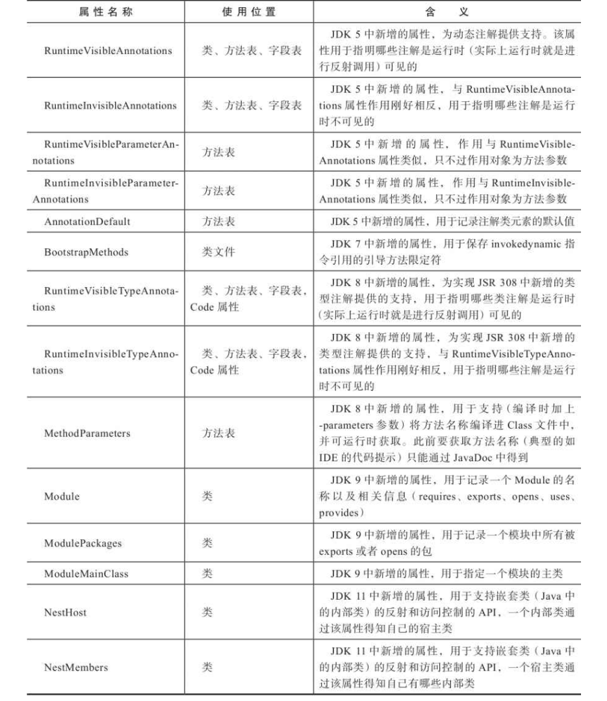

### 属性表结构

对于每一个属性，它的名称都要从常量池中引用一个CONSTANT_Utf8_info类型的常量来表示， 而属性值的结构则是完全自定义的，只需要通过一个u4的长度属性去说明属性值所占用的位数即可。
一个符合规则的属性表应该满足表6-14中所定义的结构。

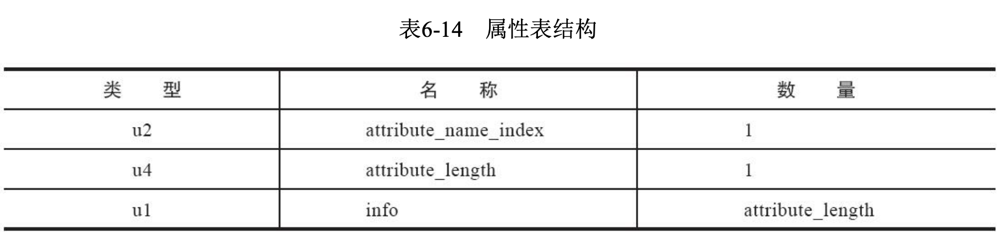

##### Code属性

Java程序方法体里面的代码经过Javac编译器处理之后，最终变为字节码指令存储在Code属性内。 Code属性出现在方法表的属性集合之中，但并非所有的方法表都必须存在这个属性，譬如接口或者抽
象类中的方法就不存在Code属性，如果方法表有Code属性存在，那么它的结构将如表6-15所示

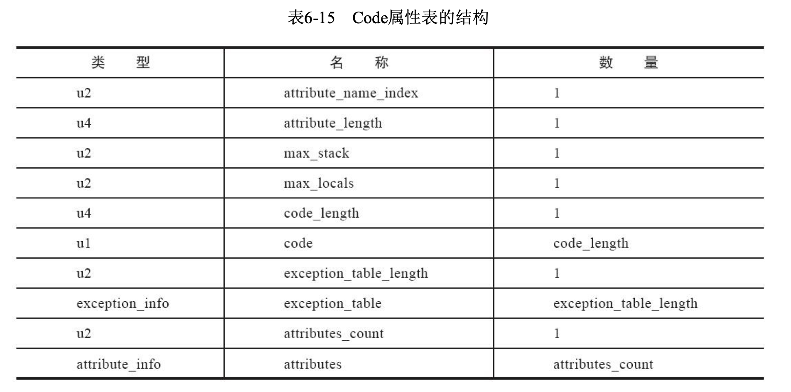