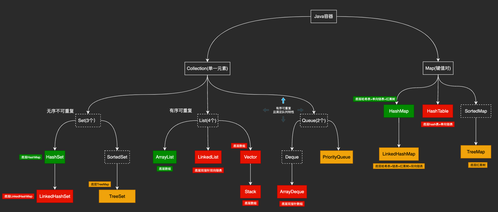

# 1 框架纵览

# 并发容器

ConcurrentHashMap：并发版HashMap

CopyOnWriteArrayList：并发版ArrayList

CopyOnWriteArraySet：并发Set

ConcurrentLinkedQueue：并发队列(基于链表)

ConcurrentLinkedDeque：并发队列(基于双向链表)

ConcurrentSkipListMap：基于跳表的并发Map

ConcurrentSkipListSet：基于跳表的并发Set

ArrayBlockingQueue：阻塞队列(基于数组)

LinkedBlockingQueue：阻塞队列(基于链表)

LinkedBlockingDeque：阻塞队列(基于双向链表)

PriorityBlockingQueue：线程安全的优先队列

SynchronousQueue：读写成对的队列

LinkedTransferQueue：基于链表的数据交换队列

DelayQueue：延时队列
