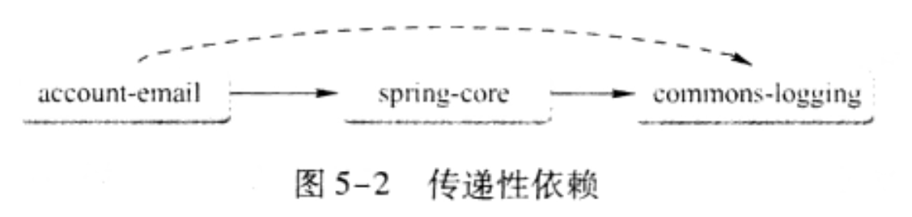
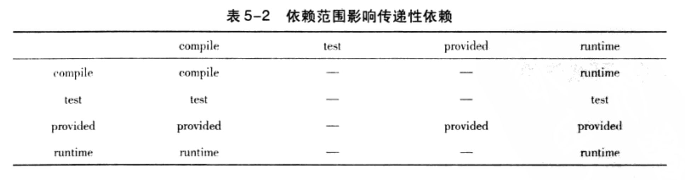
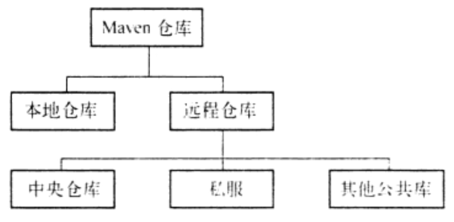
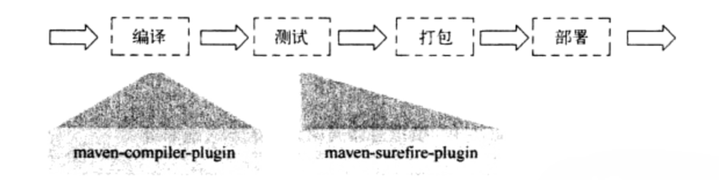
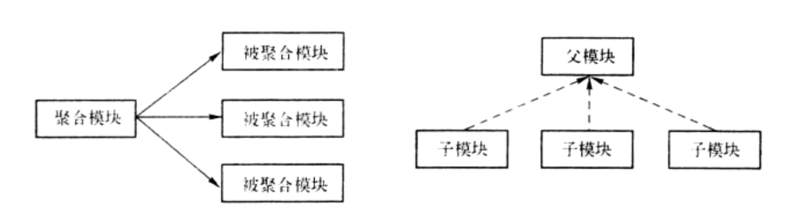

# 0 前言

## 0.1 解决maven打包的jar无法直接运行的问题

maven默认打包的jar是无法直接运行的，因为带有mian方法的类信息不会添加到manifest中（位于jar文件中的META-INF/MANIFEST.MF文件）无法看到Main Class的配置
为了生成可执行的jar文件，需要借助maven-shade-plugin；配置如下

```xml

<build>
    <plugins>
        <plugin>
            <groupId>org.apache.maven.plugins</groupId>
            <artifactId>maven-shade-plugin</artifactId>
            <version>3.2.1</version>
            <configuration>
                <createDependencyReducedPom>false</createDependencyReducedPom>
            </configuration>
            <executions>
                <execution>
                    <phase>package</phase>
                    <goals>
                        <goal>shade</goal>
                    </goals>
                    <configuration>
                        <transformers>
                            <transformer
                                    implementation="org.apache.maven.plugins.shade.resource.ManifestResourceTransformer">
                                <mainClass>com.weaver.workflow.HelloWorld</mainClass>
                            </transformer>
                        </transformers>
                    </configuration>
                </execution>
            </executions>
        </plugin>
    </plugins>
</build>
```

# 1 maven坐标和依赖

## 1.1 Maven坐标

- groupId:
  定义当前项目隶属的实际项目，比如著名的springframework这一实际项目；其对应的maven项目有很多；spring-core、spring-context等；这是由于maven中模块的概念；因此，一个实际的项目，往往被划分为很多模块；groupId的表示方式与java的包名定义类似；通常与域名反向一一对应；
- artifactId: 该元素定义实际项目中的一个maven项目（模块）；推荐的做法是使用实际项目名称作为artifactId的前缀
- version: 该元素定义当前maven项目所处的版本
- packaging: 该元素定义maven项目的打包方式，当不定义packaging的时候，默认打包方式为jar
- classifier: 该元素用来帮助定义构建输出的一些附属构建。附属构建与主构建对应；比如生成构建的时候可以借助插件生成doc、source等；classifier不能直接定义，而需要借助插件生成

maven构件的名称生成规则为：
> artifactid-version [classifier].packaging

## 1.2 依赖

### 1.2.1 依赖的配置

一个依赖的声明可以包含如下配置

```xml

<dependencies>
    <dependency>
        <groupId>实际项目id（组id）</groupId>
        <artifactId>Maven项目Id（模块）</artifactId>
        <version>版本号</version>
        <type>依赖的类型，对应于项目坐标定义的packaging，大部分情况下该元素无需配置</type>
        <scope>依赖范围</scope>
        <optional>标记依赖是否可选</optional>
        <exclusions>
            <!--用于排除传递依赖-->
            <exclusion>
                <groupId></groupId>
                <artifactId></artifactId>
            </exclusion>
        </exclusions>
    </dependency>
</dependencies>
```

### 1.2.2 依赖的范围

maven项目在使用的时候一共有3套classpath

1. 编译主代码一套classpath
2. 编译运行测试代码一套classpath
3. 实际运行主代码一套classpath

依赖范围实际就是控制maven依赖与这3套classpath的关系

- compile(默认值)：在编译、测试、运行3套classpath下都有效
- test：仅对测试的classpath有效
- provided：编译、测试时有效，运行时无效
- runtime：对测试、运行时classpath有效，对编译主代码的classpath无效
- system：该选项和provided与3套classpath的关系完全一致；
- import：仅作用于依赖管理的dependencyManagement元素

> 注：但使用system选项时必须通过systemPath元素显示的指示依赖文件的路径；由于此选项不是通过maven仓库解析识别；往往与本机系统绑定，会造成构件的不可移植性；

|作用域|对编译classpath有效|对测试classpath有效|对运行时classpath有效|示例|
|---|---|---|---|---|
|compile|√|√|√|spring×core|
|test|×|√|×|junit|
|provided|√|√|×|servlet×api|
|runtime|×|√|√|jdbc驱动实现|
|system|√|√|×|本地的，maven仓库之外的类文件|

### 1.2.3 传递依赖

若A模块引入类B依赖、B引入了C依赖，则C会称为A的传递依赖； 有了传递依赖机制，maven会解析各个直接依赖的pom，将哪些"必要的"间接依赖以传递依赖的形式引入到当前项目中



### 1.2.4 传递依赖与依赖范围的关系

依赖范围不仅可以控制依赖与3套classpath的关系，同时也会对传递依赖产生影响；

比如account-mail对spring-core的依赖范围为compile，而spring-core对commons-logging的依赖范围为compile；则account-mail对commons-logging的依赖范围为compile；我们把account-email对spring-core的依赖称为第一直接依赖；而spring-core对commons-logging的依赖为第二直接依赖；account-email对commnos-logging的依赖为传递依赖；

其对应解析出来的传递依赖范围如下表：第一列为第一传递依赖；第一行为第二传递依赖



### 1.2.5 传递依赖冲突

maven解决传递依赖根据2条原则：

- 第一原则：多个相同构件的传递依赖，依赖路径短者优先
- 第二原则：依赖路径相同的基础上，在pom文件中先声明者优先

### 1.2.6 阻断传递依赖

若A依赖于B，B依赖于C、D；但C、D是B的可选依赖；则C、D不会传递到A中

maven使用`<option>true</option>`标识一个依赖是否为可选依赖

```xml

<dependency>
    <groupId>org.springframework</groupId>
    <artifactId>spring-context-support</artifactId>
    <version>2.5.6</version>
    <optional>true</optional>
</dependency>

```

### 1.2.7 排除传递依赖

如果出现A依赖B，B依赖于C的v1版本，而此时项目需要的是C的v2版本；则可以先排除C的v1版本的传递依赖，后手动引入C v2版本的依赖

```xml

<dependency>
    <groupId>org.springframework</groupId>
    <artifactId>B</artifactId>
    <exclusions>
        <exclusion>
            <groupId>XXX</groupId>
            <artifactId>C</artifactId>
        </exclusion>
    </exclusions>
</dependency>
```

### 1.2.8 依赖版本统一管理

当一组构件的使用版本相同时，为了不对每个构件都分别设置版本，可以使用maven提供的属性进行版本的统一管理

```xml

<properties>
    <springframework.version>2.5.6</springframework.version>
</properties>

<dependencies>
<dependency>
    <groupId>org.springframework</groupId>
    <artifactId>spring-context-support</artifactId>
    <version>${springframework.version}</version>
</dependency>
</dependencies>
```

### 1.2.9 依赖分析

当maven项目庞大的时候依赖会变得很多，且复杂；使用maven依赖分析相关的命令可以帮助我们找出非必要依赖，并且优化我们的项目结构

我们已知maven会解析所有项目的直接依赖和传递依赖，对于有冲突的依赖maven也会自行调整，并根据规则判断每个依赖的范围，确保每个构件只有唯一一个版本被当前项目所使用；当上述所有解析过程完成后得到的最后的依赖称为已解析依赖（Resolved
Denpendency）；使用 `mvn denpendency:list`可以查看当前项目的已解析依赖，并且会列出每个构件的依赖范围；

把pom中直接声明的列为顶层依赖，而顶层依赖的依赖列为第二层依赖，以此类推，第三层、第四层...; 当这些依赖被解析完毕后，会形成一个依赖树；使用 `mvn denpendency:tree`会列出整个依赖树

为了能更好的分析整个项目的依赖，还可以使用 `mvn denpendency:analyze` 对整个项目进行分析；该分析结果包含2个重要信息

- used undeclared dependencies: 使用了但没有直接声明的依赖，也就是传递依赖；传递依赖是存在潜在风险的，比如传递依赖的版本变化是不易察觉且不可控的
- unsed declared dependencies:
  没有直接使用，但直接声明的依赖；这些依赖需要额外关注，因为maven只会解析编译项目主代码和测试代码使用的依赖，对于已经打包的第3方依赖不会直接解析；因此对于它最好不要直接删除，而是先分析再处理

> 对于unsed declared dependencies中的依赖，spring-core、或spring-bean等就是最好的说明，我们自己的项目中很显然不会直接使用到这些依赖中的类或工具；但它们是运行spring框架的必要依赖

# 2 Maven仓库

Maven仓库用于存储maven构件

## 2.1 仓库的分类

- 本地仓库：置于开发这的本地物理机上的文件系统（.m2/repository/)
- 远程仓库：置于网络上的文件系统

> 远程仓库又有细分
>  - 中央仓库：maven自带的核心远程仓库，存放类java的绝大部分构件
>  - 私服：为了节省带宽和时间，局域网内设置一个私有的仓库服务器用于存储maven构件，用于代理所有处于互联网上的远程仓库



maven查找构件的顺序：

1. 先查找本地仓库，能找到则直接使用
2. 本地仓库找不到则查找远程仓库，找到到下载到本地仓库后再使用
3. 本地、远程仓库都没有则报错

### 2.1.1 修改默认本地仓库位置

本地仓库的默认位置是基于用户目录的，如果需要自定义本地仓库地址可以在 `.m2/repository/settings.xml` 中设置 `localRepository` 元素的值来变更本地仓库的地址

### 2.2 私服仓库的好处

- 节省自己的外网带宽
- 加速Maven的构件：不停的请求外部仓库是十分耗时的，但maven的一些工作机制在执行构件任务的时候要求maven不断的检查远程仓库的数据；因此如果项目配置了很多远程仓库，构件速度就会降低；使用私服则无此问题
- 部署第三方构件：如果是团队开发，很多构件都是团队内部产生的，没有私服，则内部构件不好在团队之间进行共享
- 提高稳定性，增强控制：有了私服，断网了也能用
- 降低中央仓库的负荷

### 2.3 配置远程仓库

很多时候默认的远程仓库无法满足我们的需求，项目需要的构件可能在另外一个仓库中；此时可以在pom中配置该仓库

```xml

<repositories>
    <repository>
        <id>jboss</id><!--id必须唯一，重复的id会被覆盖-->
        <name>JBossReporsitory</name>
        <url>http://repository.jboss.com/maven2/</url>
        <releases><!--发布版本构件配置-->
            <enabled>true</enabled><!--开启仓库发布版本构件下载的支持-->
            <updatePolicy>daily
            </updatePolicy><!--maven从远程仓库检查更新的频率，默认daily（一天一次）、never（从不检查）、always（每次构建都检查）、interval:X（每X分钟检查一次）-->
            <checksumPolicy>ignoer
            </checksumPolicy><!--配置maven检查检验文件的策略，maven部署构件的时候会同时部署校验和文件，下载的时候会校验和验证；当值为warn时，会输出警告，fail时会直接构建失败-->
        </releases>
        <snapshots><!--快照版本构件支持-->
            <enabled>false</enabled><!--关闭仓库快照版本构件下载的支持-->
            <updatePolicy></updatePolicy>
            <checksumPolicy></checksumPolicy>
        </snapshots>
    </repository>
</repositories>
```

### 2.4 远程仓库的认证

大部分仓库是无需认证就可以访问的，但有时处于安全的考虑，需要我们提供认证信息才可以访问一些仓库；此时就需要配置认证信息；

配置认证信息与配置仓库不同，仓库信息可以直接在pom文件中；但认证信息必须在settings.xml文件中，原因在于pom是提交到仓库中供大家使用的，而settings.xml则只在本地使用；因此认证信息放在settings.xml中更为安全；配置方式如下：

```xml

<servers>
    <server>
        <id>nexus</id><!--id必须和pom文件中需要认证的仓库保持一致，正是这个id将认证信息与pom中的仓库配置联系到了一起-->
        <username>admin</username>
        <password>123</password>
    </server>
</servers>
```

### 2.5 部署到远程仓库

无论是日常开发中生成的构件，还是正式版发布的构件都需要部署到仓库中，供其他团队成员使用；maven除了能编译、测试、打包之外还能将项目生成的构件部署到仓库中；

需要编辑项目的pom文件，配置distributionManagement元素

```xml

<distributionManagement>
    <repository><!--发布版本构件发布的仓库-->
        <id>repository-id</id>
        <name>repository-name</name>
        <url>http://repository-url</url>
    </repository>
    <snapshotRepository><!--快照版本构件发布的仓库-->
        <id>repository-id</id>
        <name>repository-name</name>
        <url>http://repository-url</url>
    </snapshotRepository>
</distributionManagement>
```

> 发布的时候往往需要认证，认证的过程同样需要进行settings.xml配置; id需要和pom中的仓库中的id对应；

配置正确后运行 `mvn clean deploy` 命令将构件发布到远程仓库中，如果当前构件的是快照版，则会发布到快照仓库中，反之发布到稳定版仓库中

### 2.6 maven解析仓库构件的逻辑

1. 若依赖范围是system，maven直接从本地文件系统解析构件
2. 根据依赖坐标计算仓库路径后，尝试直接从本地仓库中寻找构件，如果找到，则解析成功
3. 在本地仓库不存在相应构件的情况下，若依赖声明的是明确的显示的发布版的版本号，比如1.3、 1.3-beta-2等，则遍历所有远程仓库，发现后下载并使用；
4. 若依赖版本是RELEASE或LATEST，则基于更新策略，读取远程仓库的元数据maven-metadata.xml，将其与本地版本的元数据合并后，计算出RELEASE或LATEST的真实值，基于这个真实值检查本地仓库和远程仓库
5. 如果依赖的版本是SNAPSHOT，则基于更新策略，读取远程仓库的元数据，将其与本地版本的元数据合并后，计算出最新快照版的真实值，基于这个真实值检查本地仓库和远程仓库，如步骤2、3
6. 如果得到的构件版本是时间戳版本的快照，如1.4.1-20090212.172346-12，则复制其时间戳版本的文件至非时间戳版本，并使用非时间戳版本的构件

### 2.7 镜像仓库

由于地理位置的元素，直接使用远程中央仓库，速度往往比较慢；因此可以使用镜像仓库；镜像仓库可以看成是你要使用的目标仓库的一个克隆版，只不过它距离你更近，速度更快；

如下方式可以配置一个镜像仓库，除了外部的标签不一致外，其余配置与普通仓库的配置并无差异

```xml

<mirrors>
    <mirror>
        <id>alimaven</id>
        <name>aliyun maven</name>
        <url>https://maven.aliyun.com/repository/public</url>
        <mirrorOf>central</mirrorOf>
    </mirror>
    <mirror>
        <id>teams</id>
        <mirrorOf>*</mirrorOf>
        <name>Teams Maven Mirror</name>
        <url>http://nexus.yunteams.cn/content/groups/public</url>
        <snapshots>
            <enabled>true</enabled>
            <updatePolicy>always</updatePolicy>
        </snapshots>
    </mirror>
</mirrors>
```

mirror的高级使用，  <mirrorOf></mirrorOf>标签的其他值

- *： 匹配所有远程仓库
- external:* ：匹配所有不在本机上的远程仓库
- repo1,repo2：使用逗号分隔多个仓库
- *,!repo1：匹配除了repo1仓库外的所有仓库

其中关键的标签为 `<mirrorOf>central</mirrorOf>`，它表示你需要镜像代理的目标仓库；如上代码第二个镜像配置，所有对central（中央仓库）的请求都会转发到这个镜像仓库中

# 3 maven生命周期与插件

maven对软件开发的整个过程有一套完整的抽象概念，即清理、初始化、编译、测试、打包、集成测试、验证、部署站点等；这套完整的抽象概念称为maven的生命周期

生命周期是一套抽象概念和定义；而插件则是对生命周期的具体实现；比如maven的生命周期中有编译这一过程；则其具体功能的实现由maven-compile-plugin插件来实现


## 3.1 三套生命周期

maven一共包含3套生命周期，每一套生命周期之间是相互独立的；生命周期内部分为多个阶段；而这些阶段在他们自己的生命周期内是相互依赖且有顺序的

### 3.1.1 clean生命周期

clean生命周期的目的是清理项目，其包含三个阶段

- pre-clean：执行清理前需要处理的工作
- clean：清理上一次构建的文件
- post-clean：执行清理完成之后的一些功过

### 3.1.2 default生命周期

default生命周期定义了真正构件项目时需要执行的所有步骤

- validate
- initialize
- generate-source
- process-source：处理项目主资源文件，一般是对/src/main/resources目录内内容进行变量替换后复制到项目输出的主cleasspath目录中
- generate-reources
- process-resources
- compile：编译项目主代码，一般是对src/main/java目录下的java文件进行编译，并将编译后的文件输出到主classpath目录下
- process-classes
- generate-test-sources
- process-test-sources：处理项目测试资源文件，一般是对/src/test/resources目录内内容进行变量替换后复制到项目输出的test的cleasspath目录中
- generate-test-resources
- process-test-reources
- test-compile：编译项目测试代码，一般是对src/test/java目录下的java文件进行编译，并将编译后的文件输出到测试的classpath目录下
- process-test-classes
- test：使用单元测试框架进行测试，测试代码不会被打包部署
- prepare-package
- package：接收编译好的代码，打包成可发布的格式，比如jar
- pre-intergration-test
- intergration-test
- post-intergration-test
- verify
- install：将包安装到本地Maven仓库
- deploy：将最终的包复制到远程仓库

### 3.1.3  site生命周期

site生命周期的目标是建立和发布项目站点，maven能基于pom文件，制动生成一个友好的站点，方便团队之间的交流合作

- pre-site：执行项目站点生成之前的一些工作
- site：生成项目站点文档
- post-site：执行一些项目站点生成之后需要执行的一些工作
- site-deploy：将生成的站点发布到服务器上

结合平时使用的maven命令可以理解，执行命令时，实际执行的是生命周期的某个阶段

比如 `mvn clean install` 执行的就是clean生命周期的pre-clean、clean阶段和default生命周期的validate到install阶段

## 3.2 插件目标和生命周期的绑定

插件是对生命周期的具体实现，而每个插件可以实现多个功能；比如maven-dependency-plugin插件拥有如下功能：

- 列出项目已解析依赖
- 列出项目依赖树
- 分析项目依赖

上述每一个功能点即为这个插件的插件目标

因此完整的对应关系如下：

- 生命周期---maven插件
- 生命周期阶段---maven插件目标

### 3.2.1 自定义插件目标与生命周期的绑定

为了能让用户在没有任何配置的情况下也能使用maven，maven默认情况下对主要的生命周期阶段绑定了很多插件目标；当用户通过命令行调用生命周期阶段的时候，对应的插件目标就会执行对应的任务；

除了默认的绑定，开发人员可以自定义绑定插件目标到对应的生命周期阶段上；

如下配置方式将maven-source-plugin插件的jar-no-fork目标绑定到了default生命周期的verify阶段上

```xml

<build>
    <plugins>
        <plugin>
            <groupId>org.apache.maven.plugins</groupId>
            <artifactId>maven-source-plugin</artifactId>
            <version>3.2.1</version>
            <executions>
                <execution>
                    <id>attach-source</id>
                    <phase>verify</phase><!--指定执行阶段-->
                    <goals><!--绑定插件目标-->
                        <goal>jar-no-fork</goal>
                    </goals>
                </execution>
            </executions>
        </plugin>
    </plugins>
</build>
```

当插件目标绑定到不同的生命周期阶段的时候，其执行顺序会由生命周期阶段的先后顺序决定；如果多个目标被绑定到同一个阶段，他们的执行顺序会由声明插件目标的先后顺序决定

## 3.3 插件配置

绑定了生命周期阶段和插件目标；还可以配置插件目标的参数；

有2中方式配置插件目标参数：

1. 命令行配置参数
2. pom文件配置参数

### 3.3.1 命令行配置参数

可以在Maven命令中使用-D参数，其后接上参数key=参数value的方式来配置，如下

```shell
mvn install -Dmaven.test.skip=true 
```

此配置将default生命周期的test插件目标配置跳过执行，故不会执行test的操作

### 3.3.2 pom中插件全局配置

命里行配置虽然灵活度高，但比较繁琐，每次执行都要配置；对于哪些确定的参数，可以通过pom文件定死，写好后每次会以这个参数执行插件目标；例如：

```xml

<build>
    <plugins>
        <plugin>
            <groupId>org.apache.maven.plugins</groupId>
            <artifactId>maven-compiler-plugin</artifactId>
            <version>2.1</version>
            <configuration><!--插件目标配置-->
                <source>1.5</source>
                <target>1.5</target>
            </configuration>
        </plugin>
    </plugins>
</build>
```

# 4 Maven 聚合

Maven项目开发过程中可能会产生多个模块，如模块A、B、C；很多时候构建项目的时候我们需要A、B、C一起构件，而非对每一个项目单独使用maven构建命令；

而Maven的聚合则可以很好的解决这个问题

使用Maven聚合需要单独新建一个模块用于聚合，其具体的pom文件配置如下；

```xml
<?xml version="1.0" encoding="UTF-8"?>
<project xmlns="http://maven.apache.org/POM/4.0.0"
         xmlns:xsi="http://www.w3.org/2001/XMLSchema-instance"
         xsi:schemaLocation="http://maven.apache.org/POM/4.0.0 http://maven.apache.org/xsd/maven-4.0.0.xsd">
    <modelVersion>4.0.0</modelVersion>

    <groupId>com.juvenxu.mvnbook.account</groupId>
    <artifactId>account-aggregator</artifactId>
    <version>1.0-SNAPSHOT</version>
    <packaging>pom</packaging> <!--用于搭建聚合的模块packaging元素的值必须为pom，否则无法聚合-->

    <modules>
        <!--需要聚合的模块列表-->
        <module>../account-email</module>
        <module>../account-persist</module>
    </modules>

</project>
```

如上配置所示，要同时构件account-email、account-persist。只需在account-aggregator模块执行mvn命令 `mvn clean install`即可

在Maven执行构件命令的时候，会解析聚合模块的pom，根据这个pom文件解析出需要构建模块，以及构件的顺序；然后根据这个顺序依此构件所有模块；

# 5 Maven的pom继承

在多个模块中，可能会存在很多相同的配置和依赖，这些重复的配置和依赖会增加项目配置的工作量，且修改的时候容易出现遗漏导致一些难以理解的问题且难以排查； 使用Maven的继承可以很好的解决这一问题；

maven的继承类似java的父类，它可以将公共的配置和依赖抽取到父pom中，这样就可以实现配置和依赖的复用；

使用继承需要定义如下父pom

```xml
<?xml version="1.0" encoding="UTF-8"?>
<project xmlns="http://maven.apache.org/POM/4.0.0"
         xmlns:xsi="http://www.w3.org/2001/XMLSchema-instance"
         xsi:schemaLocation="http://maven.apache.org/POM/4.0.0 http://maven.apache.org/xsd/maven-4.0.0.xsd">
    <modelVersion>4.0.0</modelVersion>

    <groupId>com.juvenxu.mvnbook.account</groupId>
    <artifactId>account-parent</artifactId>
    <version>1.0-SNAPSHOT</version>
    <packaging>pom</packaging> <!--用于搭建继承的模块packaging元素的值必须为pom，否则无法继承-->

</project>
```

并且在子模块中显示配置其父pom文件的坐标；如下：

```xml
<?xml version="1.0" encoding="UTF-8"?>
<project xmlns="http://maven.apache.org/POM/4.0.0"
         xmlns:xsi="http://www.w3.org/2001/XMLSchema-instance"
         xsi:schemaLocation="http://maven.apache.org/POM/4.0.0 http://maven.apache.org/xsd/maven-4.0.0.xsd">
    <modelVersion>4.0.0</modelVersion>

    <!--显示的指定父pom的坐标-->
    <parent>
        <artifactId>account-aggregator</artifactId>
        <groupId>com.juvenxu.mvnbook.account</groupId>
        <version>1.0-SNAPSHOT</version>
        <relativePath>pom.xml</relativePath><!--父模块的相对位置，默认值是../pom.xml（也就是默认父模块默认在当前目录的上一层）-->
    </parent>

    <groupId>com.juvenxu.mvnbook.account</groupId>
    <artifactId>account-email</artifactId>
    <version>1.0-SNAPSHOT</version>
    <name>account-email</name>
</project>
```

当构建时，会根据 <relativePath>pom.xml</relativePath> 检查父pom，如果找不到，则从本地仓库查找

最后如果想使用聚合的功能，则将父pom也一起配置到聚合模块中

## 5.1 可被继承的pom元素

1. groupId ：项目组 ID ，项目坐标的核心元素；
2. version ：项目版本，项目坐标的核心元素；
3. description ：项目的描述信息；
4. organization ：项目的组织信息；
5. inceptionYear ：项目的创始年份；
6. url ：项目的 url 地址
7. develoers ：项目的开发者信息；
8. contributors ：项目的贡献者信息；
9. distributionManagerment ：项目的部署信息；
10. issueManagement ：缺陷跟踪系统信息；
11. ciManagement ：项目的持续继承信息；
12. scm ：项目的版本控制信息；
13. mailingListserv ：项目的邮件列表信息；
14. properties ：自定义的 Maven 属性；
15. dependencies ：项目的依赖配置；
16. dependencyManagement ：醒目的依赖管理配置；
17. repositories ：项目的仓库配置；
18. build ：包括项目的源码目录配置、输出目录配置、插件配置、插件管理配置等；
19. reporting ：包括项目的报告输出目录配置、报告插件配置等。

# 6 依赖管理

当多个项目中出现多个子模块使用相同的依赖，且版本需要得到统一控制的时候，可以使用Maven的依赖管理进行处理； 使用依赖管理可以最大程度的统一项目依赖的版本，降低依赖的重复配置

依赖管理具体使用如下，在父模块的pom文件中配置：

```xml
<?xml version="1.0" encoding="UTF-8"?>
<project xmlns="http://maven.apache.org/POM/4.0.0"
         xmlns:xsi="http://www.w3.org/2001/XMLSchema-instance"
         xsi:schemaLocation="http://maven.apache.org/POM/4.0.0 http://maven.apache.org/xsd/maven-4.0.0.xsd">
    <modelVersion>4.0.0</modelVersion>

    <groupId>com.juvenxu.mvnbook.account</groupId>
    <artifactId>account-parent</artifactId>
    <version>1.0-SNAPSHOT</version>
    <packaging>pom</packaging>

    <properties>
        <spring.version>2.5.6</spring.version>
        <juint.version>4.7</juint.version>
    </properties>

    <dependencyManagement>
        <dependencies>
            <dependency>
                <groupId>org.springframework</groupId>
                <artifactId>spring-beans</artifactId>
                <version>${spring.version}</version>
            </dependency>
            <dependency>
                <groupId>org.springframework</groupId>
                <artifactId>spring-context</artifactId>
                <version>${spring.version}</version>
            </dependency>
            <dependency>
                <groupId>org.springframework</groupId>
                <artifactId>spring-core</artifactId>
                <version>${spring.version}</version>
            </dependency>
            <dependency>
                <groupId>junit</groupId>
                <artifactId>junit</artifactId>
                <version>${juint.version}</version>
                <scope>test</scope>
            </dependency>
        </dependencies>
    </dependencyManagement>
</project>
```

dependencyManagement元素声明的依赖并不会直接作用于项目，也就是它并不会立马就被引入到当前项目中；只有当子模块实际引用类父模块中定义的依赖后，该依赖才会实际生效；可以理解为父pom中只是定义了这些依赖可以被怎么使用

子模块中通过如下方式使用，让依赖具体生效

```xml
<?xml version="1.0" encoding="UTF-8"?>
<project xmlns="http://maven.apache.org/POM/4.0.0"
         xmlns:xsi="http://www.w3.org/2001/XMLSchema-instance"
         xsi:schemaLocation="http://maven.apache.org/POM/4.0.0 http://maven.apache.org/xsd/maven-4.0.0.xsd">
    <modelVersion>4.0.0</modelVersion>

    <groupId>com.juvenxu.mvnbook.account</groupId>
    <artifactId>account-child</artifactId>
    <version>1.0-SNAPSHOT</version>
    <packaging>jar</packaging>

    <dependencyManagement>
        <dependencies>
            <dependency>
                <groupId>org.springframework</groupId>
                <artifactId>spring-beans</artifactId>
            </dependency>
            <dependency>
                <groupId>org.springframework</groupId>
                <artifactId>spring-context</artifactId>
            </dependency>
            <dependency>
                <groupId>org.springframework</groupId>
                <artifactId>spring-core</artifactId>
            </dependency>
            <dependency>
                <groupId>junit</groupId>
                <artifactId>junit</artifactId>
            </dependency>
        </dependencies>
    </dependencyManagement>
</project>
```

## 6.1 特殊的依赖范围 import

该依赖范围仅针对dependencyManagement元素有效，使用该范围的依赖通常指向一个pom，其作用是将pom中的dependencyManagement配置，导入融合到当前pom的dependencyManagement元素中

# 7 插件管理

与dependencyManagement类似，对于插件的依赖和配置可以通过pluginManagement进行复用；在父模块中声明的插件依赖、版本和配置都不会产生实际的效果，只有摸个子模块显示的声明引用了父副模块中的插件后，该插件才会实际生效；
如果使用的配置和父模块中声明的完全一致，则可以简单的声明组id和构件id即可；如果所需配置与父配置不同，则完全可以自定义子模块中插件的配置以覆盖父模块配置；版本好仍然继承父模块

# 8 聚合与继承的关系

- 聚合的目的是为了快速方便的构建项目
- 继承的目的是为了消除重复的配置
- 两者pom文件配置的packaging类型都必须为pom类型
- 两者除了pom文件外都没有其他实际的内容
- 实际的开发过程中，通常一个pom既是聚合pom，也是继承pom（父pom）



# 9 Maven反应堆

反应堆指的是maven所有模块组成的一个构建结构，对于单项目来说，反应堆就是该模块本身；对于多模块项目，反应堆包含了各个模块之间的依赖和继承关系，根据这个依赖关系，可以计算出整个项目合理的构建顺序；

maven的实际构建顺序：

1. maven按顺序读取pom，如果该pom没有依赖模块，则构建该模块；否则先构建其依赖的模块
2. 如果依赖的模块还依赖其他模块则进一步构建内层依赖的模块

模块之间的依赖关系会将反应堆构建成一个有向无环图；各个模块是图中的节点，依赖关系是有向边；这个图不允许出现循环；因此，当模块之间循环依赖的时候，maven会报错；

## 9.1 裁剪反应堆

构建maven项目的时候，我们可以单个项目构建，也可以所有项目一起构建。但如果只想构建项目中的部分模块则比较困难；反应堆的裁剪就是解决此问题的；

- -pl projects <arg>：指定构建某几个模块

```shell
mvn clean install -pl account-email,account-perisit
```

- -pl projects -am：同时构建所列模块的依赖模块

```shell
mvn clean install -pl account-email -am
```

- -pl projects -amd：同时构建依赖于所列模块的模块

```shell
mvn clean install -pl account-email -amd
```

- -rf：在完整的反应堆构建顺序上，指定从那个模块开始构建

```shell
mvn clean install -pl account-parent -amd -rf account-email
```

在前面3个命令的基础上，组合使用第4个命令，可以对裁剪出来的反应堆二次裁剪，如下例子：

```shell
mvn clean install -pl account-email,account-perisit
```

> 在项目庞大，模块数量多的时候，使用反应堆裁剪，可以极大的提高构建速度
