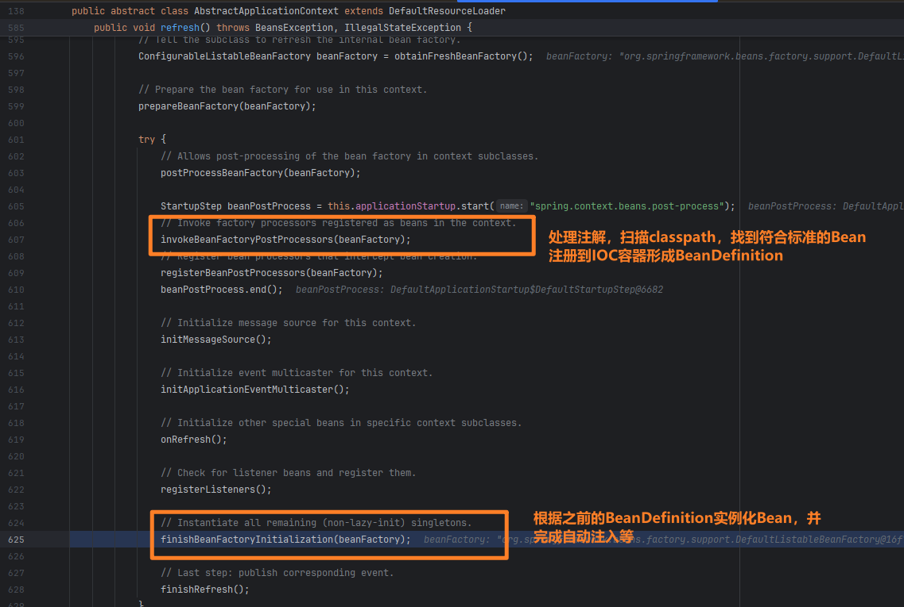

## SpringBoot启动过程的各个阶段

### 启动初始化阶段

`org.springframework.boot.SpringApplication#SpringApplication(org.springframework.core.io.ResourceLoader, java.lang.Class<?>...)`

- **启动点**：Spring Boot应用通常从包含`main`方法的主类开始，该类通常使用`@SpringBootApplication`注解。
- **创建`SpringApplication`实例**：
    - 加载META-INF/spring.factories文件中的实现类并缓存（其中包含自动配置相关实现类）
    - 设置初始化器和监听器（Initializers/Listeners）`ApplicationListeners`和`ApplicationContextInitializers`
      。这些组件会响应特定的应用事件或对上下文进行额外配置。
    - 推断主应用类
    - 确定应用类型（SERVLET、REACTIVE、NONE）

### 环境准备阶段

```java 
Startup startup = Startup.create();
if (this.registerShutdownHook) 
    SpringApplication.shutdownHook.enableShutdownHookAddition();
DefaultBootstrapContext bootstrapContext = createBootstrapContext();
ConfigurableApplicationContext context = null;
configureHeadlessProperty();
SpringApplicationRunListeners listeners = getRunListeners(args);
listeners.starting(bootstrapContext, this.mainApplicationClass);
try {
    ApplicationArguments applicationArguments = new DefaultApplicationArguments(args);
    ConfigurableEnvironment environment = prepareEnvironment(listeners, bootstrapContext, applicationArguments);
    Banner printedBanner = printBanner(environment);
}
```

- 创建和配置环境（Environment）
    - 加载application.properties/application.yml配置文件
        - 先加载bootstrap配置文件（如果使用Spring Cloud）
        - 然后按优先级加载配置文件：
            - 命令行参数
            - Java系统属性
            - OS环境变量
            - application-{profile}.properties/yml（外部）
            - application.properties/yml（外部）
            - application-{profile}.properties/yml（内部）
            - application.properties/yml（内部）
- 加载系统属性和环境变量
- 处理命令行参数
- 打印启动Banner

### 创建并预处理应用上下文阶段

```java 
context = createApplicationContext();
context.setApplicationStartup(this.applicationStartup);
prepareContext(bootstrapContext, context, environment, listeners, applicationArguments, printedBanner);
```

- **创建`ApplicationContext`**
  ：根据应用类型（如Servlet、Reactive）创建具体的上下文实现（如`AnnotationConfigServletWebServerApplicationContext`）。
    - 创建IOC容器BeanFactory(beanDefinitionMap)
- **上下文预处理**
    - 将环境（Environment）设置到应用上下文
    - 添加BeanFactoryPostProcessor
    - 创建BeanDefinitionLoader
    - 添加启动类到IOC容器中（注册主配置类的BeanDefinition）

### 刷新上下文阶段（视应用复杂度而定）

这是最复杂和耗时的阶段，主要完成以下工作：



#### 预刷新

- 处理配置文件和上下文环境中的占位符
-

#### 加载`BeanDefinition`

##### 加载配置

- 处理@Configuration类
- 处理@Import注解，导入配置
- 处理@ImportResource注解，导入XML配置

##### 处理注解

- 处理`@ComponentScan`注解，根据`@ComponentScan`扫描类路径，找到带有`@Component`、`@Service`、`@Repository`、`@Controller`
  等注解的类，注册为bean定义`BeanDefinition`。加载的方式包括注解扫描、XML配置等。
- **处理`BeanFactoryPostProcessor`**：调用所有的`BeanFactoryPostProcessor`，如`ConfigurationClassPostProcessor`
  ，这些处理器可以修改bean定义的元数据。

##### 自动配置

- **处理`@EnableAutoConfiguration`**
  ：加载自动配置类并注册相关bean定义。加载META-INF/spring.factories中的自动配置类，根据条件注解（@Conditional）判断是否需要自动配置

#### 初始化并创建bean

- **初始化单例bean**：Spring容器开始创建和初始化所有单例bean，包括依赖注入、属性设置、初始化方法调用等。
- **处理`@PostConstruct`和`@PreDestroy`注解**：执行生命周期回调方法。

### 启动嵌入式Web服务器

- **启动Tomcat、Jetty或Netty**：如果是一个Web应用，Spring
  Boot会启动嵌入式的Web服务器（如Tomcat）。这个过程包括创建`ServletContext`、注册`DispatcherServlet`等。
- **注册Servlet和Filter**：注册所有的Servlet、Filter和监听器（Listener）。

### 运行应用

- **发布`ApplicationReadyEvent`事件**：此时应用已经准备就绪，可以接受请求或执行其他任务。
- **启动`CommandLineRunner`和`ApplicationRunner`**：如果有实现了`CommandLineRunner`或`ApplicationRunner`
  接口的bean，会在应用启动后立即执行它们的`run`方法。

### 应用运行中

- **处理请求**：对于Web应用，处理来自客户端的HTTP请求。
- **应用运行**：持续运行，等待处理请求或执行其他任务，直到应用被手动停止。

### 关闭阶段

- **发布`ContextClosedEvent`事件**：在应用上下文关闭时，发布事件。
- **销毁单例bean**：调用单例bean的`destroy`方法，清理资源。

### 应用终止

- **释放资源**：关闭所有应用资源，如数据库连接池、线程池等。
- **关闭应用**：关闭应用上下文，停止所有相关服务和组件。

=======================================

PostProcessor（后置处理器）在Spring
Boot中扮演着非常重要的角色，它们允许我们在Bean生命周期的不同阶段对Bean进行修改或增强。这些处理器主要分为两类：BeanPostProcessor和BeanFactoryPostProcessor。

作用：

1. 允许自定义或修改Bean的属性
2. 在Bean初始化前后执行特定的逻辑
3. 替换或修改Bean定义
4. 条件化地修改应用上下文的内部bean工厂

举个例子：
假设我们有一个ConfigurationPropertiesBindingPostProcessor。这个处理器的作用是将配置文件（如application.properties）中的属性值绑定到带有@ConfigurationProperties注解的Bean上。

形象的比喻：
想象Spring Boot是一个大型的玩具工厂，而PostProcessor就像是工厂流水线上的质检员和改装工人。

1. BeanFactoryPostProcessor就像是在玩具设计图纸阶段的质检员。他们可以查看并修改玩具的"设计图"（Bean定义），以确保玩具的设计符合要求。

2. BeanPostProcessor则像是在玩具即将出厂前的改装工人。他们可以在玩具制作完成后，但在送到"商店"（应用程序）之前，对玩具进行最后的调整和改装。

3. 以ConfigurationPropertiesBindingPostProcessor为例，它就像是一个特殊的改装工人，负责给玩具"贴标签"。它会根据"工厂说明书"
   （配置文件）给每个玩具贴上正确的标签（属性值），确保玩具有正确的"参数"。

这些"质检员"和"改装工人"确保了从工厂出来的每个"玩具"（Bean）都是符合规格的，并且具有正确的"配置"和"功能"
。它们的存在使得整个"玩具制作过程"（Spring Boot启动过程）更加灵活和可定制，能够生产出更符合"顾客"（开发者）需求的"玩具"（应用程序）。

PostProcessor模式在Spring框架中的实现主要基于两种设计模式：

1. 观察者模式（Observer Pattern）

2. 模板方法模式（Template Method Pattern）

让我详细解释一下这两种模式如何在PostProcessor中体现：

1. 观察者模式：

PostProcessor本质上是一种观察者模式的实现。在这个模式中：

- Spring容器acts作为主题（Subject）
- 各种PostProcessor acts作为观察者（Observer）

当Spring容器在处理Bean的不同生命周期阶段时，它会通知（调用）相应的PostProcessor。这些PostProcessor"观察"
着Bean的创建和初始化过程，并在适当的时候进行干预。

2. 模板方法模式：

PostProcessor接口定义了一些钩子方法（hook
methods），如postProcessBeforeInitialization和postProcessAfterInitialization。这些方法在Bean的生命周期中的特定点被调用。

Spring提供了这些方法的默认实现（通常是空实现），而具体的PostProcessor可以选择覆盖这些方法来提供自定义行为。这符合模板方法模式的特征，即在抽象类中定义算法的骨架，而将一些步骤的实现延迟到子类中。

举例说明：

```java
public interface BeanPostProcessor {
    default Object postProcessBeforeInitialization(Object bean, String beanName) throws BeansException {
        return bean;
    }

    default Object postProcessAfterInitialization(Object bean, String beanName) throws BeansException {
        return bean;
    }
}

// 自定义PostProcessor
public class CustomBeanPostProcessor implements BeanPostProcessor {
    @Override
    public Object postProcessBeforeInitialization(Object bean, String beanName) throws BeansException {
        // 自定义前置处理逻辑
        return bean;
    }

    @Override
    public Object postProcessAfterInitialization(Object bean, String beanName) throws BeansException {
        // 自定义后置处理逻辑
        return bean;
    }
}
```

在这个例子中，BeanPostProcessor接口定义了处理Bean的模板方法，而CustomBeanPostProcessor实现了这些方法来提供具体的处理逻辑。

这种设计允许Spring框架在不修改核心代码的情况下，通过添加新的PostProcessor来扩展其功能，体现了开闭原则。同时，它也提供了一种灵活的机制来干预和自定义Bean的创建和初始化过程。

## SpringBoot中如何让BeanB在BeanA之前被加载

#### 使用依赖关系

```java 
@Component
public class A {
    @Autowired
    private B b;
}
```

在上面的代码中，从依赖关系上看，A依赖于B，因此要完整的加载A，需要先加载B

#### 使用依赖注解@DepensdOn

```java 

@DepensdOn("B")
@Component
public class A {
    @Autowired
    private B b;
} 

```

使用@DepensdOn注解，可以指定BeanB在BeanA之前被加载。

#### 使用BeanFactoryPostProcessor

SpringBoot中启动过程中，会先执行BeanDefinition的注册，其次再执行非懒加载单例Bean的初始化。但是再这中间会执行BeanFactoryPostProcessor钩子。因此只要在这个PostProcessor中初始化目标Bean，他一定会在所有其他Bean初始化之前完成初始化

```java 

@Component
public class PrimaryBeanPostProcessor implements BeanFactoryPostProcessor {
    
    @Override
    public void postProcessBeanFactory(ConfigurableListableBeanFactory beanFactory) throws BeansException {
        PrimaryBean bean = beanFactory.getBean(PrimaryBean.class);//调用getBean方法即可，如果没有被初始化的Bean，他会根据BeanDefinition进行初始化，然后缓存
        System.out.println(bean);
    }
}

```
