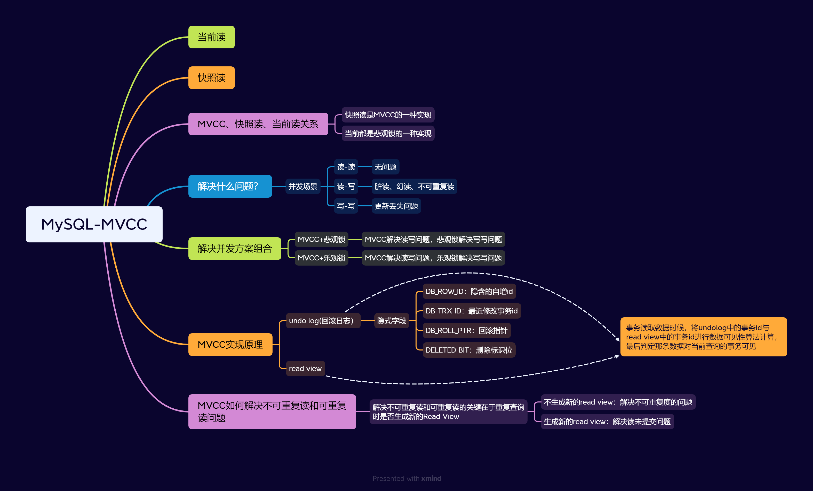
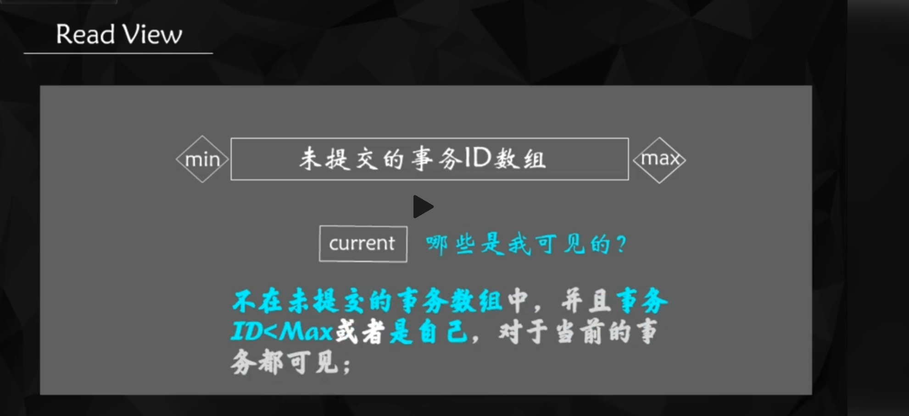
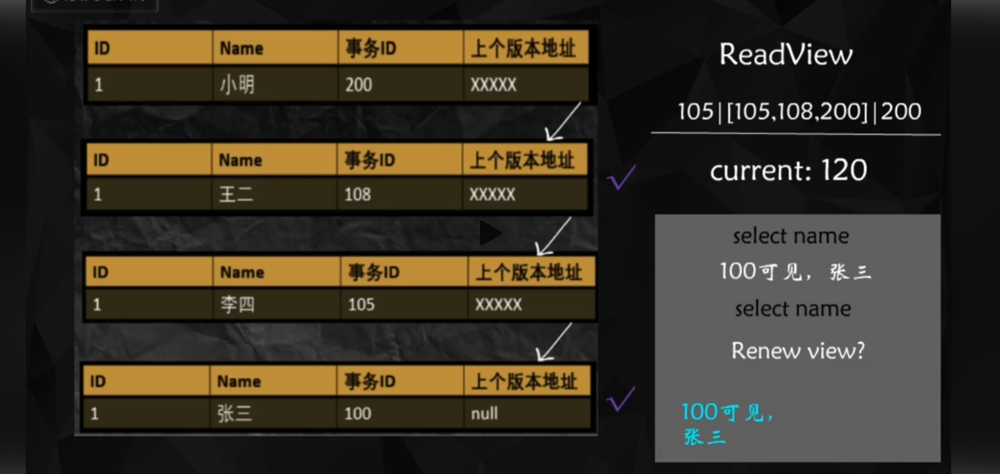

# 什么是MVCC？

MVCC 是多版本并发控制的缩写。它是一种并发控制的方法，一般在数据库管理系统中，实现对数据库的并发访问。它的作用其实就是避免同一个数据在不同事务之间的竞争，提高系统的并发性能

MySQL 的 InnoDB 引擎实现了 MVCC。它是在隔离级别为 读已提交和可重复读
，基于乐观锁理论，通过事务ID和read-view的记录进行比较判断分析数据是否可见，从而使其大部分读操作可以无需加锁，进而 提高并发性能

# MVCC的实现原理

MVCC 的实现原理涉及到几个概念：ReadView、隐藏列、事务链。ReadView 可以理解为数据库中某一个时刻所有未提交事务的快照。InnoDB
存储引擎中，它的聚簇索引记录中都包含两个必要的隐藏列，分别是：trx_id 和
roll_pointer。每次对记录进行修改时，都会记录一条 undo log 信息，每一条 undo log 信息都会有一个 roll_pointer 属性 (INSERT
操作没有这个属性，因为之前没有更早的版本)，可以将这些 undo
日志都连起来，串成一个链表。

在读已提交和可重复读的事务隔离级别下，MVCC 机制的实现就是通过版本控制来完成，核心处理逻辑就是判断所有版本中哪个版本是当前事务可见的处理。这个判断是通过
ReadView 来完成的。ReadView
包含了当前系统活跃的读写事务的信息。如果被访问版本的 trx_id 属性值小于 ReadView 的最小事务 Id，表示该版本的事务在生成
ReadView 前已经提交，所以该版本可以被当前事务访问。如果被访问版本的 trx_id
属性值大于 ReadView 的最大事务 Id，表示该版本的事务在生成 ReadView 后才生成，所以该版本不可以被当前事务访问。如果被访问版本的
trx_id 属性值在 m_ids 列表最小事务 Id 和最大事务 Id
之间，那就需要判断一下 trx_id 属性值是不是包含在 m_ids 列表中，如果包含的话，说明创建 ReadView
时生成该版本的事务还是活跃的，所以该版本不可以访问；如果不包含的话，说明创建 ReadView
时生成该版本的事务已经被提交，该版本可以被访问。

MVCC实现可以重复读和不可重复读两种隔离级别的区别在于。 再次读取时是否重新生成ReadView？ 如果不重新生成。
就是可重复读隔离级别。反之就是读已提交隔离级别

> MySQL使用MVCC实现了可重复度隔离级别。这个隔离级别还无法解决幻读的问题。MySQL是如何解决幻读问题的？

MySQL 使用 Next-Key Locks 来解决幻读问题。Next-Key Locks
是一种锁定方法，它会锁定索引记录以及索引记录之间的间隙。这样，当一个事务在读取一段范围内的数据时，它会锁定这段范围内的所有索引记录以及索引记录之间的间隙。这样，其他事务就无法在这段范围内插入新的数据，从而避免了幻读问题。

例如，假设我们有一个 age 字段，它的值为 1、3、5 和 7。现在有一个事务要读取 age 大于 2 的所有数据。在执行查询操作时，MySQL
会锁定索引记录 3 和 5 以及它们之间的间隙（即 (3,5)
）。这样，其他事务就无法在这段范围内插入新的数据，从而避免了幻读问题。

> 假设我现在有两个事务分别是事务A和事务B。事务A对一个范围内的数据进行查询。事务B在这个范围内插入数据。请你基于这个场景模拟一下。
> MySQL是如何使用间隙锁解决幻读问题的？

假设我们现在有两个事务，分别是事务 A 和事务 B。事务 A 对一个范围内的数据进行查询，而事务 B 在这个范围内插入数据。我们可以按照下面的步骤模拟这个场景。

假设事务 A 开始执行，并且它要查询一个范围内的数据。在执行查询操作时，MySQL
会锁定这个范围内的所有索引记录以及索引记录之间的间隙。这样，其他事务就无法在这个范围内插入新的数据。

假设此时事务 B 开始执行，并且它要在这个范围内插入一条新的数据。由于这个范围内的所有索引记录以及索引记录之间的间隙都被锁定了，所以事务
B 无法在这个范围内插入新的数据。因此，事务 B 会被阻塞，直到事务 A 提交并释放锁。

假设此时事务 A 提交并释放锁。此时，事务 B 可以继续执行，并且它可以在这个范围内插入新的数据。

> MySQL间隙锁的锁定范围的依据是什么？比如它通过什么标准来判断它本次间隙锁锁定的范围是这个范围。而不是更大的范围或者更小的范围。

MySQL 的 Next-Key Locks 锁定范围的依据是查询条件。当你执行一个范围查询时，MySQL 会根据查询条件来确定锁定范围。例如，假设你执行了一个查询语句，它的查询条件是
age > 5。在这种情况下，MySQL 会锁定所有
age 大于 5 的索引记录以及索引记录之间的间隙。

如果你的查询条件更复杂，那么 MySQL 会根据查询条件来确定锁定范围。例如，假设你执行了一个查询语句，它的查询条件是 age > 5 AND
age < 10。在这种情况下，MySQL 会锁定所有 age 大于 5 且小于 10
的索引记录以及索引记录之间的间隙。

总之，MySQL 的 Next-Key Locks 锁定范围的依据是查询条件。它会根据查询条件来确定锁定范围，从而避免幻读问题。

## MVCC ReadView的判断过程

在MySQL的MVCC（Multi-Version Concurrency
Control，多版本并发控制）机制中，ReadView用于在一个事务的生命周期内维护数据一致性，确保事务只能看到它开始时的数据快照，而不会被其他并发事务的更改所影响。这个机制广泛应用于InnoDB存储引擎。

### ReadView的组成部分

一个ReadView由以下几个重要部分组成：

1. **`m_ids`**：表示在创建ReadView时系统中所有活动的事务ID。
2. **`min_trx_id`**：`m_ids`中的最小事务ID。
3. **`max_trx_id`**：当前系统中将要分配给下一个事务的ID。
4. **`creator_trx_id`**：当前创建ReadView的事务ID。

### 数据可见性判断的依据

在使用MVCC读取数据时，InnoDB会创建一个ReadView，并基于这个ReadView判断数据的可见性。判断依据如下：

1. **未提交的数据**：如果数据的事务ID（`trx_id`）等于当前事务的ID（`creator_trx_id`），则可见。
2. **已提交的数据**：如果数据的事务ID小于`min_trx_id`，则可见。
3. **未决事务的数据**：
    - 如果数据的事务ID大于或等于`max_trx_id`，则不可见。
    - 如果数据的事务ID在`m_ids`中，则不可见。
    - 否则，可见。

> 如果数据的事务ID大于或等于max_trx_id，则不可见。” 其中 “事务ID大于或等于max_trx_id"说明了什么？

在MySQL的MVCC机制中，“事务ID大于或等于`max_trx_id`” 这一判断主要是为了确保当前事务不能看到在它之后启动的其他事务所做的更改。具体解释如下：

### 事务ID和max_trx_id的含义

- **事务ID（transaction ID，`trx_id`）**：每个事务在开始时都会分配一个唯一的事务ID。这个ID是递增的，意味着后启动的事务会有更大的事务ID。
- **`max_trx_id`**：这个值表示在创建ReadView时系统中将要分配给下一个事务的ID。换句话说，所有大于或等于`max_trx_id`
  的事务ID都是在当前事务创建ReadView之后才启动的。

### 解释“事务ID大于或等于max_trx_id”

当一个事务创建ReadView时，它希望看到的是当前时刻的数据库状态，而不包括之后的事务对数据库的更改。因此，对于任何大于或等于`max_trx_id`
的事务ID，表示这些事务是在当前事务创建ReadView之后启动的，当前事务不应该看到它们所做的更改。
