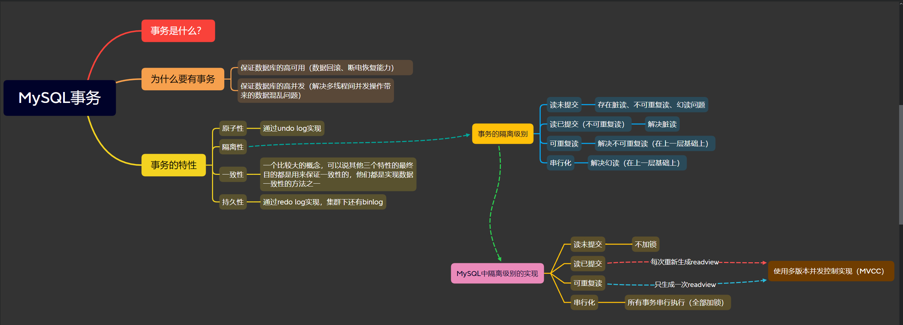
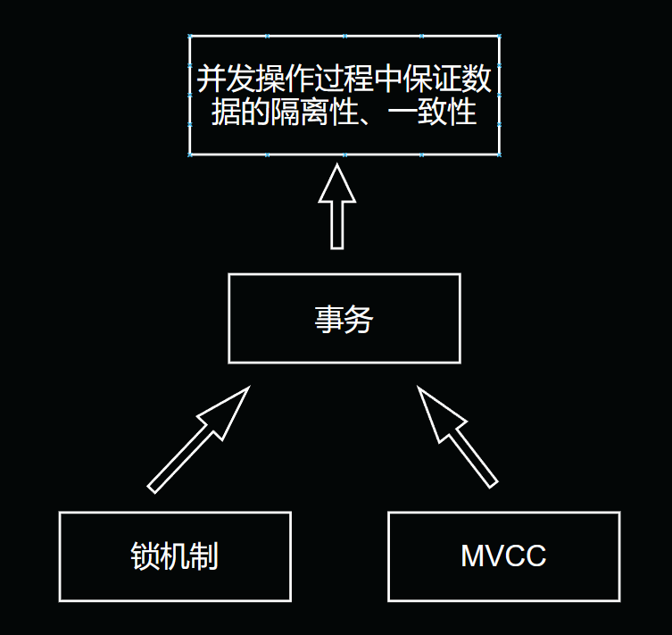

# 事务

事务的标准特征（ACID）

考虑一个场景：账户A向账户B转200元

- 原子性：一个事务必须被视为一个不可分割的最小工作单元，整个事务中的操作，要么全部成功，要么全部失败
- 隔离性：一个事务的操作在没有提交之前，对其他事务是不可见的；比如在没有提交前其他用户看A的账号，始终是没有少这200元的
- 一致性：数据库总是从一个一致性的状态转换到另一个一致性状态，如转账过程中，A账户的钱少了200，则B账户的钱应该要+200；反之就违背了一致性
- 持久性：一旦事务提交，所修改的数据就会永久的保存到数据库中

## 并发情况下事务的问题

在数据库并发场景下，可能会出现脏读、修改丢失、不可重复读和幻读等问题。

**脏读：**指在数据库事务处理过程中，事务A读取了另一个未提交事务B的数据。这种现象可能会导致不一致的结果，因为事务B可能在之后进行了回滚，使得先前A读取的数据无效

**修改丢失：**指在一个事务读取一个数据时，另外一个事务也访问了该数据，那么在第一个事务中修改了这个数据后，第二个事务也修改了这个数据。这样第一个事务内的修改结果就被丢失，因此称为丢失修改。

**不可重复读：**是指在数据库事务处理过程中，一个事务在多次读取同一数据时，由于其他事务的修改导致后续读取的结果与前面的结果不一致

> 比如：
> 假设我们有一个商品库存的数据库，商品A的库存数量为10。
>
> 事务1开始，它读取了商品A的库存数量，得到的结果是10。
> 事务2开始，它将商品A的库存数量减少了5，然后提交了事务，此时商品A的库存数量变为5。
> 事务1再次读取商品A的库存数量，这次得到的结果是5。
> 在这个例子中，事务1在两次读取同一数据时，得到的结果不一致，这就是不可重复读的现象

**幻读：** 是指在数据库事务处理过程中，一个事务在多次执行同一查询时，由于其他事务的插入操作导致后续查询的结果包含了先前不存在的行

> 假设我们有一个订单的数据库，当前有10个订单。
>
> 事务1开始，它查询了订单的数量，得到的结果是10。
> 事务2开始，它插入了一个新的订单，然后提交了事务，此时订单的数量变为11。
> 事务1再次查询订单的数量，这次得到的结果是11。
> 在这个例子中，事务1在两次执行同一查询时，得到的结果不一致，这就是幻读的现象。

> 不可重复读和幻读的区别在于它们针对的数据范围不同。不可重复读是指在同一个事务中，多次读取同一条数据时，由于其他事务的修改提交，导致多次读取的结果不同。而幻读是指在同一个事务中，
> 多次执行相同的查询语句时，由于其他事务的修改提交（如插入新数据），导致多次查询的结果不同。

### 隔离级别

- 读未提交：该级别中，即使事务中的修改没有提交，对其他事务而言这个修改也是可见的；在该隔离级别下，存在脏读、不可重复读和幻读的问题；
- 读已提交（不可重复读）：该级别解决了事务的脏读问题，事务开启到提交前，所做的修改对其他事务都不可见；该级别也叫不可重复读，因为执行两次相同的查询可能会得到不同的结果；
- 可重复读：该级别保证了同一个事务中，多次读取同样记录的结果是相同的；这解决了不可重复读的问题；但无法解决幻读（事务A第一次读取表中记录的过程中事务B向表插入或删除记录，导致事务A再次读取记录时与第一次读取得到的记录数不一致）
- 串行化：最高隔离级别，它保证了每一个事务都是串行的执行，从而解决了幻读的问题

> 问：mysql事务的隔离级别中，不可重复读和可重复读之间的区别是什么？为什么可重复读隔离级别可以解决不可重复读的问题，但是无法解决幻读的问题？
>
> 答：MySQL事务的隔离级别中，不可重复读和可重复读之间的区别在于事务读取数据的方式和范围。
> - 不可重复读：在同一个事务中，两次读取同一条记录，第二次读取的结果会和第一次读取的结果不同。这是因为在第一次读取后，另一个事务修改了该记录并提交了，而在第二次读取时，读取到了修改后的数据。
>
> - 可重复读：在同一个事务中，读取同一条记录的两次操作，第二次读取的结果和第一次读取的结果相同。这是因为在第一次读取后，另一个事务修改了该记录并提交了，
    但是在可重复读隔离级别下，第二次读取会读取到第一次读取时的快照，因此不会看到其他事务提交的修改。
    可重复读隔离级别可以解决不可重复读的问题，因为它使用了事务级别的快照机制，保证了事务内部读取数据的一致性。但是，可重复读隔离级别无法解决幻读的问题。
> - 幻读:
    指的是在同一事务内，对一个范围的数据进行两次查询，第二次查询会发现有新的数据出现，这是因为在事务进行过程中，另一个事务插入了符合第一次查询条件的新数据并提交了。可重复读隔离级别只能保证单行记录的读取一致性，而对于范围的读取，仍然存在并发事务的干扰，因此无法解决幻读问题。
>
> 为了解决幻读问题，需要使用更高级别的隔离级别，如串行化隔离级别。串行化隔离级别会在事务执行时对所有数据进行锁定，保证事务间的互斥性，从而避免幻读的发生。

| 隔离级别 | 脏读 | 不可重复读 | 幻读 |
|------|----|-------|----|
| 读未提交 | ✅  | ✅     | ✅  |
| 读已提交 | ❌  | ✅     | ✅  |
| 可重复读 | ❌  | ❌     | ✅  |
| 串行化  | ❌  | ❌     | ❌  |

# 事务的实现原理

## 事务如何实现原子性

MySQL事务的原子性是通过undo log来实现的。Undo log是一种回滚日志，它记录了数据被修改前的信息。当一个事务执行时，它会在内存中执行，并且在修改数据之前，MySQL会将修改前的信息记录在undo
log中。
如果一个事务在执行过程中发生错误或被用户手动回滚，MySQL会使用undo log中的信息来将数据恢复到修改前的状态。这样，即使事务中的某些操作已经执行，但由于事务记录了undo
log（回滚日志） ，所以这些操作也会被撤销，从而保证了事务的原子性。
总之，MySQL事务的原子性是通过使用undo log来实现的。当一个事务需要回滚时，MySQL会使用undo log中的信息来将数据恢复到修改前的状态，从而保证了事务的原子性。

MySQL使用WAL（Write-Ahead Logging）机制，这意味着在任何数据修改被实际写入磁盘之前，相应的日志必须先被写入。这样做可以确保在发生故障时，数据库可以从日志中恢复到一致的状态。

> 听起来undolog和redolog的功能差不多呀，redolog可以用于恢复事务操作的数据，undolog也可以在事务执行过程发生异常时恢复到之前的数据状态。两者有什么区别吗？

Redo log和undo log都可以用于恢复数据，但它们的用途和实现方式是不同的。 Redo
log是用来保证事务的持久性的。它记录了数据页的修改情况。当MySQL发生崩溃或其他意外时，它可以通过检查redo
log来恢复未提交的事务。Redo log是一种物理日志，它记录了数据页的修改情况。 而undo
log是用来实现事务的原子性的。它记录了数据被修改前的信息。当一个事务在执行过程中发生错误或被用户手动回滚时，MySQL会使用undo
log中的信息来将数据恢复到修改前的状态。这样，即使事务中的某些操作已经执行，但由于事务具有原子性，所以这些操作也会被撤销，从而保证了事务的原子性。
总之，Redo log和undo
log都可以用于恢复数据，但它们的用途和实现方式是不同的。Redo log是用来保证事务的持久性的，而undo log是用来实现事务的原子性的。

> 假设我现在有一个事务。这个事务包含了三条insert语句和一个update语句。请你基于这个场景。完整地描述一下undolog在这个事务中的作用，包括它如何记录？记录的具体内容是是什么？什么时候写入磁盘？在事务出现异常的时候。
> Undo log如何恢复数据？

假设你现在有一个事务，这个事务包含了三条insert语句和一个update语句。在这个场景中，undo log的作用是记录数据被修改前的信息，以便在事务出现异常时能够恢复数据。

当你执行这个事务时，MySQL会在内存中执行这些语句。在执行每条语句之前，MySQL会检查这条语句是否会修改数据。如果会修改数据，那么MySQL会将修改前的数据记录在undo
log中。

例如，在执行update语句之前，MySQL会将被修改的行的原始数据记录在undo log中。同样，在执行insert语句之前，MySQL也会将插入的行的原始数据记录在undo
log中。

这些undo log信息会被逐步写入磁盘，以便在发生崩溃或其他意外时能够使用它们来恢复数据。

如果在执行事务过程中发生异常，例如MySQL崩溃或用户手动回滚事务，那么MySQL会使用undo
log中的信息来将数据恢复到修改前的状态。例如，如果事务中的update语句已经执行，但由于发生异常而需要回滚，那么MySQL会使用undo
log中记录的原始数据来将被修改的行恢复到修改前的状态。

总之，在这个场景中，undo log的作用是记录数据被修改前的信息，并且在事务出现异常时使用这些信息来恢复数据。undo
log会在事务执行过程中逐步写入磁盘，并且在发生异常时用于恢复数据。

> 上面说的undo log逐步写入磁盘，这个逐步能具体解释下吗？是执行一条MDL语句，就会写入一次磁盘？

当我说undo log逐步写入磁盘时，我的意思是undo log信息会在事务执行过程中不断地写入磁盘，而不是在事务提交时一次性写入。

具体来说，当一个事务执行时，它会在内存中执行，并且在修改数据之前，MySQL会将修改前的信息记录在undo log中。这些undo
log信息会被逐步写入磁盘，以便在发生崩溃或其他意外时能够使用它们来恢复数据。

但是，这并不意味着每执行一条DML语句就会写入一次磁盘。实际上，undo log的写入是由InnoDB存储引擎控制的，它会根据系统的负载情况和配置参数来决定何时将undo
log写入磁盘。

总之，当我说undo log逐步写入磁盘时，我的意思是undo
log信息会在事务执行过程中不断地写入磁盘，而不是在事务提交时一次性写入。但具体的写入时间并不是固定的，而是由InnoDB存储引擎根据系统的负载情况和配置参数来决定的。

## 事务如何实现一致性

> 一致性这个点其实比较笼统。 数据库的一致性。 其目的就是为了让数据不出现混乱，始终让数据是有意义的。 比如转账的场景下。
> A给B转账了两百块钱，那a就应该要少两百块钱。B应该要多两百块钱。 从这个角度出发。 之前说的原子性。 隔离性。 持久性。
> 这些特性的最终目的其实就是为了保证数据库中的数据有意义。 也就是一致性。

MySQL 实现事务的一致性是通过使用
ACID（原子性、一致性、隔离性和持久性）事务模型来保证的。其中，一致性是指在事务开始之前和事务结束之后，数据库的完整性约束没有被破坏，也就是说，事务的执行不会破坏数据库的完整性和一致性。

MySQL 实现事务的一致性主要有两种方式：

1. 回滚（Rollback）：如果在事务执行期间出现了错误，MySQL 可以通过回滚操作来撤销事务中已经执行的操作，从而保证数据库的一致性。
2. 提交（Commit）：如果在事务执行期间没有出现错误，MySQL 可以通过提交操作来将事务中的所有操作永久保存到数据库中，从而保证数据库的一致性。

此外，MySQL 还提供了锁机制来保证事务的隔离性，避免多个事务之间相互干扰。同时，MySQL
也会将事务执行过程中的操作记录在日志中，以便在系统崩溃或断电等情况下，可以通过日志来恢复数据，从而保证事务的持久性。

## 事务如何实现隔离性

MySQL的隔离性对应了四个隔离级别。 每一种隔离级别都有其不同的实现。

读未提交：它是性能最好，也可以说它是最野蛮的方式，因为它压根儿就不加锁，所以根本谈不上什么隔离效果，可以理解为没有隔离。

串行化：读的时候加共享锁，也就是其他事务可以并发读，但是不能写。写的时候加排它锁，其他事务不能并发写也不能并发读。

读提交和可重复读。这两种隔离级别是比较复杂的，既要允许一定的并发，又想要兼顾的解决问题。在MySQL中使用MVCC实现了这两个隔离级别

## 事务如何实现持久性

>
假设我现在有一个事务，其中包含三个insert操作。请你基于这个事务，全面细致的分析下这个过程中MySQL事务实现持久性的全部细节。包括redolog、binlog。以及redolog、binlog和被插入数据写入磁盘的顺序和时间。都要全面详细的一步一步的列出来

当你在MySQL中执行一个事务时，其中包含三个insert操作，这些操作会首先在内存中执行。在事务提交之前，MySQL会将这些更改记录在redo
log中。redo
log是一种物理日志，它记录了数据页的修改情况。这就是我们常说的WAL（write ahead log）机制。

当事务提交时，redo log会被写入磁盘以保证持久性。此时，binlog也会记录这些更改。binlog是一种逻辑日志，它记录了对数据的修改操作。

在某个时间点，MySQL会将内存中的更改刷新到磁盘上。这个过程是异步的，并且与redo log和binlog的写入是独立的。

总之，当你执行一个事务时，MySQL会先将更改写入redo log并在事务提交时将其持久化到磁盘上。同时，binlog也会记录这些更改。最后，在某个时间点，MySQL会将内存中的更改刷新到磁盘上。

> "最后，在某个时间点，MySQL会将内存中的更改刷新到磁盘上。" 这里说的某个时间点是一定晚于redolog和binlog的吗?

是的，内存中的更改刷新到磁盘上的时间点一定晚于redo log和binlog的写入。这是因为redo
log和binlog的写入是在事务提交时发生的，而内存中的更改刷新到磁盘上是一个异步的过程，它会在事务提交后的某个时间点发生。

> 基于上面的描述的MySQL持久性机制。如果在redolog还未写入磁盘时，发生宕机其他意外。这个事务会被怎么处理？

如果在binlog还未写入磁盘时，MySQL发生崩溃或其他意外，那么这个事务仍然会被提交。这是因为binlog不是用来保证事务的持久性的，而是用来进行主从复制和数据恢复的。

当MySQL重新启动时，它会检查redo log并执行崩溃恢复。由于redo log已经被写入磁盘，所以这个事务会被恢复。因此，这个事务将被视为已提交，并且对数据库的更改将生效。

但是，由于binlog还未写入磁盘，所以这个事务不会被记录在binlog中。这意味着，在主从复制和数据恢复时，这个事务将不会被复制或恢复。

> binlog和redolog写入磁盘的时间顺序有先后区别吗？还是他们的写入是相互独立的。时间顺序不固定

binlog和redo log的写入是相互独立的，它们的写入时间顺序不固定。

在事务提交时，MySQL会先将更改记录在redo log中，然后将redo log写入磁盘以保证持久性。同时，MySQL也会将更改记录在binlog中。

由于redo log和binlog的写入是异步的，所以它们的写入时间顺序不固定。有时候redo log可能会先写入磁盘，而有时候binlog可能会先写入磁盘。

> redolog和binlog默认情况下，会在事务提交的时候强制刷新一次到磁盘中吗？

在默认情况下，当事务提交时，redo log会被强制刷新到磁盘中，以保证事务的持久性。这就是我们常说的WAL（write ahead log）机制。

而binlog的刷新策略则可以通过设置sync_binlog参数来配置。当sync_binlog设置为1时，MySQL会在每次事务提交时强制将binlog刷新到磁盘中。当sync_binlog设置为大于1的值时，MySQL会在每执行N次事务提交后将binlog刷新到磁盘中，其中N为sync_binlog的值。当sync_binlog设置为0时，MySQL不会强制将binlog刷新到磁盘中，而是依赖于操作系统的缓存刷新策略。

> redolog和binlog的全部区别，请详细列举下

Redo log和binlog是MySQL中两种不同类型的日志，它们之间有以下几个主要区别：

1. 用途不同：Redo log是用来保证事务的持久性的，它记录了数据页的修改情况。当MySQL发生崩溃或其他意外时，它可以通过检查redo
   log来恢复未提交的事务。而binlog是用来进行主从复制和数据恢复的，它记录了对数据的修改操作。
2. 记录内容不同：Redo log是一种物理日志，它记录了数据页的修改内容。而binlog是一种逻辑日志，它记录了对数据的修改操作。
3. 写入方式不同：Redo log和binlog的写入方式也不同。当事务提交时，MySQL会先将更改记录在redo log中，然后将redo
   log写入磁盘以保证持久性。同时，MySQL也会将更改记录在binlog中。由于redo
   log和binlog的写入是异步的，所以它们的写入时间顺序不固定。
4. 配置方式不同：Redo log和binlog也有不同的配置方式。你可以通过设置innodb_log_file_size和innodb_log_files_in_group参数来配置redo
   log的大小和数量。而binlog则可以通过设置max_binlog_size和expire_logs_days参数来配置binlog文件的大小和过期时间。

总之，Redo log和binlog是MySQL中两种不同类型的日志，它们分别用于保证事务的持久性和进行主从复制和数据恢复。

# 事务、锁、MVCC的关系

首先要知道事务到底是一个什么东西？ MySQL的事务指的是多个操作要么全部执行，要么全部不执行，这种操作方式称为事务。这种定义决定了事务包含我们上述的四种特性。
而为了实现它的特性。我们需要借助锁和MVCC。

# 疑难杂症

> MySQL中同一个会话中，事务是否可以并发？

在MySQL中，同一个会话中的事务是不能并发执行的。在同一个会话中，您必须先完成一个事务，才能开始另一个事务。

当您在同一个会话中执行多个事务时，这些事务将按照它们被执行的顺序依次执行。每个事务都必须等待前一个事务提交或回滚后才能开始执行。

> CREATE TABLE test (id INT PRIMARY KEY, value INT);
> INSERT INTO test VALUES (1, 100);
>
> set autocommit = 0;
>
>开启事务1
>
> START TRANSACTION;
> SELECT * FROM test WHERE id = 1 FOR UPDATE;
>
>  开启事务2
>
> START TRANSACTION;
> SELECT * FROM test WHERE id = 1 FOR UPDATE;
>
> 这是我在同一个会话中的测试sql。自动提交开关已关闭，但事务2并没有被阻塞呀。这是为什么呢？

在您的例子中，您在同一个会话中执行了两个START TRANSACTION语句。但是，在MySQL中，当您在同一个会话中执行多个START
TRANSACTION语句时，只有第一个START
TRANSACTION语句会真正地开启一个新的事务。后续的START TRANSACTION语句将被忽略。

因此，在您的例子中，您实际上只开启了一个事务，而不是两个。在这个事务中，您执行了两条SELECT ... FOR
UPDATE语句。由于这两条语句都在同一个事务中执行，所以它们不会相互阻塞。

> 所以在同一个会话当中是没有办法模拟我先开启事务A。排他锁定表T。然后开启事务B再去获取表T中某行数据的排他锁或共享锁这个场景的吗？

是的，在同一个会话中，您无法模拟这种场景。因为在同一个会话中，您必须先完成一个事务，才能开始另一个事务。也就是说，在同一个会话中，不同事务之间是串行执行的，而不是并发执行的。

如果您想模拟这种场景，您可以在两个不同的会话中分别开启事务A和事务B。例如，您可以在会话1中开启事务A并对表T加上排他锁，然后在会话2中开启事务B并尝试对表T中的某行数据加上排他锁或共享锁。在这种情况下，您会发现事务B中的操作将被阻塞，直到事务A释放排他锁为止。