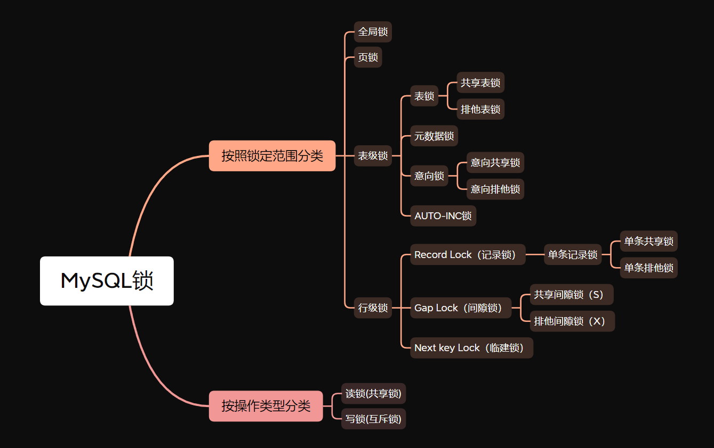
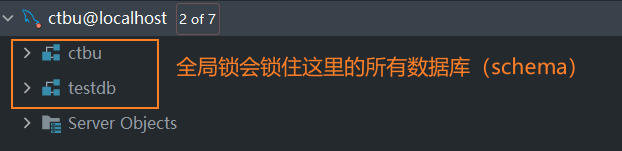

## 一、全局锁

全局锁是对整个数据库实例加锁，MySQL提供了一个全局锁的加锁方式 `flush table with read lock` (FTWRL)
。当数据库实例被加上全局锁后所有数据库实例都会处于只读状态；

- 无法对数据进行增删改操作（DML）
- 无法新增或修改表结构（DDL）
- 无法提交更新类型的事务



全局锁一般用于非InnoDB引擎数据的全表备份。（使用InnoDB引擎的表，可以使用mysqldump + --single-transaction参数进行全表备份）

使用全局锁还有另外一种方式：`set global readonly = true`

两种全局锁实现的区别：

- `set global readonly = true`作为一种标识，可以用于其他场景，因此使用此种方式可能会对其他场景造成影响；
- 执行WFTRL时，如果链接乱开，锁会自动释放。而`set global readonly = true`则不会，数据库会一直处于锁定状态。
- readonly方式对super账号无效

## 页锁

MySQL没有实现页锁

## 表级锁

表级锁是对整个表加锁，表级锁的锁定粒度较大，并发度较低，但加锁和解锁的速度较快，不会出现死锁的情况

#### 表锁

MySQL的表锁分为

- 共享表锁（读锁）
- 排他表锁（写锁）

设现在有两个MySQL会话： 当会话1对表A加读锁后

- 会话1可以继续读取表A的数据，但是无法修改表A的数据
- 会话2可以读取表A的数据，修改表A的数据会被阻塞，直到会话1释放锁

当会话1对表A加写锁后

- 会话1可以继续读取表A的数据，也可以修改表A的数据
- 会话2无法读取表A的数据，也无法修改表A的数据，会被阻塞，直到会话1释放锁

MySQL 的表锁是一种简单的锁机制，它可以防止其他会话对表进行不适当的读写操作。MySQL
支持两种类型的表锁：读锁和写锁。读锁允许多个客户端会话同时在表上获取读锁，而写锁只允许一个会话在表上获取写锁，并且只有该会话才能对表进行读写操作，直到锁被释放1。

你可以使用 LOCK TABLES 语句来显式地获取表锁。例如，要获取一个写锁，你可以这样写：

LOCK TABLES mytable WRITE; 复制 要释放表锁，你可以使用 UNLOCK TABLES 语句。

表锁通常用于模拟事务或在更新表时获得更高的速度。例如，在执行备份操作时，你可以使用 FLUSH TABLES WITH READ LOCK
语句来获取全局读锁，以便安全地执行备份操作。

#### 元数据锁

MySQL 使用元数据锁来管理对数据库对象（包括表、视图、存储过程、函数、触发器、计划事件、表空间等）的并发访问并确保数据一致性。元数据锁不仅适用于表，还适用于模式、存储过程（过程、函数、触发器、计划事件）、表空间、使用
GET_LOCK() 函数获取的用户锁等

当一个会话试图访问一个数据库对象时，它会请求一个元数据锁。如果该锁与现有的锁兼容，则会立即授予该锁；否则，该会话将等待直到锁被释放。例如，当一个会话试图修改一张表的结构时，它会请求一个排他的元数据锁。如果另一个会话已经持有该表的共享元数据锁，则该请求将被阻塞，直到共享锁被释放。

#### 意向锁

意向锁是MySQL InnoDB存储引擎中的一种表级锁,它的主要作用是协调行锁和表锁的关系,提高加锁效率。让我为您详细解释意向锁的作用,并举例说明。

意向锁的主要作用:

1. 预示接下来的操作:
   意向锁表明事务稍后要在表中的某些行上设置某种类型的锁（共享或排他）。

2. 提高加锁效率:
   避免在加表级锁时逐行检查是否有行级锁存在。

3. 实现锁层次:
   在表级别和行级别之间建立一种层次关系,使得锁管理更加高效。

意向锁分为两种:

- 意向共享锁(IS): 表示事务想要获得一张表中某几行的共享锁
- 意向排他锁(IX): 表示事务想要获得一张表中某几行的排他锁

举例说明:

假设我们有一个`employees`表,包含大量员工记录。现在有两个并发的操作:

1. 事务A想要更新id为100的员工记录
2. 事务B想要对整张表加共享锁以进行全表扫描

没有意向锁的情况:
事务B在尝试对表加共享锁时,需要检查表中的每一行是否有排他锁,这个过程非常耗时。

有意向锁的情况:

1. 事务A首先会在表上加意向排他锁(IX),然后在id为100的记录上加行级排他锁。
2. 事务B尝试在表上加共享锁时,会立即发现表上已经有了意向排他锁。
3. 事务B知道表中有些行已经被加了排他锁,因此会等待。

代码示例:

```sql
-- 事务A
START TRANSACTION;
SELECT * FROM employees WHERE id = 100 FOR UPDATE;
-- 这会在表上加IX锁,在id=100的行上加X锁
UPDATE employees SET salary = salary + 1000 WHERE id = 100;
COMMIT;

-- 事务B
START TRANSACTION;
LOCK TABLES employees READ;
-- 这会被阻塞,因为表上已经有IX锁
SELECT * FROM employees;
UNLOCK TABLES;
COMMIT;
```

在这个例子中,意向锁使得事务B能够快速判断是否可以获取表锁,而不需要检查每一行。这大大提高了在大型表上的加锁效率。

总的来说,意向锁通过在表级别提供行级锁信息,优化了锁管理过程,减少了不必要的锁检查,从而提高了数据库的并发性能。

#### AUTO-INC锁

## 行级锁

#### 记录锁

行锁在 MySQL 的 InnoDB 引擎中是基于索引实现的。如果某个加锁操作没有使用索引，那么该锁就会退化为表锁1。

记录锁（Record Locks）是一种行锁，它为某行记录加锁，封锁该行的索引记录。例如，当我们执行 SELECT * FROM table WHERE id = 1 FOR
UPDATE; 时，id 为 1
的记录行会被锁住。需要注意的是：id
列必须为唯一索引列或主键列，否则上述语句加的锁就会变成临键锁。同时查询语句必须为精准匹配（=），不能为>、<、like等，否则也会退化成临键锁1。

#### 间隙锁

间隙锁（Gap Lock）是 InnoDB
在可重复读提交下为了解决幻读问题时引入的锁机制。幻读的问题存在是因为新增或者更新操作，这时如果进行范围查询的时候（加锁查询），会出现不一致的问题，这时使用不同的行锁已经没有办法满足要求，需要对一定范围内的数据进行加锁，间隙锁就是解决这类问题的1。

```sql
create table test
(
    id   int auto_increment
        primary key,
    name varchar(8) null
)
    charset = utf8;

insert into test (id, name)
values (1, '1'),
       (5, '5'),
       (7, '7'),
       (10, '10'),
       (11, '11');
```

> 这是我的建表语句和数据插入语句。请你基于这个表和数据。举一个例子。模拟间隙锁的使用场景

好的，这是一个例子来模拟间隙锁的使用场景：

假设我们有两个事务A和B。在事务A中，我们执行以下语句：

START TRANSACTION; SELECT * FROM test WHERE id > 7 FOR UPDATE; 复制
这个查询语句会锁住id大于7的所有行，也就是id为10和11的行。同时，它还会在id为7和10之间的间隙上加上间隙锁。

现在，在事务B中，如果我们尝试插入一行数据，其id在7和10之间，比如：

START TRANSACTION; INSERT INTO test (id, name) VALUES (8, '8'); 复制 这个插入语句将会被阻塞，直到事务A提交或回滚。这就是一个简单的例子来模拟间隙锁的使用场景

#### 临键锁

临键锁（Next-Key Lock）是MySQL中的一种锁类型，它结合了行锁和间隙锁的特性。它的主要作用是解决幻读（Phantom Read）的问题。

幻读指的是在一个事务中执行相同的查询语句，但结果集却不同，出现了新增或删除的行。临键锁通过在索引记录和索引记录之间的间隙上设置锁来防止幻读的发生。

当MySQL执行范围查询（Range Query）或者使用索引扫描的方式获取数据时，会使用临键锁。具体的场景包括：

- 事务使用WHERE条件执行范围查询时，MySQL会在满足条件的索引记录上加上行锁，并在索引记录和索引记录之间的间隙上加上间隙锁。
- 事务执行INSERT操作时，MySQL会在待插入的位置上加上间隙锁，防止其他事务在同一个间隙插入新行。
- 事务执行SELECT...FOR UPDATE语句时，MySQL会对符合查询条件的索引记录加上行锁，并对索引记录和索引记录之间的间隙加上间隙锁。

# 表锁示例

```sql
# 给表加读锁
lock tables table_name read;
# 给表加写锁
lock tables table_name write;
# 解锁
unlock tables;
# 查看加锁的表
show open tables;
```

设现在有两个MySQL会话：

> 当会话1对表A加读锁后

- 会话1可以继续读取表A的数据，但是无法修改表A的数据
- 会话2可以读取表A的数据，修改表A的数据会被阻塞，直到会话1释放锁

> 当会话1对表A加写锁后

- 会话1可以继续读取表A的数据，也可以修改表A的数据
- 会话2无法读取表A的数据，也无法修改表A的数据，会被阻塞，直到会话1释放锁

> 查看表锁的状态

```sql
# Table_locks_immediate:记录所有请求表锁时，立马获得锁的次数
# Table_locks_waited:记录所有请求表锁时，需要等待后才能获得锁的次数，值越大，说明锁竞争越激烈
show status like 'table%';

```

## 行锁示例

MySQL默认的InnoDB引擎默认使用行级锁；

在MySQL的InnoDB引擎中，对数据表中行记录加锁。默认的修改数据语句：update、delete、insert都会自动给涉及到的数据加上排他行锁。select语句默认不会加任何锁类型，如果要加排他锁可以使用select
…for
update语句，加共享锁可以使用select … lock in share mode语句

注意事项： InnoDB 行级锁是通过给索引上的索引项加锁来实现的。如果不通过索引条件检索数据，InnoDB 会使用表锁而不是行级锁

## 分析行锁状态

```sql
show status like '%innodb_row_lock%';
```

- Innodb_row_lock_current_waits：当前有多少个事务在等待行锁
- Innodb_row_lock_time：从服务器启动到现在，所有事务在等待行锁的时间总和
- Innodb_row_lock_time_avg：从服务器启动到现在，所有事务在等待行锁的平均时间
- Innodb_row_lock_time_max：从服务器启动到现在，所有事务在等待行锁的最大时间
- Innodb_row_lock_waits：从服务器启动到现在，所有事务在等待行锁的次数

## innoDB存储引擎下，什么情况下MySQL会自动使用表锁

在InnoDB存储引擎下，MySQL通常使用行级锁来提高并发性能，但在某些特定情况下会自动使用表锁。以下是一些常见的场景：

1. **DDL操作**：当执行`ALTER TABLE`、`DROP TABLE`等DDL语句时，InnoDB会自动对表加上表级锁，以确保表结构的修改不会与其他事务冲突¹²。

2. **崩溃恢复**：在崩溃恢复过程中，InnoDB可能会使用表级锁来确保数据的一致性和完整性²。

3. **没有使用索引的查询**：如果查询没有使用索引，InnoDB可能会退化为使用表锁而不是行锁¹。

4. **元数据锁（MDL）**：从MySQL 5.5版本开始，InnoDB引入了元数据锁（MDL）。在执行增删改查操作时，MySQL会自动加上MDL锁，以防止在操作过程中发生表结构变更²。

这些自动加锁机制有助于确保数据的一致性和完整性，但在高并发环境下可能会影响性能。因此，了解这些机制并合理设计数据库和查询是非常重要的。


## MySQL中行级锁是什么时候会被使用到？

在MySQL的InnoDB存储引擎中，行级锁主要在以下情况下被使用：

1. **通过索引条件检索数据**：当查询条件使用了索引（如主键或二级索引），InnoDB会使用行级锁来锁定相关的行。这种方式可以提高并发性能，减少锁冲突¹²。

2. **更新或删除特定行**：当执行`UPDATE`或`DELETE`语句并且条件使用了索引时，InnoDB会对匹配的行加锁²。

3. **插入操作**：在插入新行时，InnoDB会对插入点加锁，以防止其他事务在同一位置插入数据²。

4. **间隙锁（Gap Lock）**：在某些情况下，如范围查询或防止幻读，InnoDB会使用间隙锁，这也是一种行级锁²。

需要注意的是，如果查询条件没有使用索引，InnoDB将退化为使用表锁而不是行级锁³。


## MySQL中的乐观锁和悲观锁是什么？怎么实现的 ？什么场景下会使用到乐观锁和悲观锁？

在MySQL中，乐观锁和悲观锁是两种处理并发控制的策略，它们在不同的场景下有着各自的优势和应用。

**乐观锁**是一种基于数据版本控制的锁机制，它假设多事务间的数据冲突发生的概率较小，通常适用于读多写少的场景。乐观锁的实现方式之一是通过在数据库表中增加一个`version`字段，当数据被读取时，`version`值一同被读出。在更新数据时，会检查当前数据库中的`version`值是否与之前读取的值相等，如果相等，则执行更新并将`version`值增加；如果不相等，说明数据在读取后已被其他事务修改，此时更新操作将不会执行。这种方法避免了长事务中的数据库加锁开销，提高了系统的整体性能表现。

**悲观锁**则是一种更为保守的并发控制方式，适用于写多读少的场景。悲观锁假设在数据处理过程中，数据很可能被其他事务修改，因此在数据被读取后立即将其锁定，直到事务结束。在MySQL中，悲观锁可以通过`SELECT ... FOR UPDATE`语句实现，这会锁定符合条件的所有行，其他事务必须等待这些行被解锁后才能进行修改。例如，在商品下单的场景中，如果需要确保商品的状态在下单过程中不被其他事务修改，可以使用悲观锁来保证数据的一致性。

在选择使用乐观锁还是悲观锁时，需要根据具体的业务场景和数据操作的特点来决定。如果系统中的读操作远多于写操作，并且数据冲突的可能性较小，乐观锁是一个较好的选择。相反，如果写操作较为频繁，或者对数据一致性有较高要求的场景，悲观锁可能更为合适。在实现时，乐观锁通常在应用层面通过代码逻辑来控制，而悲观锁则可以依赖数据库本身的锁机制来实现。


## 有没有可能在更新数据的时候检查version一致，此时要执行最终的更新，但是此时其他时候修改了数据，并修改了version字段。此时如何保证本次更新被放弃呢？我的意思是，在已经校验version字段之后，其他事务更新了数据，此时这次更新本应该被放弃的吧？

确实，您描述的情况是可能发生的，这种情况通常被称为“lost update”问题，它是并发事务中的一个经典问题。在乐观锁的实现中，当一个事务读取数据和版本号后，但在它提交更新之前，另一个事务可能已经更新了数据并修改了版本号。如果第一个事务在提交时没有再次检查版本号，它就会执行更新，覆盖第二个事务所做的更改。

为了防止这种情况，乐观锁的更新操作通常遵循以下步骤：

1. **读取数据和版本号**：事务A开始，并读取数据及版本号V。

2. **业务处理**：事务A进行业务逻辑处理，准备更新。

3. **检查并更新**：在提交更新之前，事务A再次检查版本号。如果版本号V仍然匹配数据库中的当前版本号，则执行更新操作，并将版本号V增加（例如，V+1）。

4. **提交事务**：如果版本号匹配，事务A提交更改。如果版本号不匹配，事务A知道在它读取数据后有其他事务已经更新了数据，因此它应该放弃更新并可能重试或回滚。

5. **使用数据库的原子性操作**：在执行更新时，使用SQL语句确保检查和更新是原子操作。例如，使用带有条件的更新语句：
   ```sql
   UPDATE your_table
   SET data_column = new_data_value, version_column = version_column + 1
   WHERE id = your_id AND version_column = your_version;
   ```
   这条SQL语句的意思是：“如果`id`是你指定的ID，并且`version_column`等于你读取的版本号，则更新`data_column`并增加`version_column`。”

6. **检查更新结果**：大多数数据库在执行更新操作后会返回一个受影响的行数。如果受影响的行数为0，这意味着版本号在读取数据后已经被其他事务更改，当前事务应该放弃更新。

7. **异常处理**：在应用层面，如果检测到版本号不匹配，应该有一个明确的异常处理机制，比如重试逻辑或者回滚事务。

通过这种方式，即使在读取数据后其他事务更新了数据，当前事务也会检测到版本号不匹配，并放弃更新，从而避免了数据的不一致性。这是乐观锁的核心优势之一，它允许系统在大多数没有冲突的情况下无锁运行，只有在检测到冲突时才采取行动。


## 悲观锁是读锁还是写锁？

悲观锁通常是指在数据库操作中，为了确保数据一致性，在读取和修改数据时采取的一种锁定机制。悲观锁可以细分为两种类型的锁：

1. **共享锁（Shared Lock，简称S锁）**：这是一种读锁。当一个事务对数据加上共享锁后，其他事务可以读取这行数据，但是不能修改，只有加锁的事务可以进行读取操作。共享锁主要用于解决读-读并发的情况，允许多个事务并发读取同一数据，但不能同时进行写操作。

2. **排他锁（Exclusive Lock，简称X锁）**：这是一种写锁。当一个事务对数据加上排他锁后，其他事务既不能读取也不能修改这行数据，只有加锁的事务可以进行读取和修改操作。排他锁主要用于解决写-写并发的情况，确保在数据被修改时，不会有其他事务干扰。

在实际应用中，悲观锁的实现通常依赖于数据库的锁机制。例如，在MySQL的InnoDB存储引擎中，悲观锁可以通过以下方式实现：

- 使用`SELECT ... FOR UPDATE`语句来加排他锁，这会锁定选定的行，其他事务必须等待这些行被解锁后才能进行读取或修改。
- 使用`SELECT ... LOCK IN SHARE MODE`语句来加共享锁，这会锁定选定的行，允许其他事务读取但不能修改。

悲观锁的名称来源于它对事务冲突的态度——悲观地预期到数据冲突的可能性，因此在操作前先进行锁定，以保证数据操作的安全性。这种锁适用于写操作较为频繁的场景，可以有效地避免数据的并发问题，但同时也可能降低系统的并发性能，因为其他事务需要等待锁的释放。
