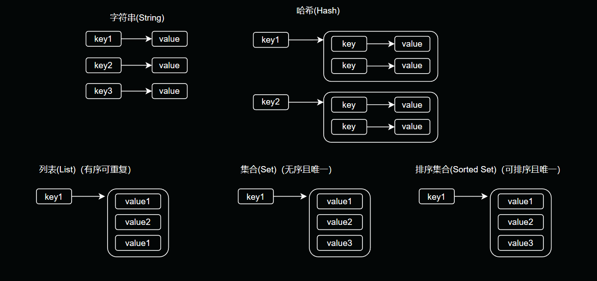

# 一、基本数据类型

## 1.1 字符串

1. set - 设置key的值；若key存在，覆盖旧值无视类型，成功返回OK(注意大写OK，很多框架封装返回的值改变了，不要被误导了)

2. get - 获取指key值；若key不存在，返回nil(不是null,不要搞错)

3. mset - 同set一致，批量设置键值对，减少网络开销

4. mget - 同get一致，批量获取键值对，减少网络开销

5. incr - key值+1，不存在则先set后incr，返回integer切记值必须能标识为数字

6. incrby - 同incr一致，多出一个指定数字增量值

7. decr - 同incr原理一致，操作方式变为了减法

8. decrby - 同incrby原理一致，操作方式变为了减法

9. strlen - 获取长度len，若不存在返回0，类型为integer

10. setnx - 设置key值，若key不存在，则返回1，否则返回0。(若场景需要设置过期时间，不推荐使用这个命令，网络波动情况下，有可能setnx成功，expire却失败了，不是原子操作)

11. setex - 设置key值及过期时间，若key已存在，则替换旧值覆盖。(若需要set值且需设置过期时间且要求较高必须要有过期时间，推荐使用这个命令，设置key值+过期时间是原子操作，要么成功要么失败)

12. append - 对key值进行末尾追加数据，返回值是字符串长度

### 1.1.1 使用场景

1. 缓存：将结构体json序列化成字符串，然后将字符串保存在redis的value中，将结构体的业务唯一标示作为key；
   这种保存json的用法用的最多的场景就是缓存用户信息，将用户bean信息转成json再序列化为字符串作为value保存在redis中，将用户id作为key。
   从代码中获取用户缓存信息就是一个逆过程，根据userid作为key获取到结构体json，然后将json转成java bean。

2. 计数器：您可以使用INCR和DECR命令来对字符串类型的键进行原子增减操作，从而实现计数器功能。

3. 限制请求次数

4. 分布式session保持

## 1.2 哈希

### 1.2.1 使用场景

1. 存储对象：哈希类型可以用于存储和表示对象，其中哈希的字段可以对应对象的属性，字段的值可以是对象的属性值。这对于存储和读取复杂的结构化数据非常有用。

2. 用户信息：哈希类型适合存储用户信息，例如用户名、电子邮件、年龄等。每个用户可以使用一个独立的哈希，使得存储和检索用户信息更加方便和高效。

3. 配置项：如果需要存储一组配置项，可以使用哈希类型。每个配置项可以作为哈希的一个字段，并且可以通过字段名快速检索和更新配置。

4. 计数器：可以使用哈希类型来实现计数器功能。每个哈希字段可以表示不同的计数器，例如网站的访问计数、点赞计数、评论计数等。

5. 缓存数据：哈希类型可以用于缓存复杂的数据结构，如序列化对象、JSON 数据等。通过将数据存储为哈希类型，可以提高缓存的读取效率。

6. 实时统计数据：如果需要实时统计数据，例如网站访问次数、用户活跃度等，哈希类型可以用于存储统计数据。每个哈希字段可以表示不同的统计指标，例如每天的访问次数、每小时的用户活跃度等。

## 1.3 列表

### 1.3.1 使用场景

## 1.4 集合

### 1.4.1 使用场景

## 1.5 排序集合

### 1.5.1 使用场景

# 二、特殊数据类型

## 2.1 HyperLogLogs

Redis HyperLogLog 是用来做基数统计的算法，它的优点是，在输入元素的数量或者体积非常大时，计算基数所需的空间总是固定的、并且是很小的。在 Redis 里面，每个 HyperLogLog 键只需要花费 12 KB
内存，就可以计算接近 2^64 个不同元素的基数。

### 2.1.1 使用场景

HyperLogLog 主要的应用场景就是进行基数统计。例如，对于 Google 主页面而言，同一个账户可能会访问 Google 主页面多次。于是，在诸多的访问流水中，如何计算出 Google
主页面每天被多少个不同的账户访问过就是一个重要的问题。对于这种场景，可以使用 HashMap、BitMap 和 HyperLogLog 来解决。其中，HyperLogLog 存在一定误差，但占用内存少，稳定占用 12k 左右内存，可以统计
2^64 个元素。

基数统计是指统计一组数据中不同元素的数量。例如，假设有一组数据 [1, 2, 3, 3, 4, 5, 5]，那么这组数据的基数就是 5，因为它包含了 5 个不同的元素：1、2、3、4 和 5。

一个具体的例子是网站的日活跃用户数统计。假设一个用户在一天内访问了网站多次，那么在统计日活跃用户数时，这个用户只能算作一个用户。因此，可以使用基数统计来统计网站的日活跃用户数。

## 2.2 Bitmaps

在 Redis 中，可以把 Bitmaps 想象成一个以比特位为单位的数组，数组的每个单元只能存储 0 和 1，数组的下标在 Bitmaps 中叫做偏移量。需要注意的是：Bitmap 在 Redis 中并不是一个新的数据类型，其底层是
Redis 实现。

### 2.2.1 使用场景

Bitmaps 可以用于各种实时分析，例如存储与对象 ID 关联的布尔信息。例如，你想知道自己网站用户的最长连续访问天数。另一个常见的使用场景是用户签到功能。很多网站都提供了签到功能，并且需要展示最近一个月的签到情况，这种情况可以使用
Bitmap 来实现。根据日期 offset = （今天是一年中的第几天） % （今年的天数），key = 年份：用户 id。

## 2.3 Geospatial

1. geoadd：添加地理位置的坐标。

2. geopos：获取地理位置的坐标。

3. geodist：计算两个位置之间的距离。

4. georadius：根据用户给定的经纬度坐标来获取指定范围内的地理位置集合。

5. georadiusbymember：根据储存在位置集合里面的某个地点获取指定范围内的地理位置集合。

6. geohash：返回一个或多个位置对象的 geohash 值。

### 2.3.1 使用场景

Geospatial主要用于存储地理位置信息，并对存储的信息进行操作，该功能在 Redis 3.2 版本新增。