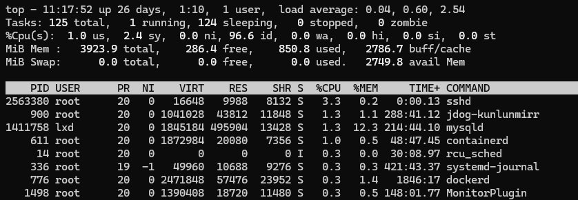

## linux服务器磁盘、cpu拉满排查

排查思路主要为：

- top命令查看cpu占用情况
- df、du命令查看磁盘使用情况

#### 查看CPU占用情况

使用top命令查看cpu、内存、磁盘使用情况，查看是否有进程占用cpu、内存、磁盘。定位到消耗cpu最厉害的进程



> 要查看指定目录的磁盘占用情况，可以使用 `du`（disk usage）命令。`du` 命令可以递归地计算目录或文件的磁盘使用情况，并以多种格式输出结果。

#### 查看指定目录的总磁盘占用

要查看某个目录的总磁盘占用情况，可以使用以下命令：

```bash
du -sh /path/to/directory
```

- `-s`：显示目录的总计信息，而不是每个文件或子目录的详细信息。
- `-h`：以人类可读的格式显示输出，例如 KB、MB、GB。

示例：

```bash
du -sh /var/log
```

输出将显示 `/var/log` 目录的总大小，例如：

```
450M    /var/log
```

#### 查看目录及其子目录的磁盘占用

如果你想查看目录及其每个子目录的磁盘占用情况，可以去掉 `-s` 选项：

```bash
du -h /path/to/directory
```

示例：

```bash
du -h /var/log
```

输出将显示 `/var/log` 目录下每个子目录及文件的大小，例如：

```
4.0K    /var/log/private
16K     /var/log/apt
450M    /var/log
```

#### 查看目录的前 N 大文件和子目录

要查看目录中占用空间最大的 N 个文件或子目录，可以结合 `du` 和 `sort` 命令：

```bash
du -ah /path/to/directory | sort -rh | head -n N
```

- `-a`：显示目录中所有文件和目录的大小。
- `-r`：逆序排序（从大到小）。
- `head -n N`：只显示前 N 个结果。

示例：

```bash
du -ah /var/log | sort -rh | head -n 10
```

输出将显示 `/var/log` 目录中前 10 个占用空间最大的文件或子目录。

#### 查看目录的深度级别

如果你只想查看某个深度的目录大小，可以使用 `--max-depth` 选项。例如，查看指定目录下第一层子目录的大小：

```bash
du -h --max-depth=1 /path/to/directory
```

示例：

```bash
du -h --max-depth=1 /var/log
```

输出将显示 `/var/log` 目录及其每个一级子目录的大小。

#### 总结

- 使用 `du -sh /path/to/directory` 查看指定目录的总磁盘占用。
- 使用 `du -h /path/to/directory` 查看目录及其子目录的详细磁盘占用。
- 使用 `du -ah /path/to/directory | sort -rh | head -n N` 查看占用空间最大的 N 个文件或目录。
- 使用 `du -h --max-depth=1 /path/to/directory` 查看指定深度的目录大小。

## linux服务器仅cpu飙高

linux服务器cpu高占用，我使用top命令筛选出来了几个cpu占用高的进程，如何查看进程的详细信息？

```shell
ps -p <PID> -o pid,ppid,cmd,%cpu,%mem,etime,stat
```

排查下来是一个springboot应用，如何继续分析具体是什么原因导致的CPU飙高？

可以通过以下步骤分析Spring Boot应用导致CPU飙高的原因：

1. **线程分析**：
   使用`jstack`命令获取线程堆栈，找到占用CPU高的线程。
   ```bash
   jstack <PID> > thread_dump.txt
   ```

2. **查找高CPU线程**：
   通过`top`命令切换到线程视图，找到占用CPU高的线程ID（TID）。
   ```bash
   top -H -p <PID>
   ```

3. **TID转为十六进制**：
   将找到的TID转换为十六进制。
   ```bash
   printf "%x\n" <TID>
   ```

4. **定位问题代码**：
   在生成的`thread_dump.txt`中搜索十六进制的TID，分析对应的线程堆栈，找到可能导致CPU飙高的代码位置。

这样你可以确定具体的代码或线程导致了高CPU使用。

显示 5420:28 Druid-Connectio占用CPU最大

出现这种情况，说明是`Druid-Connection`线程占用了大量CPU。你可以通过以下步骤进一步排查问题：

1. **分析堆栈信息**：
   通过`jstack`抓取堆栈信息，定位`Druid-Connection`线程的具体执行位置。
   ```bash
   jstack <PID> | grep -A 30 "Druid-Connection"
   ```

   这样可以看到该线程在执行的代码堆栈。

2. **检查数据库连接池**：
    - 确认数据库连接池配置是否合理，例如最大连接数、连接超时时间等。
    - 检查是否存在数据库连接泄漏或频繁的连接创建和销毁，这可能导致`Druid`线程的高CPU使用。

3. **监控数据库性能**：
    - 通过数据库管理工具查看当前SQL执行情况，是否存在慢查询或长时间占用连接的SQL语句。
    - 确认数据库是否有性能瓶颈，导致线程等待时间过长。

4. **优化代码**：
    - 如果是因为频繁的数据库操作导致的，可以考虑优化代码，减少不必要的数据库查询或更新操作。
    - 使用Druid的监控功能，分析具体的SQL性能，并针对性地进行优化。

通过上述步骤，你可以进一步定位和解决`Druid-Connection`线程导致的CPU飙高问题。

## React出现渲染错误后再次调用setState等触发组件重新渲染的方法，组件依然不会重新渲染

react-dom.development.js:14887 Uncaught Error: Objects are not valid as a React child (found: object with keys {success,
data}). If you meant to render a collection of children, use an array instead.

在react中发生了上面的错误之后，即使我在调用一些更新组件的方法比如useState钩子等组件也不再重新渲染。这是为什么？

你遇到的错误是 `Objects are not valid as a React child`，这是因为在 JSX 中，不能直接渲染一个对象。你需要确保渲染的内容是
React 可接受的类型，比如字符串、数字、React 元素或数组等。

### 错误的根本原因：

在 JSX 中，试图渲染一个对象，比如 `{success, data}`，会导致 React 抛出错误，提示对象不能作为子元素直接渲染。通常，这种错误是由于误操作将对象直接放到了
JSX 的输出中，可能在 `return` 中或者在某个渲染函数里。

### 代码示例：

假设你有这样一段代码：

```js
const result = {success: true, data: {name: 'John'}};

return (
    <div>
        {result} {/* 这会导致错误 */}
    </div>
);
```

在这里，`result` 是一个对象，React 不知道如何渲染它，因此会抛出错误。

### 如何修复：

确保你只渲染 React 能处理的类型。如果你想显示对象中的某些值，你需要提取这些值。例如：

```js
const result = {success: true, data: {name: 'John'}};

return (
    <div>
        Success: {result.success.toString()} {/* 渲染 success */}
        Name: {result.data.name} {/* 渲染 name */}
    </div>
);
```

### 为什么 `useState` 等钩子不再触发组件重新渲染？

通常，出现这种错误时，React 会停止组件的更新，因为 JSX 渲染过程中遇到了致命的错误，阻止了后续的更新。即使你调用了 `useState`
钩子，React 也无法继续更新组件，导致 UI 不再重新渲染。

### 如何解决：

1. **确保没有 JSX 渲染错误**：检查所有的 JSX 输出，确保没有渲染对象或无效的数据类型。
2. **调试输出**：使用 `console.log` 确认你要渲染的值是 React 能接受的类型。
3. **捕获异常**：如果你不确定数据的格式，使用条件渲染或类型检查来防止错误：
   ```js
   return (
     <div>
       {typeof result === 'object' ? JSON.stringify(result) : result}
     </div>
   );
   ```

这样可以避免直接渲染对象时的错误，并确保在数据出现问题时，组件仍然能保持正常的运行。
