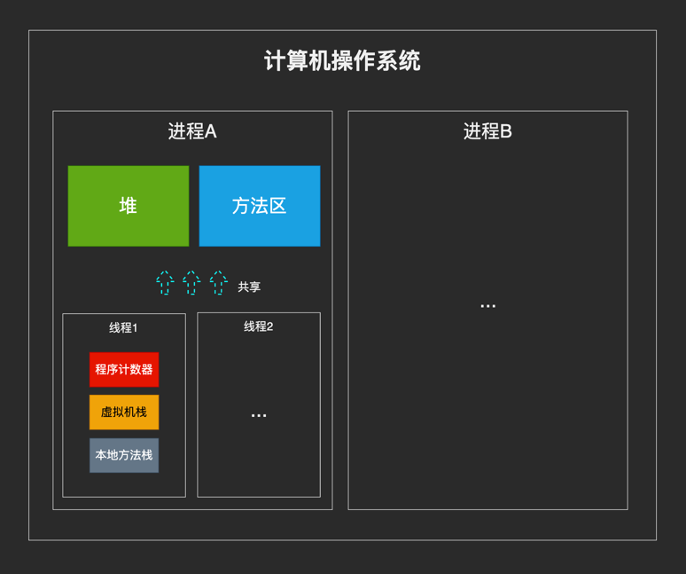
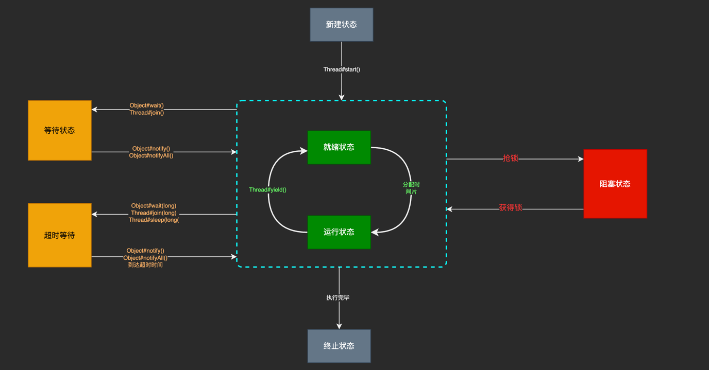
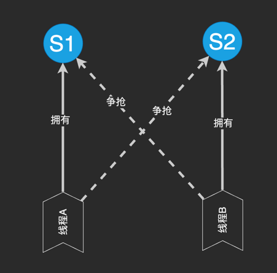
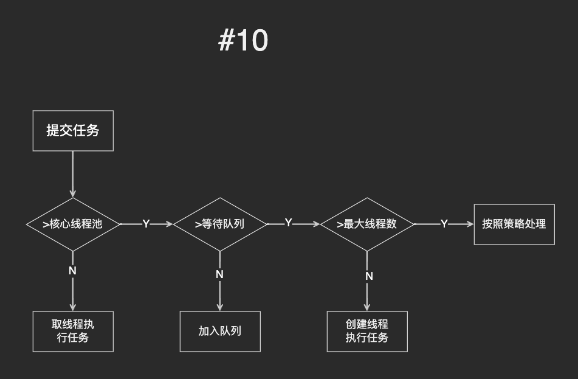
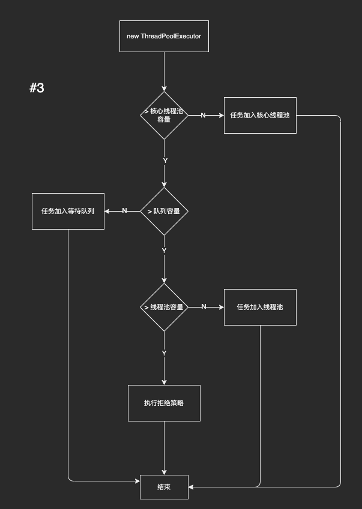
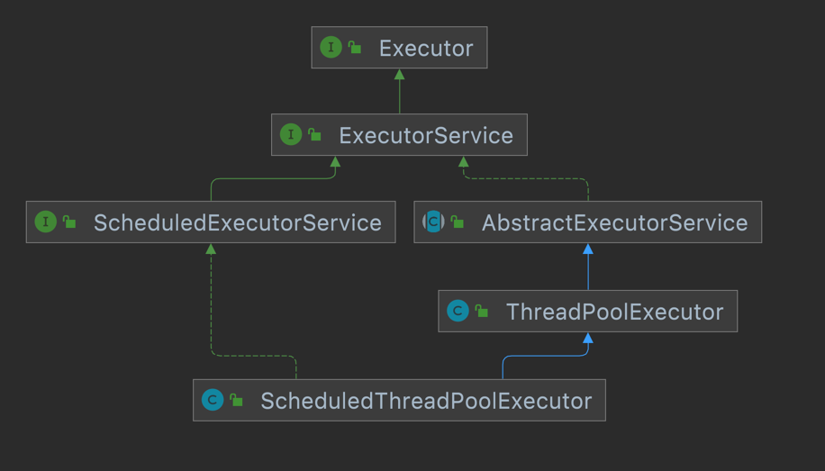

# Java多线程

## 1、程序、进程与线程

1. 程序：实际上，在我们的电脑上使用的各种软件就是程序，QQ、LOL，开发工具idea，这些统统都叫程序
2. 进程：当上面说的程序真正运行起来的时候，程序就变成了电脑上的进程。我们可以通过任务管理器查看到；在java中，启动了一个main函数时，其实就启动了JVM进程；而main函数就是JVM中的一个线程
3. 线程：一个程序中包含多个线程，比如一个视频播放器在运行的时候同时调用了视频节码和声卡，他们两个都在一起运行，这就是线程的功劳。又比如说，在浏览器中打开了多个网页，这时候其实一个网页就是一个线程。

### 1.1 进程与线程的联系

1. 进程与进程之间相对独立，相互之间比较隔离；但是同类线程之间却共享进程的堆栈及方法区资源
2. 每个线程同时拥有自己的程序计数器、虚拟机栈、本地方法栈
3. 系统在线程之间切换要比在进程之间切换高效的多；因此多线程拥有跟好的效率优势

_图1_



## 2 并发与并行

- 并发：多个线程在同一时间段内同时进行
- 并行：多个线程在同一时间点上同时运行

并行一般需要多cpu或多内核支持


## 3 使用多线程的好处

- 单核心：线程A被阻塞后，线程B可以继续使用CPU；反之，单线程中，线程A被阻塞后则整个系统处于阻塞状态；因此多线程可以提高cpu利用率
- 多核心：除了拥有单核心说过的优势外，多线程在多核心中可以真正意义上的线程并行；且多线程在多核心上处理任务可以更快；原本一个线程10min中处理，多核心n个线程同时处理只需10/n （min）即可

## 4 线程状态及状态间的转换

### 4.1 线程状态如下表：

|状态|说明|
|---|---|
|new|新建状态，此时线程已经被构建出来，但并未启动（没有调用start方法）|
|ready|就绪状态，此时线程已经启动，并且就绪，只要cpu分配时间片就可以执行|
|runnable|运行状态，线程处于执行中|
|blocked|阻塞状态，线程被挂起，无法继续执行（属于被强制搁置的情况）|
|waiting|等待状态，线程等待其他线程给出通知后才能做出其他响应|
|time_waiting|超时等待状态，有时间限制的等待状态，超过时间限制后会自动唤醒|
|terminated|终止状态，表示线程已经执行完毕|

### 4.2 线程在各状态之间的转换



## 5 线程的上下文切换

线程在执行的过程中拥有自己的状态（上下文），如程序计数器的值，虚拟机栈的状态等；当出现如下情况的时候，线程会从cpu中退出：

- 主动让出cpu，如调用了sleep(),wait()方法等
- 时间片使用完，操作系统为防止线程长时间占用cpu，进而导致其他线程无法运行
- 调用了阻塞类型的系统调用，例如IO操作；
- 线程运行结束

前3种情况都会发生线程切换，比如A线程时间片使用完，系统切换到B线程运行，B运行完毕后重新切换为A线程，此切换过程即为上下文切换；切换过程要保留A线程的运行现场，并加载B线程上次运行的状态；因此上下文切换是需要消耗时间的；频繁的上下文切换会导致性能的下降

## 6 线程死锁

线程死锁表现为，多个线程争抢某一资源S，而S被其他线程保持且不释放；导致所有线程都无限等待下去；进行整个进程处于无限阻塞的状态；



## 6.1 死锁产生的条件（4个都要满足）

- 互斥：资源任意时刻上只能被一个线程占用
- 请求保持：线程拥有资源且保持拥有状态不释放
- 不可剥夺：线程拥有的资源不可被强制剥夺，只能自己释放
- 循环等待：线程之间形成保持自己资源又请求其他线程资源的循环状态

## 6.2 避免死锁产生，破坏其条件

- 破坏请求保持条件：一次性请求所需的所有资源
- 破坏不可剥夺条件：若请求不到需要的资源，可以先释放自己的资源
- 破坏循环等待条件：按一定逻辑顺序进行资源请求，避免出现循环等待

## 6.3 线程sleep()方法与wait()方法的

- sleep()方法没有释放锁，而wait()方法会释放锁
- 两者都可以暂停线程的执行
- wait()常用于线程之间的通信、sleep()用于单纯的线程暂停
- wait() 方法被调用后，线程不会自动苏醒，需要别的线程调用同一个对象上的 notify() 或者 notifyAll()方法。sleep()方法执行完成后，线程会自动苏醒。或者可以使用 wait(long timeout)
  超时后线程会自动苏醒。

## 7 synchronized关键字

### 7.1 使用方式

#### 7.1.1 修饰实例方法

```java
public synchronized void method(){
        //业务代码
        //此方式锁资源为调用当前方法的实例对象自己
        }
```

#### 7.1.2 修饰静态方法

```java
synchronized static void method(){
        //业务代码
        //此时锁资源为当前类的class对象
        }
```

#### 7.1.3 同步代码块

```java
synchronized(this/类.class){
        //业务代码
        //此时锁对象可以自定义
        }
```

### 7.2 锁升级过程

[详细请看此链接](https://www.cnblogs.com/wuqinglong/p/9945618.html)

## 8 volatile关键字

### 8.1 CPU内存模型

cpu缓存是为了解决cpu的计算于内存的读取速度不匹配的问题，中间加入缓存以此提高运行效率


### 8.2 volatile的作用

- 使变量在多线程之间的操作中变得可见
- 防止jvm对编译后的代码进行指令重排

## 9 编发编程的3大特性

1. 原子性：一次操作或者多次操作，要么所有的操作全部都得到执行并且不会受到任何因素的干扰而中断，要么都不执行。synchronized 可以保证代码片段的原子性。
2. 有序性：代码执行执行的先后顺序，即使指令重排后其同一段指令不管执行多少次，结果都是一致的
3. 可见性：当一个线程对共享变量进行了修改，那么另外的线程都是立即可以看到修改后的最新值。volatile 关键字可以保证共享变量的可见性。

## 10 synchronized与volatile

synchronized 关键字和 volatile 关键字是两个互补的存在，而不是对立的存在！

- volatile 关键字是线程同步的轻量级实现，所以 volatile 性能肯定比synchronized关键字要好 。但是 volatile 关键字只能用于变量而 synchronized 关键字可以修饰方法以及代码块
- volatile 关键字能保证数据的可见性，但不能保证数据的原子性。synchronized 关键字两者都能保证
- volatile关键字主要用于解决变量在多个线程之间的可见性，而 synchronized 关键字解决的是多个线程之间访问资源的同步性

## 11 ThreadLocal

通常情况下，我们创建的变量是可以被任何一个线程访问并修改的。如果想实现每一个线程都有自己的专属本地变量该如何解决呢？ JDK 中提供的ThreadLocal类正是为了解决这样的问题。
ThreadLocal类主要解决的就是让每个线程绑定自己的值，

如果你创建了一个ThreadLocal变量，那么访问这个变量的每个线程都会有这个变量的本地副本，这也是ThreadLocal变量名的由来。他们可以使用 get() 和 set()
方法来获取默认值或将其值更改为当前线程所存的副本的值，从而避免了线程安全问题。


## 12 线程池

使用线程池的好处：

1. 降低资源消耗。通过重复利用已创建的线程降低线程创建和销毁造成的消耗
2. 提高响应速度。当任务到达时，任务可以不需要等到线程创建就能立即执行
3. 提高线程的可管理性。线程是稀缺资源，如果无限制的创建，不仅会消耗系统资源，还会降低系统的稳定性，使用线程池可以进行统一的分配，调优和监控

### 12.1 Runnable与Callable

- Runnable接口无法抛出异常或返回执行结果；反之Callable接口可以

```java

@FunctionalInterface
public interface Runnable {
    /**
     * 被线程执行，没有返回值也无法抛出异常
     */
    public abstract void run();
}

@FunctionalInterface
public interface Callable<V> {
    /**
     * 计算结果，或在无法这样做时抛出异常。
     * @return 计算得出的结果
     * @throws 如果无法计算结果，则抛出异常
     */
    V call() throws Exception;
}
```

### 12.1.1 Runnable与Callable的相互转化

使用Executors工具，可以实现Runnable与Callable的相互转化

```java
Executors.callable(Runnable task)或 Executors.callable(Runnable task,Object result)
```

### 12.2 submit()与execute()

- execute()方法用于提交不需要返回值的任务，所以无法判断任务是否被线程池执行成功与否；
- submit()方法用于提交需要返回值的任务。线程池会返回一个 Future 类型的对象，通过这个 Future 对象可以判断任务是否执行成功，并且可以通过 Future 的 get()方法来获取返回值，get()
  方法会阻塞当前线程直到任务完成，而使用 get(long timeout，TimeUnit unit)方法则会阻塞当前线程一段时间后立即返回，这时候有可能任务没有执行完。

### 12.3 创建线程池

《阿里巴巴 Java 开发手册》中强制线程池不允许使用 Executors 去创建，而是通过 ThreadPoolExecutor 的方式，这样的处理方式让写的同学更加明确线程池的运行规则，规避资源耗尽的风险

#### 12.3.1 方式一：通过框架工具Executors创建

1. Executors.newFixedThreadPool():
   该方法返回一个固定线程数量的线程池。该线程池中的线程数量始终不变。当有一个新的任务提交时，线程池中若有空闲线程，则立即执行。若没有，则新的任务会被暂存在一个任务队列中，待有线程空闲时，便处理在任务队列中的任务
2. SingleThreadExecutor： 方法返回一个只有一个线程的线程池。若多余一个任务被提交到该线程池，任务会被保存在一个任务队列中，待线程空闲，按先入先出的顺序执行队列中的任务。
3. CachedThreadPool：
   该方法返回一个可根据实际情况调整线程数量的线程池。线程池的线程数量不确定，但若有空闲线程可以复用，则会优先使用可复用的线程。若所有线程均在工作，又有新的任务提交，则会创建新的线程处理任务。所有线程在当前任务执行完毕后，将返回线程池进行复用。

> Executors返回线程池对象的弊端如下：
> - FixedThreadPool和SingleThreadExecutor：允许请求的队列长度为Integer.MAX_VALUE，可能堆积大量的请求，从而导致OOM。
> - CachedThreadPool和ScheduledThreadPool：允许创建的线程数量为Integer.MAX_VALUE，可能会创建大量线程，从而导致OOM。

#### 12.3.2 方式二：使用ThreadPoolExecutor构造函数创建

ThreadPoolExecutor的3个最重要的参数：

1. corePoolSize: 核心线程数定义了最小可以同时运行的线程数量。
2. maximumPoolSize: 当队列中存放的任务达到队列容量的时候，当前可以同时运行的线程数量变为最大线程数。
3. workQueue: 当新任务来的时候会先判断当前运行的线程数量是否达到核心线程数，如果达到的话，新任务就会被存放在队列中。

其他参数

1. keepAliveTime:当线程池中的线程数量大于 corePoolSize 的时候，如果这时没有新的任务提交，核心线程外的线程不会立即销毁，而是会等待，直到等待的时间超过了keepAliveTime才会被回收销毁；
2. unit: keepAliveTime 参数的时间单位。
3. threadFactory :executor 创建新线程的时候会用到。
4. handler :饱和策略。关于饱和策略下面单独介绍一下。

### 12.3.3 ThreadPoolExecutor饱和策略

如果当前同时运行的线程数量达到最大线程数量并且队列也已经被放满了任务时，ThreadPoolTaskExecutor 定义一些策略:

- ThreadPoolExecutor.AbortPolicy： 抛出 RejectedExecutionException来拒绝新任务的处理。
- ThreadPoolExecutor.CallerRunsPolicy： 调用执行自己的线程运行任务，也就是直接在调用execute方法的线程中运行(run)
  被拒绝的任务，如果执行程序已关闭，则会丢弃该任务。因此这种策略会降低对于新任务提交速度，影响程序的整体性能。如果您的应用程序可以承受此延迟并且你要求任何一个任务请求都要被执行的话，你可以选择这个策略。
- ThreadPoolExecutor.DiscardPolicy： 不处理新任务，直接丢弃掉。
- ThreadPoolExecutor.DiscardOldestPolicy： 此策略将丢弃最早的未处理的任务请求。

```java
public class ThreadPoolExecutor extends AbstractExecutorService {
    public void execute(Runnable command) {
        if (command == null)
            throw new NullPointerException();
        int c = ctl.get();
        if (workerCountOf(c) < corePoolSize) {//判断正在执行的线程是否<核心线程数
            if (addWorker(command, true))//添加任务到线程池
                return;
            c = ctl.get();
        }
        if (isRunning(c) && workQueue.offer(command)) {//此时核心线程数量已满，尝试添加到线程队列中
            int recheck = ctl.get();
            if (!isRunning(recheck) && remove(command))
                reject(command);
            else if (workerCountOf(recheck) == 0)//工作线程为0，则添加到核心线程池中
                addWorker(null, false);
        } else if (!addWorker(command, false))//将任务添加到非核心线程池中
            reject(command);//添加失败则执行拒绝策略
    }
}
```



## 12.4 Atomic原子类 (JUC)

### 12.4.1 JUC中原子类的分类

> 基本类型：使用原子的方式更新基本类型

- AtomicInteger：整型原子类
- AtomicLong：长整型原子类
- AtomicBoolean：布尔型原子类

> 数组类型：使用原子的方式更新数组里的某个元素

- AtomicIntegerArray：整型数组原子类
- AtomicLongArray：长整型数组原子类
- AtomicReferenceArray：引用类型数组原子类

> 引用类型

- AtomicReference：引用类型原子类
- AtomicStampedReference：原子更新带有版本号的引用类型。该类将整数值与引用关联起来，可用于解决原子的更新数据和数据的版本号，可以解决使用 CAS 进行原子更新时可能出现的 ABA 问题。
- AtomicMarkableReference ：原子更新带有标记位的引用类型

> 对象的属性修改类型

- AtomicIntegerFieldUpdater：原子更新整型字段的更新器
- AtomicLongFieldUpdater：原子更新长整型字段的更新器
- AtomicReferenceFieldUpdater：原子更新引用类型字段的更新器

## 12.4 AQS

## 2、线程的创建

### 2.1创建方式

1. 继承Thread类（重点）
2. 实现Runnable接口（重点）
3. 实现Callable接口

### 2.2使用继承Thread类的方式创建线程

使用继承Thread类的方式首先应该继承Thread类，然后覆盖父类的run方法。run方法中就是你的逻辑代码，其次，如果需要开启这个线程，那么应该创建当前类的对象，并调用start()
方法，记住是start方法而不是run方法。调用run方法并不会开启线程，而是只会想单线程一样执行代码逻辑。

一下代码运行后，会同时启动两个线程，一个主线程，一个就是因为调用了start方法而开启的子线程，在控制台中打印的时候会出现交替执行的现象。但是我们无法人为控制那个先执行，那个后执行。调度任务交给CPU来完成。

```java
public class MyThread extends Thread {

    @Override
    public void run() {
        for (int i = 0; i < 100; i++) {
            System.out.println("我在看代码");
        }
    }

    public static void main(String[] args) {
        MyThread myThread = new MyThread();
        myThread.start();
        for (int i = 0; i < 100; i++) {
            System.out.println("我在----主----线程");
        }
    }
}
```

### 2.3使用实现Runnable接口的方式创建线程

使用实现Runnable接口的方式，也需要实现run方法，并且把逻辑代码写到run方法内部。但是在启动线程的时候会有所不同，这里仍然需要创建Thread类的对象，然后将实现了Runnable接口的类对象作为参数放入创建Thread类的构造器方法中。最后通过Thread类的对象来启动线程。

```java
public class MyRannable1 implements Runnable {

    @Override
    public void run() {
        for (int i = 0; i < 100; i++) {
            System.out.println("子线程跑===-=-==-=" + i);
        }

    }

    public static void main(String[] args) {
        MyRannable1 myRannable1 = new MyRannable1();
        //仍然使用thread类对象启动线程
        new Thread(myRannable1).start();
        for (int i = 0; i < 1000; i++) {
            System.out.println("主线程" + i);
        }
    }
}
```

这两种方法中推荐使用Runnable接口的方式。原因在于，使用Runnable接口可以很轻松的让多个线程操作同一份资源，但是在Thread类中实现起来会比较复杂。具体例子可参考同级目录ThreadStart.java;RunableStart.java

### 2.4使用实现Callable接口创建多线程

使用callable有几个好处，1.能获取结果 2.会获取异常

使用callable接口时，主要分为四个步骤

- 创建执行服务
- 提交执行
- 获取结果
- 关闭资源

```java
public class MyCallable implements Callable<Boolean> {

    String name;

    MyCallable(String name) {
        this.name = name;
    }

    @Override
    public Boolean call() throws Exception {
        for (int i = 0; i < 10; i++) {
            System.out.println(name);
            Thread.sleep(300);
        }
        return true;
    }

    public static void main(String[] args) throws ExecutionException, InterruptedException {
        MyCallable t1 = new MyCallable("张三");
        MyCallable t2 = new MyCallable("里斯");
        MyCallable t3 = new MyCallable("轨道");

        //创建执行服务
        ExecutorService threadPool = Executors.newFixedThreadPool(3);
        //提交执行
        Future<Boolean> res1 = threadPool.submit(t1);
        Future<Boolean> res2 = threadPool.submit(t2);
        Future<Boolean> res3 = threadPool.submit(t3);
        //获取结果
        Boolean aBoolean1 = res1.get();
        Boolean aBoolean2 = res2.get();
        Boolean aBoolean3 = res3.get();
        //关闭服务
        threadPool.shutdown();

    }

}
```

## 3 的状态

- 创建状态：当new一个Thread对象的时候，线程就被创建了
- 就绪状态：当调用了start()方法之后，线程就进入了就绪状态，此时需要CPU分配资源才能进入运行状态
- 运行状态：处于就绪状态的线程得到了CPU的资源
- 等待状态：进入等待状态的线程需要等别的状态发出通知唤醒
- 超时等待：不同于等待状态：超时等待会在一定的时间结束后自动唤醒
- 阻塞状态：等待用户输入等情况，比如让线程睡眠
- 死亡状态：线程执行完毕，或者以外退出了


## 4 线程常用方法

| 方法             | 描述                                       |
| ---------------- | ------------------------------------------ |
| setPriority(int) | 更改线程优先级                             |
| sleep(long)      | 让当前线程休眠指定秒数                     |
| join()           | 等待该线程停止                             |
| yield()          | 停止当前正在执行的线程对象，并执行其他线程 |
| interrupt()      | 中断线程                                   |
| isAlive()        | 测试线程是否处于活动状态                   |

## 5 线程的停止

不推荐使用jdk提供的stop()、destory()等方法【已废弃】

如果能让线程正常的走完生命周期是最理想的停止方式，如果是需要手动停止的话，最好使用标志位的方式来停止，也就是设置一个flag，当为某一种方式的时候就停止线程。

使用标识位停止线程需要注意两个要点

1. 设立一个标识位，一般可以用Boolean类型
2. 提供一个外部方法，用来改变标志位，让线程在指定的位置停止

如下展示使用标志位停止线程的方式

```java
public class StopThreadTest implements Runnable {

    /**
     * 设立一个标志位
     */
    private boolean flag = true;

    /**
     * 提供一个外部方法改变标识位
     */
    public void stop() {
        this.flag = false;
    }

    @Override
    public void run() {
        while (flag) {
            System.out.println("子线程===");
        }
    }


    public static void main(String[] args) {
        StopThreadTest threadTest = new StopThreadTest();
        new Thread(threadTest).start();

        for (int i = 0; i < 100; i++) {
            System.out.println("===主线程==" + i);
            if (i == 90) {
                threadTest.stop();
                System.out.println("子线程停止");
            }
            try {
                Thread.sleep(10);
            } catch (InterruptedException e) {
                e.printStackTrace();
            }
        }
    }
}
```

## 6 线程的休眠

让线程休眠最常用的方法就是使用Thread.sleep()方法。sleep时间到达之后，线程就又会进入就绪状态，等待CPU分配资源。

每一个对象都有一把锁，sleep不会释放锁

## 7 线程礼让(yield()方法)

礼让线程，就是让当前正在执行的线程暂停，但不阻塞，当前线程从运行状态转为就绪状态，所有的线程重回统一起跑线，让CPU重新分配资源。

注意：礼让线程不一定成功，因为都是统一起跑线，所以原来礼让的线程可能又再次获得资源进入运行状态。完全取决于CPU的调度

比如说，A、B两个线程，A处于运行，B处于就绪。现在A礼让线程，两者都回到就绪状态。此时CPU重新分配资源，可能还是A得到资源进入运行，这时就礼让失败了。如果B此时得到资源，那么B就进入了运行。此时礼让成功。

如下代码演示了线程礼让（主要就是礼让方法的演示）

```java
public class ThreadYield implements Runnable {
    @Override
    public void run() {
        System.out.println(Thread.currentThread().getName() + "开始");
        //线程礼让
        Thread.yield();
        System.out.println(Thread.currentThread().getName() + "结束");
    }

    public static void main(String[] args) {
        ThreadYield threadYield = new ThreadYield();
        new Thread(threadYield, "a").start();
        new Thread(threadYield, "b").start();
    }
}
```

## 8 线程强制执行（join()方法）

Join合并线程，只能当插入进来的这个线程执行完毕后其他线程才能执行。和插队一个原理。

```java
public class ThreadJoin implements Runnable {
    @Override
    public void run() {
        for (int i = 0; i < 100; i++) {
            System.out.println("*心*悦*会*员*来*了，通*通*闪*开*" + i);
        }
    }

    public static void main(String[] args) throws Exception {
        ThreadJoin threadJoin = new ThreadJoin();
        Thread thread = new Thread(threadJoin);
        thread.start();
        for (int i = 0; i < 200; i++) {
            if (i == 100) {
                thread.join();
            }
            System.out.println("主线程默默执行" + i);
        }
    }
}
```

## 9 线程的状态判断

Java代码中可以使用以下常量判断线程状态

| 常量          | 描述                                                       |
| ------------- | ---------------------------------------------------------- |
| NEW           | 线程处于新生状态                                           |
| RUNNABLE      | 处于运行状态                                               |
| BLOCKED       | 被阻塞等待监视器锁定的线程处于此状态。                     |
| WAITING       | 正在等待另一个线程执行特定动作的线程处于此状态             |
| TIMED_WAITING | 正在等待另一个线程执行动作达到指定等待时间的线程处于此状态 |
| TERMINATED    | 已退出的线程处于此状态                                     |

注意：线程一旦执行完了就不能再次启动。

以下代码可判断线程状态

``` java
public class ThreadState implements Runnable{
    @Override
    public void run() {
        try {
            Thread.sleep(1000);
            System.out.println("嘿嘿");
        } catch (InterruptedException e) {
            e.printStackTrace();
        }
    }

    public static void main(String[] args) throws InterruptedException {
        ThreadState threadState = new ThreadState();
        //线程创建
        Thread thread = new Thread(threadState);
        Thread.State state = thread.getState();
        System.out.println(state);

        //线程开始执行
        thread.start();
        state = thread.getState();
        System.out.println(state);

        while (state != Thread.State.TERMINATED){
            Thread.sleep(100);
            state = thread.getState();
            System.out.println(state);
        }
    }
}
```

## 10 线程的优先级

线程的优先级用数字表示，范围1~10。优先级高的线程自然容易优先执行。注意：这里说的是容易，所以并不是优先级高的就一定优先执行，有时候并不是这样的。只是优先级高就更加容易先执行。

使用下面两种方法获取或者改变优先级

- getPriority() : 获得当前线程的优先级
- setPriority(int) ：设置线程的优先级

如下代码演示了线程优先级的启动，记住一点，线程的优先级一定是要先设置，再启动，否则无效。

```java
public class ThreadPriority implements Runnable {
    @Override
    public void run() {
        System.out.println(Thread.currentThread().getName() + "启动——>" + Thread.currentThread().getPriority());
    }

    public static void main(String[] args) {
        ThreadPriority threadPriority = new ThreadPriority();
        Thread t1 = new Thread(threadPriority, "线程1");
        Thread t2 = new Thread(threadPriority, "线程2");
        Thread t3 = new Thread(threadPriority, "线程3");
        Thread t4 = new Thread(threadPriority, "线程4");

        System.out.println(Thread.currentThread().getName() + "启动——>" + Thread.currentThread().getPriority());

        t1.setPriority(2);
        t1.start();

        t2.setPriority(Thread.MAX_PRIORITY);
        t2.start();

        t3.setPriority(6);
        t3.start();

        t4.setPriority(8);
        t4.start();
    }
}
```

## 11 守护线程

线程分为用户线程和守护线程，其实在Java开发的时候用户线程很常见，常用的main线程就是用户线程，但是守护线程就不是那么常见了，但是它确实存在。如gc线程（垃圾回收线程），虽然在开发的时候我们无法明确的感知它的存在，但是它却在暗处守护着程序的执行。这就是守护线程。

当两种线程同时存在的时候，虚拟机必须等到用户线程执行完毕的，但是虚拟机却不用等到守护线程执行完毕。

设置守护线程的方法

```java
thread.setDaemon(true)
```

## 12 线程同步

线程同步发生多个线程操作同一个资源的时候，也就是并发。

要解决并发过程中的同步问题就需要让线程来排队，一个一个来访问，就不会导致资源的泄露和错误。

当然，当队列排好了之后，为了防止某些祸乱分子的捣乱，需要在一个线程在执行的时候，给他提供安全的环境，于是，锁就出现了。当线程获得锁的时候，只有在这个线程完成它的任务后，其他线程才能继续完成他们的任务。

所以要实现线程同步就需要：队列+锁

让线程变得安全

### 13 同步方法

同步方法在方法定义上加上synchronized关键字即可让方法变为同步方法。此时的方法只有线程在获得锁之后才能使用。

同步方法默认锁定this，就是调用这个方法的对象本身。

```java
public class TicketTest implements Runnable {

    private int ticket = 100;
    private boolean flag = true;

    public synchronized void buy() throws InterruptedException {
        if (ticket < 1) {
            flag = false;
            return;
        }
        Thread.sleep(500);
        System.out.println(Thread.currentThread().getName() + "拿到了第：" + (ticket--) + "张票");
    }

    @Override
    public void run() {
        while (flag) {
            try {
                this.buy();
            } catch (InterruptedException e) {
                e.printStackTrace();
            }
        }
    }

    public static void main(String[] args) {
        TicketTest ticket = new TicketTest();
        Thread liming = new Thread(ticket, "李明");
        Thread dakang = new Thread(ticket, "达康书记");
        Thread huangniu = new Thread(ticket, "黄牛");

        dakang.start();
        liming.start();
        huangniu.start();
    }
}
```

## 14 同步块儿

同步代码块儿就是拥有synchronized关键字的代码块儿，同步代码块儿的obj可以是任意对象，但是推荐使用共享资源作为同步监视器，也就是需要增删改的对象，obj就是同步监视器。

```java
synchronized (this){//obj
        if(ticket< 1){
        flag=false;
        return;
        }
        Thread.sleep(500);
        System.out.println(Thread.currentThread().getName()+"拿到了第："+(ticket--)+"张票");
        }
```

## 15 死锁

死锁发生在多个线程各自占有一些共享资源，并且相互等待其他线程释放占有的资源才能运行，而导致两个或者多个线程都在等待对方释放资源，都停止执行的情形。

某一个同步块同时拥有两个以上对象锁的时候，就可能发生死锁。

### 15.1 死锁产生的四个必要条件

- 一个资源一次被多个线程使用
- 一个线程因为请求资源而被阻塞的时候，其他线程抱着这个资源不放
- 线程已经获得的资源在未使用完之前，无法被强行剥夺
- 若干线程之间形成一种头尾相接，循环等待资源的关系

只要破坏四个必要条件其中之一，就能解除死锁

以下代码演示了死锁的情况，当两个人都在拥有自己的东西的时候有希望获得别人的东西，则就会产生死锁，只有把自己的东西用完了就放开，才能解除死锁。

```java
public class Deadlock {
    public static void main(String[] args) {
        Makeup libai = new Makeup(0, "李白");
        Makeup wangzhaojun = new Makeup(1, "王昭君");
        libai.start();
        wangzhaojun.start();
    }
}


class Mirror {
    String name = "梳妆镜";
}

class Lipstick {
    String name = "阿玛尼口红";
}

class Makeup extends Thread {

    private static Mirror mirror = new Mirror();
    private static Lipstick lipstick = new Lipstick();

    private int flag;
    private String name;

    Makeup(int flag, String name) {
        this.flag = flag;
        this.name = name;
    }

    public void makeUp() throws InterruptedException {
        if (flag == 0) {
            synchronized (mirror) {
                System.out.println(name + "获得了" + mirror.name);
                Thread.sleep(1000);
                synchronized (lipstick) {
                    System.out.println(name + "获得了" + lipstick.name);
                }
            }
        } else {
            synchronized (lipstick) {
                System.out.println(name + "获得了" + lipstick.name);
                Thread.sleep(1000);
                synchronized (mirror) {
                    System.out.println(name + "获得了" + mirror.name);
                }
            }
        }
    }

    @Override
    public void run() {
        try {
            makeUp();
        } catch (InterruptedException e) {
            e.printStackTrace();
        }
    }
}
```

解决办法，将上述的同步代码块儿分开锁

```java
 public void makeUp()throws InterruptedException{
        if(flag==0){
synchronized (mirror){
        System.out.println(name+"获得了"+mirror.name);
        Thread.sleep(1000);
        }
synchronized (lipstick){
        System.out.println(name+"获得了"+lipstick.name);
        }
        }else{
synchronized (lipstick){
        System.out.println(name+"获得了"+lipstick.name);
        Thread.sleep(1000);
        }
synchronized (mirror){
        System.out.println(name+"获得了"+mirror.name);
        }
        }
        }
```

## 16 Lock锁

lock锁和synchronized同步代码块儿的作用是一样的，不过lock锁是显示的声明同步锁。使用lock的时候使用Lock接口的实现ReentrantLock。

lock锁必须放在try catch语句块儿中，解锁的语句必须放到finally语句块儿中。

```java
public class TicketTest implements Runnable {

    private Integer ticket = 10;
    private boolean flag = true;
    Lock lock = new ReentrantLock();

    public void buy() throws InterruptedException {
        if (ticket < 1) {
            flag = false;
            return;
        }
        Thread.sleep(500);
        System.out.println(Thread.currentThread().getName() + "拿到了第：" + (ticket--) + "张票");
    }

    @Override
    public void run() {
        while (flag) {
            try {
                lock.lock();
                buy();
            } catch (InterruptedException e) {
                e.printStackTrace();
            } finally {
                lock.unlock();
            }
        }
    }

    public static void main(String[] args) {
        TicketTest ticket1 = new TicketTest();
        Thread liming = new Thread(ticket1, "李明");
        Thread dakang = new Thread(ticket1, "达康书记");
        Thread huangniu = new Thread(ticket1, "黄牛");

        dakang.start();
        liming.start();
        huangniu.start();

    }
}
```

### 17 lock锁和synchronized的对比

| synchronized                 | lock锁                     |
| ---------------------------- | -------------------------- |
| 隐式锁，出了作用域自动释放锁 | 显示锁，必须手动上锁和解锁 |
| 有代码块锁和方法锁           | 只有代码块锁               |
| 性能更好                     | 性能相对较差               |

优先使用顺序：Lock>同步代码块>同步方法

## 18 线程通信

通信方法

| 方法        | 描述                   |
| ----------- | ---------------------- |
| wite()      | 线程释放锁进入等待状态 |
| notify()    | 唤醒正在等待的线程     |
| notifyAll() | 唤醒所有               |

### 18.1 解决生产者消费者问题

#### 18.1.1管程法

```java
public class ProductionAndConsumptionIssues {
    public static void main(String[] args) {
        Buffer buffer = new Buffer();
        new Producer(buffer).start();
        new Consumer(buffer).start();
    }
}


/**
 * 生产者
 */
class Producer extends Thread {

    Buffer buffer;

    Producer(Buffer buffer) {
        this.buffer = buffer;
    }

    @Override
    public void run() {
        for (int i = 1; i <= 20; i++) {
            buffer.push(new Chicken(i));
            System.out.println("生产了第" + i + "只鸡");
            try {
                Thread.sleep(200);
            } catch (InterruptedException e) {
                e.printStackTrace();
            }
        }
    }
}


/**
 * 消费者
 */
class Consumer extends Thread {

    Buffer buffer;

    Consumer(Buffer buffer) {
        this.buffer = buffer;
    }

    @Override
    public void run() {
        for (int i = 1; i <= 20; i++) {
            try {
                buffer.pop();
                System.out.println("消费了第" + i + "只鸡");
                Thread.sleep(200);
            } catch (InterruptedException e) {
                e.printStackTrace();
            }
        }

    }
}

/**
 * 缓冲区
 */
class Buffer {
    //产品容器
    Chicken[] chickens = new Chicken[10];
    //计数器
    int count = 0;

    /**
     * 向容器中放入产品
     *
     * @param chicken 鸡肉对象
     */
    public synchronized void push(Chicken chicken) {
        if (count == chickens.length) {
            this.notifyAll();
        } else {
            chickens[count] = chicken;
            count++;
            this.notifyAll();
        }
    }

    /**
     * 取出容器中的对象
     */
    public synchronized Chicken pop() throws InterruptedException {
        Chicken chicken = null;
        if (count == 0) {
            this.wait();
        } else {
            count--;
            chicken = chickens[count];
            this.notifyAll();
        }
        return chicken;
    }

}

/**
 * 产品：鸡肉
 */
class Chicken {
    int id;

    Chicken(int id) {
        this.id = id;
    }
}
```

#### 18.1.2 信号灯法

使用标志位的方式判断哪一个线程等待，那一个线程被唤醒

## Executor执行器(线程池)

使用Executor可以很好的管理Thread对象，不用自己来决定线程的生命周期。

Executors可以创建不同的线程池

```java
ExecutorService cachedThreadPool=Executors.newCachedThreadPool();
```

```java
ExecutorService fixedThreadPool=Executors.newFixedThreadPool(3);
```

```java
ExecutorService singleThreadExecutor=Executors.newSingleThreadExecutor();
```

newFixedThreadPool可以预先执行线程分配，并且可以限制线程数量

在任何线程池中，现有线程在可能的情况下，都会被自动复用。

#### ThreadPoolExecutor构造器执行过程



# synchronized详解

synchronized锁定的是一个对象，每一个对象都有一把锁。

```java
String string=new String();
public void paly(){
synchronized (string){
        for(int i=0;i< 10;i++){
        System.out.println("hello");
        }
        }
        }
```

如上代码，当执行这个方法中的代码的时候，synchronized就会锁定string对象，在使用这把锁的时候任何其他线程都无法执行这段代码。当synchronized代码块儿执行完毕后，会自动释放这把锁，此时其他线程获得这把锁，未获得锁的线程继续排队等待。这种同时只能有一个线程执行的代码的锁叫互斥锁。

锁定的对象可以自己指定，就像上面这种情况，也可以使用下面的写法。

```java
public void paly(){
synchronized (this){
        for(int i=0;i< 10;i++){
        System.out.println("hello");
        }
        }
        }
```

使用this关键字表示锁定当前对象。同时这种还有一个等价写法，也叫同步方法。

```java
public synchronized void paly(){
        for(int i=0;i< 10;i++){
        System.out.println("hello");
        }
        }
```

同步方法同样锁定的是this对象，锁同样是在代码块执行完成之后会被释放。

如果synchronized是在静态方法上，那么就相当于是锁定了当前类.class这个对象

```java
class Ticket {
    public synchronized static void paly() {
        for (int i = 0; i < 10; i++) {
            System.out.println("hello");
        }
    }
}
```

如上这种情况，相当于是锁定了Ticket.class这个对象。等价于如下情况

```java
class Ticket {
    public static void paly() {
        synchronized (Ticket.class) {
            for (int i = 0; i < 10; i++) {
                System.out.println("hello");
            }
        }
    }
}
```

一个synchronized代码块儿必定是一个原子操作，也就是说，当一个线程在执行synchronized代码块儿的时候是无法被打断的，只有当他完整执行完成，别的线程才能执行这个代码块儿。

当一个synchronized方法在执行的过程中，非synchronized方法是可以执行的。

同步方法中是否能够调用另一个同步方法呢？如下情况

```java
public class Demo2 {

    public synchronized void m1() {
        System.out.println("hello");
        this.m2();
    }


    public synchronized void m2() {
        System.out.println("thank");
    }
}
```

当m1在执行的时候调用了m2方法，从执行流程上说，执行m1的时候，获取了当前对象的锁，再调用m2的时候也需要去申请这把锁，但是发现这把锁就是自己已经拥有的这把锁。所以此种情况下是允许调用的。此种情况下的锁叫做重入锁。

重入锁还有一种情况，就是在子类的同步方法中调用父类的同步方法，此种情形也是允许的。

需要注意的一点是，当synchronized方法中出现异常的时候，锁会被释放。

# volatile关键字

```java
volatile boolean flag=true; 
```

如上有一个字段是这么定义的，在多线程中，如果需要让多个线程同时知道一个字段发生了改变，那么久需要使用volatile关键字。

通常来讲，在线程执行的时候，cpu将内存中的字段信息复制一份加入cpu的缓冲中，然后判断缓冲中字段的值，如果没有添加volatile关键字，那么在内存中的字段值发生改变的时候，缓冲中的值是无法及时更新的，但是加上了volatile关键字，那么在内存值发生改变的时候，就会通知cpu重新刷新值。

volatile关键字可以保证可见性，但是无法保证原子性，所以volatile无法代替synchronized锁，但是volatile的性能却比synchronized高出很多。

## 线程框架

