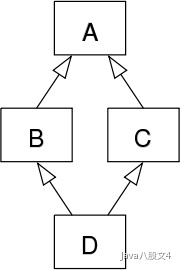

# 面向过程编程和面向对象编程。它们之间有什么本质的区别？他们各自的优势是什么？

面向过程和面向对象是两种重要的编程思想。面向过程是一种以事件为中心的编程思想，编程的时候把解决问题的步骤分析出来，然后用函数把这些步骤实现，在一步一步的具体步骤中再按顺序调用函数。
而面向对象是一种以“对象”为中心的编程思想，把要解决的问题分解成各个对象，建立对象的目的不是为了完成一个步骤，而是为了描叙某个对象在整个解决问题的步骤中的属性和行为。

面向过程编程的优点包括

- 流程化使得编程任务明确，在开发之前基本考虑了实现方式和最终结果，具体步骤清楚，便于节点分析。效率高，
- 面向过程强调代码的短小精悍，善于结合数据结构来开发高效率的程序。

缺点包括

- 需要深入的思考，耗费精力，
- 代码重用性低（保持怀疑，重用性应该不会很低），扩展能力差，
- 后期维护难度比较大

面向对象编程的优点包括

- 结构清晰，程序是模块化和结构化，更加符合人类的思维方式；
- 易扩展，代码重用率高，可继承，可覆盖，可以设计出低耦合的系统；
- 易维护，系统低耦合的特点有利于减少程序的后期维护工作量。

缺点包括

- 开销大，当要修改对象内部时，对象的属性不允许外部直接存取，所以要增加许多没有其他意义、只负责读或写的行为。这会为编程工作增加负担，增加运行开销， 并且使程序显得臃肿。
- 性能低，由于面向更高的逻辑抽象层，使得面向对象在实现的时候，不得不做出性能上面的牺牲，计算时间和空间存储大小都开销很大

# 为什么Java不支持多继承？

多继承会出现菱形继承问题，



假设我们有类B和类C，它们都继承了相同的类A。另外我们还有类D，类D通过多重继承机制继承了类B和类C

这时候，因为D同时继承了B和C，并且B和C又同时继承了A，那么，D中就会因为多重继承，继承到两份来自A中的属性和方法。

这时候，在使用D的时候，如果想要调用一个定义在A中的方法时，就会出现歧义。

因为这样的继承关系的形状类似于菱形，因此这个问题被形象地称为菱形继承问题。

**菱形继承问题的核心点在于，如果D类自己名优明确的实现B、C类中继承A类的方法，那么当系统在调用的时候，不知道到底调用的是B类中继承的方法还是C类中继承的方法。**

# 内部类

内部类指的是在类的里面还有类的存在。Java中内部类主要分为成员内部类（非静态内部类、静态内部类）、匿名内部类、局部内部类

## 成员内部类

```java
class Outer {
    private String name;
    private int age;

    /**
     * 1. 成员内部类可以直接访问外部类的成员，包括私有
     */
    class Inner {
        private String value;
        private int id;

        //编译报错：非静态内部类不能有静态成员，因为非静态内部类的对象依赖于外部类的对象；放一个静态成员，就破坏了这种依赖关系
        static int a = 10;

        public void show() {
            System.out.println(name);
            System.out.println(age);
        }
    }

    /**
     * 2. 外部类要访问内部类的成员，必须创建对象
     */
    public void test() {
        Inner inner = new Inner();
        System.out.println(inner.id);
        System.out.println(inner.value);
    }

    public static void staticTest() {
        //不能直接访问内部类的成员，因为内部类的对象依赖于外部类的对象，此时对象还没有创建
    }
}
```

非静态内部类的特点

- 非静态内部类可以直接访问外部类的成员，但是外部类不能直接访问非静态内部类成员
- 非静态内部类不能有静态方法、静态属性、静态初始化块儿
- 外部类的静态方法、静态代码块不能访问非静态内部类、包括不能使用非静态内部类定义变量和创建实例

#### 创建内部类对象

```java
public class Demo01 {
    String name;

    //非静态内部类
    class Inner {
        int age;
    }
}

class Demo02 {
    public static void main(String[] args) {
        Demo01.Inner inner = new Demo01().new Inner();
    }
}
```

## 静态内部类

```java
public class Demo {
    public static void main(String[] args) {
        //创建静态内部类对象，通过外部类.内部类的方式创建
        Outer.Inner inner = new Outer.Inner();
        //通过外部类.内部类.静态成员的方式可以“直接”访问静态成员
        Outer.Inner.a = 20;
        //访问静态内部类的普通成员，还是需要创建内部类对象后才能访问
        System.out.println(inner.id);
    }
}

class Outer {
    private String name;
    private int age;

    /**
     * 1. 成员内部类可以直接访问外部类的成员，包括私有
     */
    static class Inner {
        String value;
        int id;
        static int a = 10;

        public void show() {
            //编译报错，静态内部类不能直接访问外部类的成员，因为静态内部类不依赖于外部类的对象，没法“直接”访问外部类的成员
            //System.out.println(name);
            //System.out.println(age);
        }
    }

    /**
     * 2. 外部类要访问内部类的成员，必须创建对象
     */
    public void test() {
        Inner inner = new Inner();
        System.out.println(inner.id);
        System.out.println(inner.value);
    }

    public static void staticTest() {
        //不能直接访问内部类的成员，因为内部类的对象依赖于外部类的对象，此时对象还没有创建
    }
}
```

特点：

- 当静态内部类对象存在时，不一定外部类的对象存在，因为静态内部类不依托于外部类，因此静态内部类的方法不能直接访问外部类的方法
- 静态内部类看作一个外部类的静态成员，因此外部类的方法可以通过：静态内部类.名字 的方式访问静态内部类的静态成员。通过new静态内部类访问静态内部类的实例

### 匿名内部类

适合那些只需使用一次的类

```java
new 父类构造器/实现的接口(){

        }
```

具体代码

```java
public interface Demo01 {
    String hello();
}

class Demo02 {
    public static void main(String[] args) {
        Demo02 demo02 = new Demo02();
        demo02.say(new Demo01() {
            @Override
            public String hello() {
                return null;
            }
        });
    }

    public void say(Demo01 demo) {
        System.out.println("say hello");
    }
}
```

如上代码，在第8行的时候，new一个Demo01的时候默认就实现了Demo01这个接口，并且直接写出方法体，实现了接口的具体方法。因为这个类只需用一次，故就不用定义它的名字等其他内容。此为匿名内部类。

### 局部内部类

定义在方法中的内部类，作用域范围仅限于方法内部，用的极少。