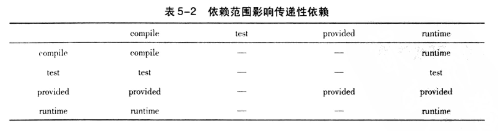
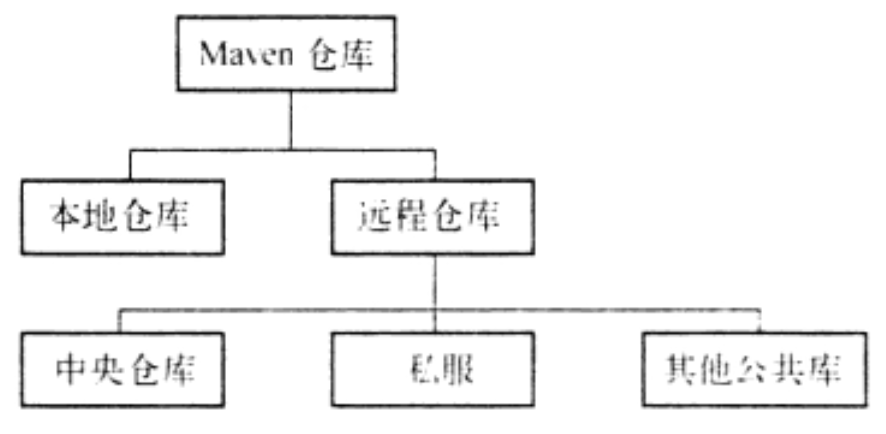

# 0 前言

## 0.1 解决maven打包的jar无法直接运行的问题

maven默认打包的jar是无法直接运行的，因为带有mian方法的类信息不会添加到manifest中（位于jar文件中的META-INF/MANIFEST.MF文件）无法看到Main Class的配置
为了生成可执行的jar文件，需要借助maven-shade-plugin；配置如下

```xml

<build>
    <plugins>
        <plugin>
            <groupId>org.apache.maven.plugins</groupId>
            <artifactId>maven-shade-plugin</artifactId>
            <version>3.2.1</version>
            <configuration>
                <createDependencyReducedPom>false</createDependencyReducedPom>
            </configuration>
            <executions>
                <execution>
                    <phase>package</phase>
                    <goals>
                        <goal>shade</goal>
                    </goals>
                    <configuration>
                        <transformers>
                            <transformer
                                    implementation="org.apache.maven.plugins.shade.resource.ManifestResourceTransformer">
                                <mainClass>com.weaver.workflow.HelloWorld</mainClass>
                            </transformer>
                        </transformers>
                    </configuration>
                </execution>
            </executions>
        </plugin>
    </plugins>
</build>
```

# 1 maven坐标和依赖

## 1.1 Maven坐标

- groupId:
  定义当前项目隶属的实际项目，比如著名的springframework这一实际项目；其对应的maven项目有很多；spring-core、spring-context等；这是由于maven中模块的概念；因此，一个实际的项目，往往被划分为很多模块；groupId的表示方式与java的包名定义类似；通常与域名反向一一对应；
- artifactId: 该元素定义实际项目中的一个maven项目（模块）；推荐的做法是使用实际项目名称作为artifactId的前缀
- version: 该元素定义当前maven项目所处的版本
- packaging: 该元素定义maven项目的打包方式，当不定义packaging的时候，默认打包方式为jar
- classifier: 该元素用来帮助定义构建输出的一些附属构建。附属构建与主构建对应；比如生成构建的时候可以借助插件生成doc、source等；classifier不能直接定义，而需要借助插件生成

maven构件的名称生成规则为：
> artifactid-version [classifier].packaging

## 1.2 依赖

### 1.2.1 依赖的配置

一个依赖的声明可以包含如下配置

```xml

<dependencies>
    <dependency>
        <groupId>实际项目id（组id）</groupId>
        <artifactId>Maven项目Id（模块）</artifactId>
        <version>版本号</version>
        <type>依赖的类型，对应于项目坐标定义的packaging，大部分情况下该元素无需配置</type>
        <scope>依赖范围</scope>
        <optional>标记依赖是否可选</optional>
        <exclusions>
            <!--用于排除传递依赖-->
            <exclusion>
                <groupId></groupId>
                <artifactId></artifactId>
            </exclusion>
        </exclusions>
    </dependency>
</dependencies>
```

### 1.2.2 依赖的范围

maven项目在使用的时候一共有3套classpath

1. 编译主代码一套classpath
2. 编译运行测试代码一套classpath
3. 实际运行主代码一套classpath

依赖范围实际就是控制maven依赖与这3套classpath的关系

- compile(默认值)：在编译、测试、运行3套classpath下都有效
- test：仅对测试的classpath有效
- provided：编译、测试时有效，运行时无效
- runtime：对测试、运行时classpath有效，对编译主代码的classpath无效
- system：该选项和provided与3套classpath的关系完全一致；

> 注：但使用system选项时必须通过systemPath元素显示的指示依赖文件的路径；由于此选项不是通过maven仓库解析识别；往往与本机系统绑定，会造成构件的不可移植性；

|作用域|对编译classpath有效|对测试classpath有效|对运行时classpath有效|示例|
|---|---|---|---|---|
|compile|√|√|√|spring×core|
|test|×|√|×|junit|
|provided|√|√|×|servlet×api|
|runtime|×|√|√|jdbc驱动实现|
|system|√|√|×|本地的，maven仓库之外的类文件|

### 1.2.3 传递依赖

若A模块引入类B依赖、B引入了C依赖，则C会称为A的传递依赖； 有了传递依赖机制，maven会解析各个直接依赖的pom，将哪些"必要的"间接依赖以传递依赖的形式引入到当前项目中


### 1.2.4 传递依赖与依赖范围的关系

依赖范围不仅可以控制依赖与3套classpath的关系，同时也会对传递依赖产生影响；

比如account-mail对spring-core的依赖范围为compile，而spring-core对commons-logging的依赖范围为compile；则account-mail对commons-logging的依赖范围为compile；我们把account-email对spring-core的依赖称为第一直接依赖；而spring-core对commons-logging的依赖为第二直接依赖；account-email对commnos-logging的依赖为传递依赖；

其对应解析出来的传递依赖范围如下表：第一列为第一传递依赖；第一行为第二传递依赖



### 1.2.5 传递依赖冲突

maven解决传递依赖根据2条原则：

- 第一原则：多个相同构件的传递依赖，依赖路径短者优先
- 第二原则：依赖路径相同的基础上，在pom文件中先声明者优先

### 1.2.6 阻断传递依赖

若A依赖于B，B依赖于C、D；但C、D是B的可选依赖；则C、D不会传递到A中

maven使用`<option>true</option>`标识一个依赖是否为可选依赖

```xml

<dependency>
    <groupId>org.springframework</groupId>
    <artifactId>spring-context-support</artifactId>
    <version>2.5.6</version>
    <optional>true</optional>
</dependency>

```

### 1.2.7 排除传递依赖

如果出现A依赖B，B依赖于C的v1版本，而此时项目需要的是C的v2版本；则可以先排除C的v1版本的传递依赖，后手动引入C v2版本的依赖

```xml

<dependency>
    <groupId>org.springframework</groupId>
    <artifactId>B</artifactId>
    <exclusions>
        <exclusion>
            <groupId>XXX</groupId>
            <artifactId>C</artifactId>
        </exclusion>
    </exclusions>
</dependency>
```

### 1.2.8 依赖版本统一管理

当一组构件的使用版本相同时，为了不对每个构件都分别设置版本，可以使用maven提供的属性进行版本的统一管理

```xml

<properties>
    <springframework.version>2.5.6</springframework.version>
</properties>

<dependencies>
<dependency>
    <groupId>org.springframework</groupId>
    <artifactId>spring-context-support</artifactId>
    <version>${springframework.version}</version>
</dependency>
</dependencies>
```

### 1.2.9 依赖分析

当maven项目庞大的时候依赖会变得很多，且复杂；使用maven依赖分析相关的命令可以帮助我们找出非必要依赖，并且优化我们的项目结构

我们已知maven会解析所有项目的直接依赖和传递依赖，对于有冲突的依赖maven也会自行调整，并根据规则判断每个依赖的范围，确保每个构件只有唯一一个版本被当前项目所使用；当上述所有解析过程完成后得到的最后的依赖称为已解析依赖（Resolved
Denpendency）；使用 `mvn denpendency:list`可以查看当前项目的已解析依赖，并且会列出每个构件的依赖范围；

把pom中直接声明的列为顶层依赖，而顶层依赖的依赖列为第二层依赖，以此类推，第三层、第四层...; 当这些依赖被解析完毕后，会形成一个依赖树；使用 `mvn denpendency:tree`会列出整个依赖树

为了能更好的分析整个项目的依赖，还可以使用 `mvn denpendency:analyze` 对整个项目进行分析；该分析结果包含2个重要信息

- used undeclared dependencies: 使用了但没有直接声明的依赖，也就是传递依赖；传递依赖是存在潜在风险的，比如传递依赖的版本变化是不易察觉且不可控的
- unsed declared dependencies:
  没有直接使用，但直接声明的依赖；这些依赖需要额外关注，因为maven只会解析编译项目主代码和测试代码使用的依赖，对于已经打包的第3方依赖不会直接解析；因此对于它最好不要直接删除，而是先分析再处理

> 对于unsed declared dependencies中的依赖，spring-core、或spring-bean等就是最好的说明，我们自己的项目中很显然不会直接使用到这些依赖中的类或工具；但它们是运行spring框架的必要依赖

# 2 Maven仓库

Maven仓库用于存储maven构件

## 2.1 仓库的分类

- 本地仓库：置于开发这的本地物理机上的文件系统（.m2/repository/)
- 远程仓库：置于网络上的文件系统

> 远程仓库又有细分
>  - 中央仓库：maven自带的核心远程仓库，存放类java的绝大部分构件
>  - 私服：为了节省带宽和时间，局域网内设置一个私有的仓库服务器用于存储maven构件，用于代理所有处于互联网上的远程仓库



maven查找构件的顺序：

1. 先查找本地仓库，能找到则直接使用
2. 本地仓库找不到则查找远程仓库，找到到下载到本地仓库后再使用
3. 本地、远程仓库都没有则报错

### 2.1.1 修改默认本地仓库位置

本地仓库的默认位置是基于用户目录的，如果需要自定义本地仓库地址可以在 `.m2/repository/settings.xml` 中设置 `localRepository` 元素的值来变更本地仓库的地址

### 2.2 私服仓库的好处

- 节省自己的外网带宽
- 加速Maven的构件：不停的请求外部仓库是十分耗时的，但maven的一些工作机制在执行构件任务的时候要求maven不断的检查远程仓库的数据；因此如果项目配置了很多远程仓库，构件速度就会降低；使用私服则无此问题
- 部署第三方构件：如果是团队开发，很多构件都是团队内部产生的，没有私服，则内部构件不好在团队之间进行共享
- 提高稳定性，增强控制：有了私服，断网了也能用
- 降低中央仓库的负荷

# 通过model创建工程模块

首先新建一个maven项目，然后删除其中的src目录。此时整个项目就变成了一个空的骨架，这时的pom.xml文件就作为了以后model的总pom.xml文件了，承载了一些公共的依赖和配置。

建好父项目之后，直接在工程上面右键 -->new -->model即可，剩下的配置和创建过程就和平时的工程创建是一样的。

当新建一个model后，在最外层骨架的pom.xml中就会多一个model标签，同时父工程中的jar包，子model完全可以使用，反之则不行。

# 使用maven创建web工程

1. 新建一个maven项目
2. 选择webapp骨架
3. 补齐目录结构
4. 配置本地tomcat服务器（结束）

# Maven的作用

简单来说，maven是一个项目构建工具，在Java开发中可以很便捷的管理jar包等。

Maven通过坐标的方式来从本地仓库中获取jar包，坐标的构成一般为：公司/组织名（groupId）+项目名/子项目名（artifactId）+版本号组成

对于maven的设置可以在maven开发包中的setting.xml中进行同意设置，包括配置阿里云镜像，修改本地仓库操作。

maven通过本地仓库管理jar包，可以让jar包和项目分离，从而减小项目体积，并且多个项目可以公用一个仓库，因此项目越多的时候越能体现出maven的高效和便捷。

# Maven的三种仓库

- 本地仓库
- 中央仓库
- 私服（远程仓库）

本地仓库主要存放我们工程用到的jar包，是通过我们自己维护的。而本地仓库的jar包就是从中央仓库中下载的。

中央仓库是由第三方的组织或者官方进行维护的。因此我们从中央仓库下载的jar包基本都是标准的jar包。

私服是由公司搭建的，由公司内部维护的一个仓库，其中的jar包也是从中央仓库中下载的。配置私服主要是为了公司jar包安全和便于统一管理。

在项目中如果配置私服，那么工程加载jar包的顺序如下：

首先工程还是会去本地仓库中查找相应的jar包，如果没有找到，则会去私服中查找，如果仍然没有找到，就会到中央仓库进行查找，找到后会下载到私服，私服有了jar包，本地仓库就会从私服中下载jar包。最后本地仓库中也有了jar包，则项目使用本地仓库中的jar包。

# 配置阿里云的仓库镜像

将下面的配置代码复制到setting.xml中的mirrors标签中即可

```xml

<mirror>
    <id>nexus-aliyun</id>
    <mirrorOf>*</mirrorOf>
    <name>Nexus aliyun</name>
    <url>http://maven.aliyun.com/nexus/content/groups/public</url>
</mirror>
```

# Maven的其他优点

Maven由纯Java语言开发，因此支持跨平台的使用。同时使用maven开发，可以得到一个很清晰的工程结构，使用maven可以将一个大型项目按照模块拆分成若干个工程，不同的团队只需维护自己的模块即可。

# Maven的常用命令

- clear：清理，清理编译出来的目录（target）
- compile：编译，只编译main目录，不编译test目录
- test-compile：编译test目录
- test：运行test目录中的代码
- package：打包 ，Java项目打成jar包，web项目打成war包
- install：将项目发布到本地仓库，可以使用此命令将自己写好的jar包供其他团队使用
- tomcat:run：一建构建项目

# Maven命令的声明周期

- Clean：生命周期：clean
- Default：生命周期：compile、test-compile、test、package、install
- Site：生命周期：site命令，用于描述工程的静态文档

不同声明周期的命令可以一起执行，如

```
mvn clean compile
```

# Maven命令的执行顺序

相同生命周期的命令会有执行顺序的影响，比如某些命令执行的时候它只会执行自己的命令，但是另外一些命令执行的时候，其他命令也会被指定。以Default生命周期的命令为说明：

install > package > test > test-compile > compile

如上的顺序说明，如果执行install命令的时候，那么后面的命令都会被执行一次，但是如果执行compile的时候，影响效果只限于compile命令自己的效果。

# Maven添加tomcat插件

如果不使用本地的tomcat服务器，可以直接使用Maven提供的tomcat进行运行，只需在pom.xml中添加tomcat插件即可

```xml

<plugins>
    <plugin>
        <groupId>org.apache.tomcat.maven</groupId>
        <artifactId>tomcat7-maven-plugin</artifactId>
        <version>2.2</version>
        <configuration>
            <port>8081</port>
            <path>/</path>
        </configuration>
    </plugin>
</plugins>
```

如上，即可添加tomcat插件，运行时直接在maven命令中执行tomcat:run即可

这里有一个值得注意的问题，当直接运行并访问的时候，可能会出现xxx is not a servlet的500错误，此时为jar包冲突所致，修改servlet依赖的使用范围为provide即可。

# Maven中scope标签的使用

scope表示的为jar包的依赖作用范围，也就是规定了引入了jar包在哪些范围中是有效的。

- compile(默认值)：在编译、运行、测试、打包下都有效
- provided：编译、测试时有效，运行、打包时无效
- test：仅在测试时有效
- runtime：测试、运行、打包时有效
- syatem：不推荐使用，使用此范围时，不会去本地仓库寻找依赖

| 作用域   | 编译  | 测试  | 运行  | 打包  | 示例        |
| -------- | :---: | :---: | :---: | :---: | ----------- |
| compile  | **√** |   √   | **√** | **√** | spring-core |
| provided | **√** |   √   | **×** | **×** | servlet-api |
| test     | **×** | **√** | **×** |   ×   | junit       |
| runtime  | **×** | **√** |   √   |   √   | JDBCDriver  |

# 开启tomcat热部署

热部署：在tomcat运行的时候，不用停止tomcat也可以发布web项目上去。

要开启tomcat热部署，需要修改tomcat包中conf/tomcat-users.xml文件，向其中添加

```xml

<role rolename="manager-gui"/>
<role rolename="manager-script"/>
<user username="tomcat" password="12345" roles="manager-gui,manager-script"/>
```

# Maven中jar包的冲突解决

### 方式一

第一声明优先原则：在pom.xml文件中，坐标位置靠上的jar包依赖是优先声明的，此时这个包里的依赖包会优先进入项目中，如果其他jar包也同样依赖了上面这个jar的依赖包，那么将会以上面优先引入的依赖包为准。

### 方式二

路径近者优先原则

直接依赖：项目中直接导入的jar包，就是该项目的直接依赖包，也就是在pom.xml中直接声明的依赖。

传递依赖：项目中并没有明确引入依赖的jar包，但是确实又存在于工程之中的jar包，此为传递依赖

直接依赖的优先级高于传递依赖（直接依赖路劲近于传递依赖）

### 方式三

直接排除法

若在某个jar包中，其中的依赖包不想使用默认版本，可以直接将其排除

```xml

<dependency>
    <groupId>org.springframework</groupId>
    <artifactId>spring-webmvc</artifactId>
    <version>5.2.3.RELEASE</version>
    <exclusions>
        <exclusion>
            <groupId>org.springframework</groupId>
            <artifactId>spring-core</artifactId>
        </exclusion>
    </exclusions>
</dependency>
```

# Maven版本锁定和统一版本管理

使用版本锁定，可以让子工程进行继承父工程时，核心版本不被改变（即使是直接依赖也不行）

版本统一管理可以让工程的版本升级更加高效

如下演示了统一版本管理和版本锁定

```xml
<?xml version="1.0" encoding="UTF-8"?>
<project xmlns="http://maven.apache.org/POM/4.0.0"
         xmlns:xsi="http://www.w3.org/2001/XMLSchema-instance"
         xsi:schemaLocation="http://maven.apache.org/POM/4.0.0 http://maven.apache.org/xsd/maven-4.0.0.xsd">
    <modelVersion>4.0.0</modelVersion>

    <groupId>com.ctbu</groupId>
    <artifactId>web-review</artifactId>
    <packaging>pom</packaging>
    <version>1.0</version>
    <modules>
        <module>servlet-01</module>
        <module>singleton01</module>
        <module>container</module>
        <module>spring-web</module>
    </modules>


    <!--统一版本管理-->
    <properties>
        <spring.version>5.2.3.RELEASE</spring.version>
        <mysql.version>5.1.47</mysql.version>
        <mybatis.version>3.5.3</mybatis.version>
    </properties>

    <!--版本锁定-->
    <dependencyManagement>
        <dependencies>
            <dependency>
                <groupId>org.springframework</groupId>
                <artifactId>spring-core</artifactId>
                <version>${spring.version}</version>
            </dependency>
            <dependency>
                <groupId>mysql</groupId>
                <artifactId>mysql-connector-java</artifactId>
                <version>${mysql.version}</version>
            </dependency>
            <dependency>
                <groupId>org.mybatis</groupId>
                <artifactId>mybatis</artifactId>
                <version>${mybatis.version}</version>
            </dependency>
        </dependencies>
    </dependencyManagement>

    <!--工程依赖-->
    <dependencies>
        <dependency>
            <groupId>org.springframework</groupId>
            <artifactId>spring-core</artifactId>
            <version>${spring.version}</version>
        </dependency>
        <dependency>
            <groupId>mysql</groupId>
            <artifactId>mysql-connector-java</artifactId>
            <version>${mysql.version}</version>
        </dependency>
        <dependency>
            <groupId>org.mybatis</groupId>
            <artifactId>mybatis</artifactId>
            <version>${mybatis.version}</version>
        </dependency>
    </dependencies>
</project>
```

# 使用Maven进行模块化开发

maven支持将项目进行拆分，也就是将一个项目分成多个模块，模块可以统一继承自某一个父项目，父项目的jar包可以被子模块继承。如果各个模块之间需要相互引用，可以将模块的坐标写入pom.xml文件，供其他模块引用即可。

### 父工程

使用maven创建一个父工程，只需保留父工程的pom.xml即可，父工程的作用主要就是管理模块的公共依赖。

### 子模块

那经典的Java三层架构来说，dao层、service层、controller层每一个都能独立成为一个模块。他们之间通过maven坐标的方式进行通信，其中service、dao模块在建立的时候可以不用web的骨架了，因为出去了controller之后，他们就是一个纯的Java项目。

当一个A模块引入了B模块之后，A中就相当于拥有了B中的完整代码和配置文件。

# Maven父子工程的 3 种启动方式

- 直接启动root父工程（用tomcat插件）
- 启动核心模块（使用tomcat插件，此时需要将root打包到本地仓库中）
- 使用本地tomcat启动

#                                                                                               

