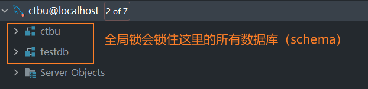

'

# 一、全局锁

全局锁是对整个数据库实例加锁，MySQL提供了一个全局锁的加锁方式 `flush table with read lock` (FTWRL)。当数据库实例被加上全局锁后所有数据库实例都会处于只读状态；

- 无法对数据进行增删改操作（DML）
- 无法新增或修改表结构（DDL）
- 无法提交更新类型的事务



全局锁一般用于非InnoDB引擎数据的全表备份。（使用InnoDB引擎的表，可以使用mysqldump + --single-transaction参数进行全表备份）

使用全局锁还有另外一种方式：`set global readonly = true`

两种全局锁实现的区别：

- `set global readonly = true`作为一种标识，可以用于其他场景，因此使用此种方式可能会对其他场景造成影响；
- 执行WFTRL时，如果链接乱开，锁会自动释放。而`set global readonly = true`则不会，数据库会一直处于锁定状态。
- readonly方式对super账号无效

# 二、页锁

MySQL没有实现页锁

# 三、表级锁

表级锁是对整个表加锁，表级锁的锁定粒度较大，并发度较低，但加锁和解锁的速度较快，不会出现死锁的情况

## 3.1 表锁

MySQL的表锁分为

- 共享表锁（读锁）
- 排他表锁（写锁）

设现在有两个MySQL会话： 当会话1对表A加读锁后

- 会话1可以继续读取表A的数据，但是无法修改表A的数据
- 会话2可以读取表A的数据，修改表A的数据会被阻塞，直到会话1释放锁

当会话1对表A加写锁后

- 会话1可以继续读取表A的数据，也可以修改表A的数据
- 会话2无法读取表A的数据，也无法修改表A的数据，会被阻塞，直到会话1释放锁

MySQL 的表锁是一种简单的锁机制，它可以防止其他会话对表进行不适当的读写操作。MySQL
支持两种类型的表锁：读锁和写锁。读锁允许多个客户端会话同时在表上获取读锁，而写锁只允许一个会话在表上获取写锁，并且只有该会话才能对表进行读写操作，直到锁被释放1。

你可以使用 LOCK TABLES 语句来显式地获取表锁。例如，要获取一个写锁，你可以这样写：

LOCK TABLES mytable WRITE; 复制 要释放表锁，你可以使用 UNLOCK TABLES 语句。

表锁通常用于模拟事务或在更新表时获得更高的速度。例如，在执行备份操作时，你可以使用 FLUSH TABLES WITH READ LOCK 语句来获取全局读锁，以便安全地执行备份操作。

## 3.2 元数据锁

MySQL 使用元数据锁来管理对数据库对象（包括表、视图、存储过程、函数、触发器、计划事件、表空间等）的并发访问并确保数据一致性。元数据锁不仅适用于表，还适用于模式、存储过程（过程、函数、触发器、计划事件）、表空间、使用
GET_LOCK() 函数获取的用户锁等

当一个会话试图访问一个数据库对象时，它会请求一个元数据锁。如果该锁与现有的锁兼容，则会立即授予该锁；否则，该会话将等待直到锁被释放。例如，当一个会话试图修改一张表的结构时，它会请求一个排他的元数据锁。如果另一个会话已经持有该表的共享元数据锁，则该请求将被阻塞，直到共享锁被释放。

## 3.3 意向锁

https://zhuanlan.zhihu.com/p/185003485

先明确行锁和表锁的互斥关系

1. 当先对表加上共享锁后，再对表中的某一行加上排他锁时，会被阻塞。但可以继续对表中的行加共享锁（也就是查询表中数据）
2. 当先对表加上排他锁后，再对表中的某一行加上共享锁时或排他锁都会被阻塞
3. 当先对表中的某一行加上共享锁后，再对表加上排他锁时会被阻塞。但可以继续对表加共享锁
4. 当先对表中的某一行加上排他锁后，在对表加共享锁和排他锁时都会被阻塞

意向锁（Intention Locks）是MySQL中InnoDB存储引擎用来支持多粒度锁定（Multiple Granularity Locking）的一种锁。多粒度锁定允许在同一个表中同时存在行锁和表锁。

意向锁是一种表级锁，它指示事务稍后需要在表中的某些行上设置哪种类型的锁（共享锁或排他锁）。有两种类型的意向锁：意向共享锁（Intention Shared
Lock，IS）表示事务打算在表中的某些行上设置共享锁；意向排他锁（Intention Exclusive Lock，IX）表示事务打算在表中的某些行上设置排他锁。

意向锁解决了以下问题：当一个事务想要在整个表上加一个排他锁时，它需要确保没有其他事务正在对该表中的任何行进行修改。通过检查是否存在意向排他锁，该事务可以快速确定是否有其他事务正在对该表中的任何行进行修改，而不需要逐行检查。

## 3.4 AUTO-INC锁

# 四、行级锁

## 4.1 记录锁

行锁在 MySQL 的 InnoDB 引擎中是基于索引实现的。如果某个加锁操作没有使用索引，那么该锁就会退化为表锁1。

记录锁（Record Locks）是一种行锁，它为某行记录加锁，封锁该行的索引记录。例如，当我们执行 SELECT * FROM table WHERE id = 1 FOR UPDATE; 时，id 为 1
的记录行会被锁住。需要注意的是：id 列必须为唯一索引列或主键列，否则上述语句加的锁就会变成临键锁。同时查询语句必须为精准匹配（=），不能为>、<、like等，否则也会退化成临键锁1。

## 4.2 间隙锁

间隙锁（Gap Lock）是 InnoDB
在可重复读提交下为了解决幻读问题时引入的锁机制。幻读的问题存在是因为新增或者更新操作，这时如果进行范围查询的时候（加锁查询），会出现不一致的问题，这时使用不同的行锁已经没有办法满足要求，需要对一定范围内的数据进行加锁，间隙锁就是解决这类问题的1。

```sql
create table test
(
    id   int auto_increment
        primary key,
    name varchar(8) null
)
    charset = utf8;

insert into test (id, name)
values (1, '1'),
       (5, '5'),
       (7, '7'),
       (10, '10'),
       (11, '11');
```

> 这是我的建表语句和数据插入语句。请你基于这个表和数据。举一个例子。模拟间隙锁的使用场景

好的，这是一个例子来模拟间隙锁的使用场景：

假设我们有两个事务A和B。在事务A中，我们执行以下语句：

START TRANSACTION; SELECT * FROM test WHERE id > 7 FOR UPDATE; 复制
这个查询语句会锁住id大于7的所有行，也就是id为10和11的行。同时，它还会在id为7和10之间的间隙上加上间隙锁。

现在，在事务B中，如果我们尝试插入一行数据，其id在7和10之间，比如：

START TRANSACTION; INSERT INTO test (id, name) VALUES (8, '8'); 复制 这个插入语句将会被阻塞，直到事务A提交或回滚。这就是一个简单的例子来模拟间隙锁的使用场景

## 4.3 临键锁

临键锁（Next-Key Lock）是MySQL中的一种锁类型，它结合了行锁和间隙锁的特性。它的主要作用是解决幻读（Phantom Read）的问题。

幻读指的是在一个事务中执行相同的查询语句，但结果集却不同，出现了新增或删除的行。临键锁通过在索引记录和索引记录之间的间隙上设置锁来防止幻读的发生。

当MySQL执行范围查询（Range Query）或者使用索引扫描的方式获取数据时，会使用临键锁。具体的场景包括：

- 事务使用WHERE条件执行范围查询时，MySQL会在满足条件的索引记录上加上行锁，并在索引记录和索引记录之间的间隙上加上间隙锁。
- 事务执行INSERT操作时，MySQL会在待插入的位置上加上间隙锁，防止其他事务在同一个间隙插入新行。
- 事务执行SELECT...FOR UPDATE语句时，MySQL会对符合查询条件的索引记录加上行锁，并对索引记录和索引记录之间的间隙加上间隙锁。

# 表锁示例

```sql
# 给表加读锁
lock tables table_name read;
# 给表加写锁
lock tables table_name write;
# 解锁
unlock tables;
# 查看加锁的表
show open tables;
```

设现在有两个MySQL会话：

> 当会话1对表A加读锁后

- 会话1可以继续读取表A的数据，但是无法修改表A的数据
- 会话2可以读取表A的数据，修改表A的数据会被阻塞，直到会话1释放锁

> 当会话1对表A加写锁后

- 会话1可以继续读取表A的数据，也可以修改表A的数据
- 会话2无法读取表A的数据，也无法修改表A的数据，会被阻塞，直到会话1释放锁

> 查看表锁的状态

```sql
# Table_locks_immediate:记录所有请求表锁时，立马获得锁的次数
# Table_locks_waited:记录所有请求表锁时，需要等待后才能获得锁的次数，值越大，说明锁竞争越激烈
show status like 'table%';

```

# 行锁示例

MySQL默认的InnoDB引擎默认使用行级锁；

在MySQL的InnoDB引擎中，对数据表中行记录加锁。默认的修改数据语句：update、delete、insert都会自动给涉及到的数据加上排他行锁。select语句默认不会加任何锁类型，如果要加排他锁可以使用select …for
update语句，加共享锁可以使用select … lock in share mode语句

注意事项： InnoDB 行级锁是通过给索引上的索引项加锁来实现的。如果不通过索引条件检索数据，InnoDB 会使用表锁而不是行级锁

## 分析行锁状态

```sql
show status like '%innodb_row_lock%';
```

- Innodb_row_lock_current_waits：当前有多少个事务在等待行锁
- Innodb_row_lock_time：从服务器启动到现在，所有事务在等待行锁的时间总和
- Innodb_row_lock_time_avg：从服务器启动到现在，所有事务在等待行锁的平均时间
- Innodb_row_lock_time_max：从服务器启动到现在，所有事务在等待行锁的最大时间
- Innodb_row_lock_waits：从服务器启动到现在，所有事务在等待行锁的次数


