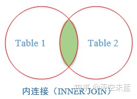
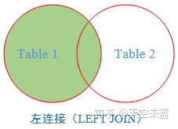
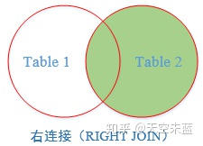
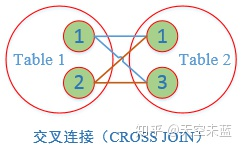
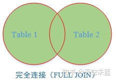
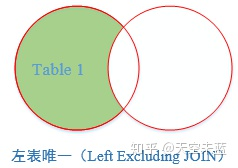
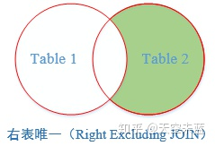
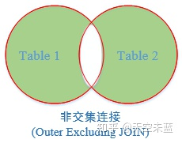

# 一、链接查询

## 1.1 内链接



查询两个表中同时满足链接条件的数据

### 1.1.1 等值链接

```sql
# 方式一：使用inner join
select *
from academy a
         inner join teacher t on a.id = t.academy_id;

# 方式2：直接使用 join
select *
from academy a
         join teacher t on a.id = t.academy_id;

# 方式3：使用 where条件(不推荐)
select *
from academy a,
     teacher t
where a.id = t.academy_id;
```

### 1.1.2 自链接

```sql
//查询与目标用户处于同一个城市的其他用户
select *
from student a,
     student b
where a.city = b.city
  and a.id = 1629794589860827187;
```

自己链接自己查询

## 1.2 左链接



获取左表中的所有记录，右表中没有匹配的数据则以null填充

## 1.3 右链接



获取右表中的所有记录，左表中没有匹配的数据则以null填充

## 1.4 交叉链接



在没有任何约束条件的情况下，返回的是笛卡尔积；此查询方式可以产生中间表用于模拟所有可能的数据组合

```sql
select *
from academy a
         cross join teacher b;
```

## 1.5 完全链接



返回两个表中所有的数据，如果两个表中的数据没有匹配的，则以null填充

## 1.6 左表唯一链接



返回满足左表同步去除其中满足右表条件的数据

```sql
SELECT A.学号, A.姓名, A.籍贯, A.年龄, B.专业, B.班级
FROM student A
         LEFT JOIN major B
                   ON A.学号 = B.学号
WHERE B.学号 IS NULL
```

## 1.7 右表唯一链接



返回满足右表同步去除其中满足左表条件的数据

```sql
SELECT A.学号, A.姓名, A.籍贯, A.年龄, B.专业, B.班级
FROM student A
         RIGHT JOIN major B
                    ON A.学号 = B.学号
WHERE A.学号 IS NULL
```

## 1.8 非交集链接



返回两个表中非交集部分的数据

```sql
SELECT A.学号, A.姓名, A.籍贯, A.年龄, B.专业, B.班级
FROM student A FULL JOIN major B
ON A.学号=B.学号
WHERE A.学号 IS NULL OR B.学号 IS NULL
```

## 1.9 on子句条件与where子句条件的区别

- ON 子句中的条件是用于连接两个表的，而 WHERE 子句中的条件是用于过滤结果集的。也就是说，ON 子句中的条件是在连接两个表时使用的，而 WHERE 子句中的条件是在连接完成之后，对结果集进行筛选的。


- 在使用连接语句进行查询时，ON 子句中的条件是必须满足的，否则连接不会成功，而 WHERE 子句中的条件是可选的，如果不满足条件，则对结果集进行过滤。


- ON 子句中的条件是针对连接的两个表之间的列进行的，而 WHERE 子句中的条件则是针对结果集中的所有列进行的。

# 二、性能优化

## 2.1 链接缓存池

当我们执行两个表的join链接查询时，会有一个比较的过程，逐条比较是很慢的。因此可以吧两个表的数据都读进内存放入缓存中。`show variables like ‘join_buffer_size’`
可以查看缓存池的大小。其大小会影响到join查询的性能。

## 2.2 驱动表与被驱动表

在 MySQL 中，联接查询通常涉及到两个或多个表之间的链接操作。在进行联接查询时，通常会有一个主动表（也称为驱动表）和一个被动表。

驱动表是指在联接操作中起主导作用的表，它通常是需要查询的表，而被动表则是根据驱动表的数据进行查询的表。驱动表决定了联接查询的基础数据集合，而被动表则通过与驱动表的连接来扩展数据集合。

### 2.2.1 驱动表与被驱动表的划分

- 当连接查询没有where条件时
    - left join 前面的表是驱动表，后面的表是被驱动表
    - right join 后面的表是驱动表，前面的表是被驱动表
    - inner join / join 会自动选择表数据比较少的作为驱动表
    - straight_join(≈join) 直接选择左边的表作为驱动表（语义上与join类似，但去除了join自动选择小表作为驱动表的特性）
- 当连接查询有where条件时，带where条件的表是驱动表，否则是被驱动表

### 2.2.2 一个具体的例子

```sql
select *
from student s
         left join teacher t on s.city = t.city
where s.city = '上海';
```

其具体执行步骤如下：

1. 从student表和teacher表中选取所有字段。

2. 根据on条件，将student表和teacher表按照city字段进行匹配， 如果student表中的city字段和teacher表中的city字段相同，
   则将两个表的对应记录连接起来，否则将student表中的记录保留，而teacher表中的记录用NULL填充。

3. 根据where条件，从连接后的结果集中筛选出city字段为’上海’的记录，作为最终的查询结果。1

### 2.2.3 关联查询中驱动表与被驱动表的注意事项

1. 关联查询时候，应该始终以数据量较小的作为驱动表，以数据量较大的作为被驱动表。这样可以减少多表之间的链接次数
2. 驱动表是无法使用索引的，因为驱动表要全表扫描，拿每一条数据和被驱动表数据进行对比
3. 被驱动表使用在条件比对字段上添加索引则可以提高数据检索对比的效率
4. 如果被驱动表相关字段有索引，则MySQL会使用"ILJ"算法
5. 如果被驱动表相关自动没有索引，则MySQL会使用"BLJ"算法

   ### 2.2.4 ILJ算法

INLJ算法，即索引嵌套循环连接算法，是一种优化的join查询算法。它的原理是，对于驱动表的每一行记录，根据关联条件去被驱动表的索引中查找匹配的记录，然后返回结果集。这样可以减少被驱动表的扫描次数和IO开销。但是这种算法要求被驱动表的关联字段必须有索引。

### 2.2.5 BLJ算法

BLJ算法，即块嵌套循环连接算法，是MySQL自己创建的一种连接查询算法。它的原理是，将指定的外层键对应的被驱动表缓存起来以提高性能。这种算法适用于没有索引的情况下，可以减少被驱动表的扫描次数。

## 2.3 优化小结

1. 用小结果集驱动大结果集，尽量减少 join 语句中的Nested Loop循环总次数。

2. 优先优化 Nested Loop 内层循环，因为内层循环是循环中执行次数最多的，每次循环提升很小的性能都能在整个循环中提升很大的性能。

3. 对被驱动表的 join 字段上建立索引，并且Join ON 条件的字段应该是相同类型的。

4. 当被驱动表的 join 字段上无法建立索引的时候，设置足够的 Join Buffer Size。

5. 对于非主键的连接查询，如果被驱动表数据特别多，建议先使用子查询查出一个临时的结果集然后再连接。（待验证）

6. 对于可以直接从一个表中取数据的情况。（例如同一个表中取交集，例如好友表，互相关注才是好友）这样的情况，使用 Join 效率是要高于子查询的。
