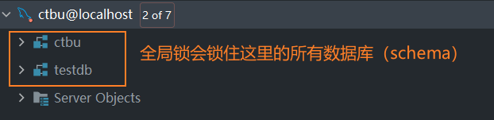

'

# 一、全局锁

全局锁是对整个数据库实例加锁，MySQL提供了一个全局锁的加锁方式 `flush table with read lock` (FTWRL)。当数据库实例被加上全局锁后所有数据库实例都会处于只读状态；

- 无法对数据进行增删改操作（DML）
- 无法新增或修改表结构（DDL）
- 无法提交更新类型的事务



全局锁一般用于非InnoDB引擎数据的全表备份。（使用InnoDB引擎的表，可以使用mysqldump + --single-transaction参数进行全表备份）

使用全局锁还有另外一种方式：`set global readonly = true`

两种全局锁实现的区别：

- `set global readonly = true`作为一种标识，可以用于其他场景，因此使用此种方式可能会对其他场景造成影响；
- 执行WFTRL时，如果链接乱开，锁会自动释放。而`set global readonly = true`则不会，数据库会一直处于锁定状态。
- readonly方式对super账号无效

# 二、页锁

MySQL没有实现页锁

# 三、表级锁

表级锁是对整个表加锁，表级锁的锁定粒度较大，并发度较低，但加锁和解锁的速度较快，不会出现死锁的情况

## 3.1 表锁

MySQL的表锁分为

- 共享表锁（读锁）
- 排他表锁（写锁）

设现在有两个MySQL会话： 当会话1对表A加读锁后

- 会话1可以继续读取表A的数据，但是无法修改表A的数据
- 会话2可以读取表A的数据，修改表A的数据会被阻塞，直到会话1释放锁

当会话1对表A加写锁后

- 会话1可以继续读取表A的数据，也可以修改表A的数据
- 会话2无法读取表A的数据，也无法修改表A的数据，会被阻塞，直到会话1释放锁

## 3.2 元数据锁

## 3.3 意向锁

## 3.4 AUTO-INC锁

# 前言

锁机制是为了解决共享资源被并发访问时出现的问题

# 锁分类

## 按操作范围

- 全局锁
- 页级锁
- 表级锁
    - 表锁：一次性锁定整个表。MyISAM默认就是表锁。表锁开销小，加锁快，无死锁。但锁范围大，容易锁冲突，并发度低
    - 元数据锁
    - 意向锁
    - 自增锁
- 行级锁
    - 行锁：一次性对一行数据加锁。InnoDB默认就是行锁。行锁开销大，加锁慢，容易死锁。但锁范围小，并发度高
    - 间隙锁：锁定索引范围，但不包括记录本身。比如update t set t.name = 'xxx' where id>=0 and id<=2;
      此时会将id为0，1，2的数据都锁住。即使没有id为1的这条记录。在该语句commit或rollback前，你也无法操作它;
    - 临建锁

## 按操作类型

- 读锁（共享锁）：当数据被读锁锁定时，其他事务可以读取该数据，但不能修改该数据
- 写锁（排他锁）：当数据被写锁锁定时，其他事务不能读取该数据，也不能修改该数据

# 表锁示例

```sql
# 给表加读锁
lock tables table_name read;
# 给表加写锁
lock tables table_name write;
# 解锁
unlock tables;
# 查看加锁的表
show open tables;
```

设现在有两个MySQL会话：

> 当会话1对表A加读锁后

- 会话1可以继续读取表A的数据，但是无法修改表A的数据
- 会话2可以读取表A的数据，修改表A的数据会被阻塞，直到会话1释放锁

> 当会话1对表A加写锁后

- 会话1可以继续读取表A的数据，也可以修改表A的数据
- 会话2无法读取表A的数据，也无法修改表A的数据，会被阻塞，直到会话1释放锁

> 查看表锁的状态

```sql
# Table_locks_immediate:记录所有请求表锁时，立马获得锁的次数
# Table_locks_waited:记录所有请求表锁时，需要等待后才能获得锁的次数，值越大，说明锁竞争越激烈
show status like 'table%';

```

# 行锁示例

MySQL默认的InnoDB引擎默认使用行级锁；

在MySQL的InnoDB引擎中，对数据表中行记录加锁。默认的修改数据语句：update、delete、insert都会自动给涉及到的数据加上排他行锁。select语句默认不会加任何锁类型，如果要加排他锁可以使用select …for
update语句，加共享锁可以使用select … lock in share mode语句

注意事项： InnoDB 行级锁是通过给索引上的索引项加锁来实现的。如果不通过索引条件检索数据，InnoDB 会使用表锁而不是行级锁

## 分析行锁状态

```sql
show status like '%innodb_row_lock%';
```

- Innodb_row_lock_current_waits：当前有多少个事务在等待行锁
- Innodb_row_lock_time：从服务器启动到现在，所有事务在等待行锁的时间总和
- Innodb_row_lock_time_avg：从服务器启动到现在，所有事务在等待行锁的平均时间
- Innodb_row_lock_time_max：从服务器启动到现在，所有事务在等待行锁的最大时间
- Innodb_row_lock_waits：从服务器启动到现在，所有事务在等待行锁的次数


