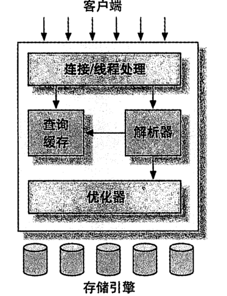
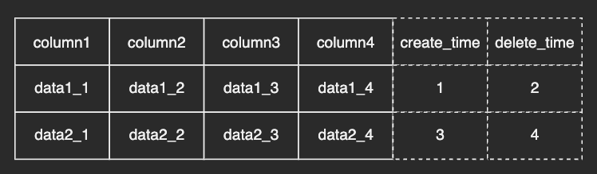

# 1 MYSQL的整体架构

## 1.1 MYSQL的逻辑架构

mysql逻辑架构图



- 第一层服务为公共服务，大多数基于网络链接的客户端都会有类似的处理
- 第二层用于处理mysql的核心服务及功能，查询解析、分析、优化、系统函数、存储过程、触发器、视图的实现都在这一层
- 第三层包含了存储引擎，存储引擎负责mysql中数据的存取

## 1.2 mysql的连接与安全认证

每一个客户端连接都会在服务器中拥有一个线程；当客户端连接到服务器时，服务器会对其进行认证；认证方式可以基于用户名密码、或安全套接字的证书；客户端验证通过后，会继续验证该连接的执行权限范围；比如是否能对A数据库的x表有select权限

## 1.3 优化与执行

mysql会解析查询，并构建一个数据结构（解析树），然后对整个结构进行优化，包括重写查询，决定表的读取顺序、选择合适的索引等；用户可以通过特殊的关键字，提示优化器，以影响优化的最终效果；对于select语句，查询前会先查缓存，缓存没有才会执行后续的一系列优化；

## 1.4 并发控制

多个查询在同一时刻修改同一数据，都会产生并发控制问题；

### 1.4.1 读写锁

在处理并发读或并发写的时候，可以通过读写所来解决并发问题；其下包含两种类型：

- 共享锁（读锁）：读锁是共享的，相互不阻塞，多个用户可以在同一时刻读取统一资源，互不干扰；
- 排它锁（写锁）：写锁是排它的，也就是说一个写锁会阻塞其他的写锁和读锁；

基于上述的安全策略，可以方式某一用户在写入数据的时候，其他用户也能读取或写入该条数据

### 1.4.2 锁粒度

中心思想是尽可能只锁定需要修改的部分，而不是锁定所有资源；或者只对需要修改的数据片进行锁定；锁的粒度越细，并发程度越高

使用锁也需要消耗系统资源，获取锁，检查锁状态，释放锁等等需要操作系统的调度

#### 1.4.2.1 锁策略-表锁

这是开销最小的策略，他会锁定整张表，一个用户对表进行写操作前，需要先获得锁，这回阻塞其他用户对该表的所有读写操作，只有没有写锁时，其他用户才能获取读锁；

#### 1.4.2.2 锁策略-行锁

行锁可以最大程度的支持并发，但同时也带来来最大的开销


## 1.6 多版本的并发控制

mysql中大多数的事务型引擎实现的都不是简单的行级锁，为了提升并发的性能，一般都同时实现来多版本的并发控制（MVCC）； 可以简单的把MVCC理解为行级锁的变种，但它不存在加锁操作，因此性能更高；

典型的MVCC并发控制实现方式：

- 乐观并发控制
- 悲观并发控制

### 1.6.1 InnoDB的多版本并发控制实现

InnoDB的MVCC，是通过在每行记录后面保存两个隐藏列实现的，这两个列，一个保存列行的创建时间、一个保存列行的删除时间；这两个字段实际存储的是系统的版本号；每开启一个事务，系统版本号就会自动递增；事务开始时候的版本号会作为事务的版本号，用来和查询到的每行记录的版本号做比较



以InnoDB的可重复读隔离级别作为例子。其在增删改查四种场景中的处理逻辑如下：

1. select: InnoDB根据以下2个条件检查没行记录
    1. InnoDB：只查找版本早于当前事务版本的数据行，以确保事务读取的行，要么事务开始前已经存在，要么是事务自身插入或修改过的
    2. 行的删除版本要么未定义、要么大于当前事务版本号，这可以确保事务读取到的行在事务开始之前没有被删除；
   > 只有满足上述两个条件的记录，才能返回作为查询结果

2. insert: InnoDB为新插入的每一行保存当前系统的版本号作为行版本号
3. delete：InnoDB为删除的每一行保存当前系统版本号作为删除标识
4. update：为插入一行新记录、保存当前系统版本号作为行版本号，同时保存当前系统版本号到原来的行作为行删除标识

保存这两个额外的系统版本号，使大多数读操作都可以不用加锁，这样设计使得读取数据操作更简单，且性能很好；但缺点是会消耗更多的存储空间；

MVCC只在读已提交和可重复读两个隔离级别下工作，其他两个隔离级别都和MVCC不兼容；读未提交总是读取最新的数据行；而不是符合当前事务版本的行；而串行化则对所有读取的行都加锁；

## 1.6 MYSQL的存储引擎

查看表的结构信息

```sql
show
table status like '表名';
```

### 1.6.1 InnoDB

- 支持事务
- 支持行级锁
- 支持索引

InnoDB表是基于聚簇索引建立的，聚簇索引对主建查询有很高的性能，不过它的二级索引必须包含主键列，所以如果主键列很大的话，其他的所有索引都会很大；因此若表上的索引较多的话，主键应该尽可能的小；

### 1.6.2 MyISAM

- MyISAM不支持行级锁，
- 不支持事务
- 可压缩表数据

MyISAM可以压缩表，在表的数据不会被修改的情况下，可以使用MyISAM引擎压缩表；压缩表后可以减少存储的空间，也能减少磁盘I/O；从而提升查询性能；

### 1.6.3 Archive

- 只支持insert和select
- 会对插入的数据进行压缩
- 每次查询都要全表扫描
- 插入的性能比较高

适用于日志和数据采集类的应用

## 1.7 转换表的存储引擎

### 1.7.1 alter table

将表从一个引擎修改为另一个引擎最简单的方法就是使用alter table语句；

```sql
alter table 'tablename' engine = InnoDB;
```

此方法适用于任何引擎，但有个问题，需要执行很长时间。mysql会按行将数据从原来的表复制到一张新的表中，在复制期间可能会消耗系统所有的I/O能力；且原来的表会加锁；导致对原来表的读取操作无法进行；

### 1.7.2 导入导出

使用mysqldump工具将数据导出到文件，然后修改文件中的create table语句的存储引擎选项；注意要修改表名，同一个数据库中不能出现相同的表名；即使他们使用的是不同的存储引擎；mysqldump默认会自动在create
table语句前加上drop table语句；不注意这一点会导致数据丢失

### 1.7.3 使用创建与查询语句

```sql
-- 创建与source_table结构相同的表
create table table_name like source_table;
-- 变更表的存储引擎
alter table table_name engine = InnoDB;
-- 将数据迁移到新的表中
insert into table_name
select *
from source_table;
```


# 2 基准测试

# 3 服务器性能优化