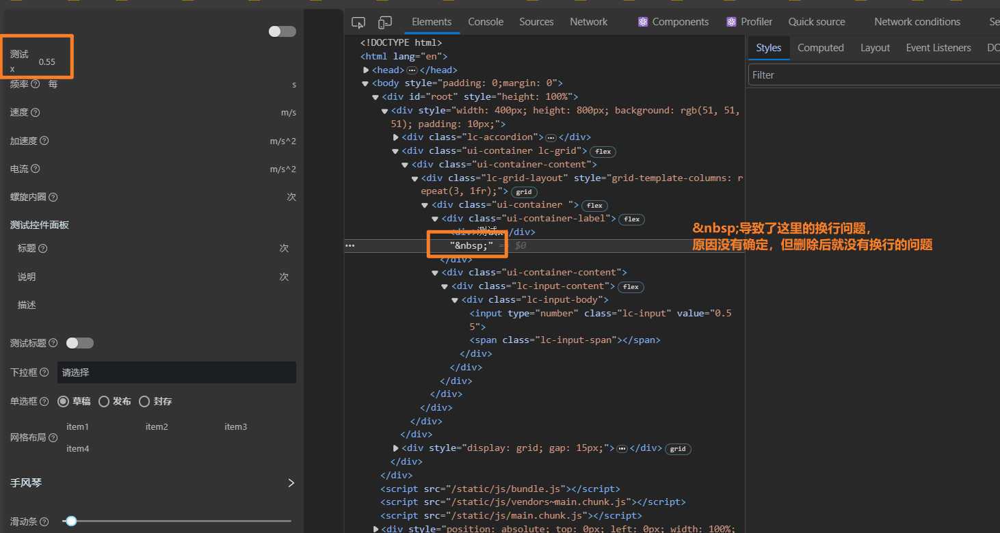

# 1 Java编码规范

## 1.1 Java方法的入参约定

java方法的入参不要使用基本数据类型，容易出现nullPointException，若入参类型为int、long、boolean等，则调用方传入null则会异常；对于调用方而言，包装类型和基本数据类型，在数值上是可以相互妆化的、

## 1.2 Java方法实现的异常使用

java方法的实现过程中应该活用异常机制，不能只依靠java内置的异常机制；在参数校验或非稳定的方法调用中，要通过抛出异常直击要害的说明可能出现的问题原因

## 1.3 三行表达式的自动拆箱/装箱导致的NullPointException

## 1.4 Map遍历过程中删除元素的注意事项

## 1.5 Arrays.asList()方法后无法add元素

# 2 Maven使用规范

## 2.1 Maven使用传递依赖，同时依赖使用了\<option>true\</option>后造成的ClassNotDefException异常

# 3 SpringBoot

## 3.1 同时使用@Autowired和@RpcReference的情况下，导致无法进行单例注入，进而启动失败问题

### 3.1.1 异常日志

```
Unsatisfied dependency expressed through field 'contextService';
nested exception is org.springframework.beans.factory.NoUniqueBeanDefinitionException: No qualifying bean of type '
com.weaver.workflow.engine.formdef.service.ContextService' available: expected single matching bean but found 2:
com.weaver.workflow.engine.formdef.service.impl.ContextServiceImpl,@Reference(group=workflow)
com.weaver.workflow.engine.formdef.service.ContextService
```

### 3.1.2 代码的错误使用

```java
public interface ContextService {

}

@Service
public class ContextServiceImpl implements ContextService {

}

@Service
public class A implements B {

    @RpcReference(group = "module")
    private ContextService contextService;
}

@Service
public class C {

    @Autowired
    private ContextService contextService;
}
```

### 3.1.3 错误分析

1. ContextService的实现交给spring管理，但没有抛出rpc，因此仅可以对器进行自动注入，也就是@Autowired方式注入。而不可以通过rpc方式进行使用（@RpcReference(group = "
   workflow")）
2. 在使用@RpcReference(group = "module")使用后，判断因该是通过某种代理方式又生成了一个bean实例；
3. 因此在进行 @Autowired 注入的时候，除了手动交给spring托管的实例，还有一个rpc方式使用时产生的实例，且类型是一样的， @Autowired方式无法识别同类型的多个实例，进而导致了启动失败

# 4 Js错误记录

## 4.1 js中数据的length++问题

如下方式调用数据的length++，会导致数组元素中多出一个empty元素。不要直接使用length++

```javascript
var a = [1, 2, 3];
a.length++;
console.log(a); // [1,2,3,empty]
```

## 4.2 css中 &nbsp; 可能造成的换行问题



## 4.3 使用React API创建hook组件的注意事项

```javascript


