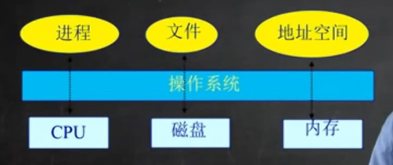
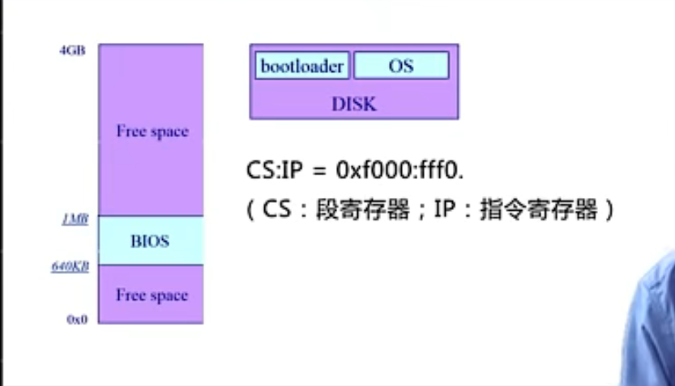
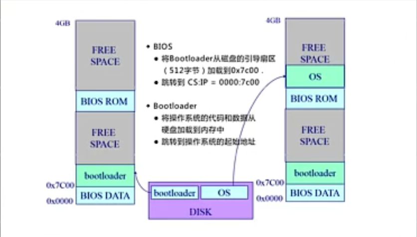

# 1 操作系统的抽象

操作系统将实际的硬件资源抽象成对应的更有利于上层应用使用和处理的概念

## 1.2 物理资源的核心构件：

- cpu：抽象为进程
- disk（磁盘）：抽象为文件系统
- memory（内存）：抽象为地址空间

# 2 操作系统的启动过程

- Disk：存放OS
- BIOS：基本I/O处理系统
- Bootloader：加载OS

# 3 操作系统与硬件设备和程序交互

- 中断：有硬件、外设对操作系统发起的请求
- 异常：应用程序在运行过程中出现异常，被迫需要操作系统进行处理
- 系统调用： 应用程序主动向操作系统发起功能调用

# 计算机工作的本质

取指执行，取指针指向的内存地址对应的指令；然后执行；

操作系统的启动过程，本质上是一个从固定起始地址不断取指执行的过程；直到最后将操作系统全部加载完毕；