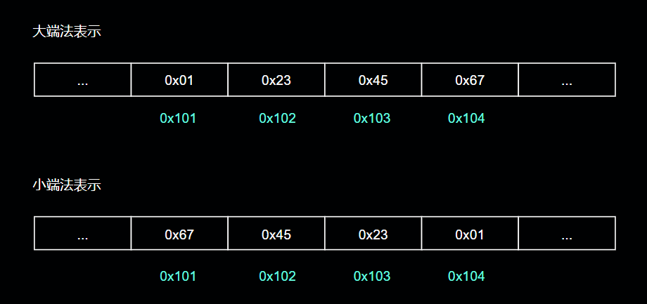

# 1 前言（基本概念与导论）

## 1.1 计算机中信息的表示

源程序实际由0和1组成的位序列构成，8个位=1个字节；每个字节可以表示程序中的文本字符；

字节序列到字符的转换可以使用ASCII编码表来转换

计算机系统中的所有信息（磁盘文件、内存中的程序、内存中的用户数据以及网络上传输的数据）都是由一串比特组成的；区分这些数据表示的含义的唯一标准是读取这些数据时所处的上下文环境；一个同样的字节，在不同额上下文环境中表现出来的含义可能不同；它可以表示成字符串、数字或者机器指令；

我们需要了解数字的机器表示方式；因为他们与现实世界中的整数和实数不同；计算机中机器表示只是对现实中真实数值的有限模拟；

## 1.2 程序运行前的准备

程序要在计算机中运行，只有源代码文件可不行；源代码需要通过其他程序编译为一系列低级机器语言指令；再将这些指令以"可执行目标程序"的格式打包好，最后以二进制磁盘文件的格式存储起来；

上述的其他文件一般是编译器，C语言可以是gcc编译器

gcc的编译过程可以分为4个阶段，这个4个阶段一起构成了编译系统


**预处理阶段**：预处理器(cpp)根据以字符#开头的命令， 修改原始的 C 程序。 比如 hello.c中第 1 行的五nclude <stdio.h> 命令告诉预处理器读取系统头文件 stdio.h 的内容，
并把它直接插入程序文本中。 结果就得到了另一个 C 程序， 通常 是以 .l 作为文件扩展名

**编译阶段：** 编译器(eel)将文本文件 hello.i 翻译成文本文件 hello.s, 它包含一 个汇编语言程序。 该程序包含函数main的定义， 如下所示:


**汇编阶段:** 接下来， 汇编器(as)将 hello.s 翻译成机器语言指令， 把这些指令打包成 一种叫做可重定位目标程序(relocatableobjectprogram)的格式， 并将结果保存在目标 文件hello.o中。
hello.o文件是一个二进制文件， 它包含的17个字节是函数main 的指令编码。 如果我们在文本编辑器中打开 hello.o 文件， 将看到一堆乱码。

**链接阶段**: 请注意， he荨o程序调用了printf函数， 它是每个C编译器都提供的 标准 C 库中的一个函数。 printf 函数存在于一个名为 printf.o 的单独的预编译 好了的目标文件中，
而这个文件必须以某种方式合并到我们的 hello.o程序中。 链接器(Id)就负责处理这种合并。 结果就得到 hello 文件， 它是一个可执行 目 标文件
(或者简称为可执行文件)， 可以被加载到内存中， 由系统执行

## 1.3 程序如何在内存中运行

### 1.3.1 计算机的基本构成


- 总线：贯穿整个系统的一组电子管道，它负责携带信息字节并在各个组件之间进行传递；总线设计成传递固定长度的字节块；也就是字（1个字=多个字节）子的长度决定了计算机的位数；4字节（32位），8字节（64位）

- I/O设备：I/O（输入输出）是计算与外部世界联系的通道，比如鼠标、键盘、显示器、磁盘；I/O设备通过控制器或适配器与I/O总线相连
- 控制器：一般是I/O设备本身或主板上的芯片组
- 适配器：一块插在主板插槽上的卡

- 主存：一个临时存储设备，在处理器执行程序时，用来存放程序和程序处理的数据；物理上，主存是一组动态随机存储器芯片组成的；逻辑上则是一个线性的字节数组；每个字节都有其索引（地址）

- CPU：处理器，是解释（执行）存储在主存中机器指令的引擎；其核心是一个大小为一个字的存储设备（寄存器），称为程序计数器（PC）任何时 刻， PC都指向主存中的某条机器语言指令(即含有该条指令的地址)

从系统通电开始， 直到系统断电， 处理器一直在不断地执行程序计数器指向的指令， 再更新程序计数器， 使其指向下一条指令

CPU 在指令的要求下可能会执行这些操作。

1. 加载: 从主存复制一个字节或者一个字到寄存器， 以覆盖寄存器原来的内容。
2. 存储: 从寄存器复制一个字节或者一个字到主存的某个位置， 以覆盖这个位置上原 来的内容。
3. 操作:把两个寄存器的内容复制到 ALU, ALU 对这两个字做算术运算， 并将结果 存放到一个寄存器中， 以覆盖该寄存器中原来的内容。
4. 跳转: 从指令本身中抽取一个字， 并将这个字复制到程序计数器(PC)中， 以覆盖 PC 中原来的值。

### 1.3.2 程序的运行过程

详细运行过程，请参考 《深入理解计算机系统》 1.4小节

## 1.4 高速缓存

在了解系统基本构成的各个组件之后，我们知道，程序运行的过程中，有一个极大的问题，那就是信息在各个计算机组件之间的来回传递；这是一种极大的开销；比如数据从磁盘复制到内存，从内存复制到寄存器，从寄存器复制到显示器等

机械原理：大的存储设备运行效率远低于小的存储设置，而大存储设备的价格 << 小的存储设备

为了减少CPU与主存之间的速度差，采用了高速缓存作为暂时的缓冲区（缓存）；用于存放处理器近期可能需要的数据


## 1.5 存储设备的层次结构

在处理器和一个较慢的存储设备（比如内存）中间加入一个高速缓存，是一个很好的提升处理器效率的方法；除了系统级设计，软件架构设计中也经常出现


存储器层次结构的主要思想是上一层的存储器作为低一层存储器的高速缓存

## 1.6 操作系统管理硬件

操作系统有两个基本功能:

1. 防止硬件被失控的应用程序滥用
2. 向应用程序提供简单一致的机制来控制复杂而又通常大不相同的低级硬件设备

操作系统通过几个基本的抽象概念（进程、虚拟内存、文件）来完成这两个功能

文件是对I/O设备的抽象表示、虚拟内存是对主存和磁盘I/O设备的抽象表示；进程则是对处理器、主存、磁盘I/O的抽象表示


### 1.6.1 进程

现代计算机中运行的程序，操作系统会提供一种假象；就好像系统上只有这一个程序在运行；程序看上去是独占的在使用处理器、
主存和I/O设备；处理器看想去就好像是在不间断的一条接一条的执行程序中的指令；就好像该程序的代码和数据是系统中唯一的对象；这些假象是通过进程这一抽象概念来实现的；

进程是操作系统对正在运行的程序的一种抽象；

操作系统保持跟踪进程运行所需的所有状态信息。这种状态，也就是上下文，包括许多信息，比如PC和寄存器文件的当前值，以及主存的内容；在任何一个时刻， 单处理器 系统都只能执行一个进程的代码。 当操作系统决定要把控制权从当前进程转移到某个新进
程时， 就会进行上下文切换， 即保存当前进程的上下文、 恢复新进程的上下文， 然后将控 制权传递到新进程。 新进程就会从它上次停止的地方开始

从一个进程到另一个进程的转换是由操作系统内核(kernel)管理的。 内核是操作系统代码常驻主存的部分。 当应用程序需要操作系统的某些操作时， 比如读写 文件， 它就执行一条特殊的 系统调用 (system call)指令，
将控制权传递给内核。 然后内核 执行被请求的操作并返回应用程序。 注意， 内核不是一个独立的进程。 相反， 它是系统管 理全部进程所用代码和数据结构的集合

### 1.6.2 线程

尽管通常我们认为一个进程只有单一的控制流， 但是在现代系统中， 一个进程实际上可以由多个称为线程的执行单元组成， 每个线程都运行在进程的上下文中， 并共享同样的 代码和全局数据。 由于网络服务器中对并行处理的需求，
线程成为越来越重要的编程模 型， 因为多线程之间比多进程之间更容易共享数据， 也因为线程一般来说都比进程更高 效。 当有多处理器可用的时候， 多线程也是一种使得程序可以运行得更快的方法

### 1.6.3 虚拟内存

虚拟内存是一个抽象概念， 它为每个进程提供了一个假象， 即每个进程都在独占地使用 主存。 每个进程看到的内存都是一致的， 称为虚拟地址空间；在Linux中， 地址空间最上面的区域是 保留给操作系统中的代码和数据的，
这对所有进程来说都是一样。 地址空间 的底部区域存放 用户进程定义的代码和数据。 请注意， 图中的地址是从下往上增大的。


每个进程看到的虚拟地址空间由大量准确定义的区构成， 每个区都有专门的功能

- 程序代码和数据：对所有的进程来说，代码是从同一固定地址开始，紧接着的是和C全局变量相对应的数据位置。代码和数据区是直接按照可执行目标文件的内容初始化的
- 堆：代码和数据区后紧随着的是运行时堆。代码和数据区在进程一开始运行时就被指定了大小，与此不同，当调用像malloc和free这样的C标准库函数时，堆可以在运行时动态地扩展和收缩
- 共享库：大约在地址空间的中间部分是一块用来存放像C标准库和数学库这样的共享库的代码和数据的区域。共享库的概念非常强大，也相当难懂
- 栈：位千用户虚拟地址空间顶部的是用户栈，编译器用它来实现函数调用。和堆一样，用户栈在程序执行期间可以动态地扩展和收缩。特别地，每次我们调用一个函数时，栈就会增长;从一个函数返回时，栈就会收缩
- 内核虚拟内存：地址空间顶部的区域是为内核保留的。不允许应用程序读写这个区域的内容或者直接调用内核代码定义的函数。相反，它们必须调用内核来执行这些操作

### 1.6.4 文件

文件就是字节序列，仅此而已。每个I/0设备，包括磁盘、键盘、显示器，甚至网络，都可以看成是文件。系统中的所有输入输出都是通过使用一小组称为UnixI/0的系统函数调用读写文件来实现的

### 1.6.5 并行

#### 1.6.5.1 线程级并行

举例来说， Intel Core i7处理器可以让每个核执行两个线程，所 以一 个 4 核的系统实际上可以并行地 执行 8个线程

多处理器的使用可以从两方面提高系统性能。

- 它减少了在执行多个任务时模拟并发的需要。正如前面提到的，即使是只有一个用户使用的个人计算机也需要并发地执行多个活动。
- 它可以使应用程序运行得更快，当然，这必须要求程序是以多线程方式来书写的，这些线程可以并行地高效执行。

#### 1.6.5.2 指令级并行

在较低的抽象层次上， 现代处理器可以同时执行多条指令的属性称为 指令级并行 。 早 期的微处理器，如 1978年的Intel 8086, 需要多个(通常是3~ 1 0 个)时钟周期来执行一 条 指令。 最近的处理器可以保持每个时钟周期2~
4 条指令的执行速率。

#### 1.6.5.3 单指令，多数据并行

在最低层次上， 许多现代处理器拥有特殊的硬件， 允许一 条指令产生多个可以并行执 行的操作， 这种 方式称为 单指令、 多数据， 即S IMD并行

### 1.6.6 操作系统的抽象


# 2 信息的表示和处理

三种最重要的数字表示

- 无符号编码：基于传统的二进制编码，用以表示非负数
- 补码编码：对有符号整数进行编码
- 浮点数编码：表示实数的科学计数法

计算机利用这些表示方法实现算数运算，比如加减乘除

对于整数，计算机可以精确表示，但对于实数，比如无限不循环或无限循环小树；计算机却不能精确表示；原因在于计算机只能使用有限数量的比特为对数字进行编码

## 2.1 信息的存储

大多数计算机使用8位的块，或者宇节(byte)，作为最小的可寻址的内存单位，而不是访问内存中单独的位。机器级程序将内存视为一个非常大的字节数组，称为虚拟内存(virtualmemory)。
内存的每个字节都由一个唯一的数字来标识，称为它的地址(address)，所有可能地址的集合就称为虚拟地址空间(virtualaddressspace)。顾名思义，这个虚拟地址空间只是一个展现给机器级程序的概念性映像。 实际的实现(见第9章)
是将动态随机访问存储器(DRAM)、闪存、磁盘存储器、特殊硬件和操作系统软件结合起来，为程序提供一个看上去统一的字节数组。

### 2.1.1 16进制数

一个字节由8位组成。在二进制表示法中，它的值域是000000002~111111112。如果看成十进制整数，它的值域就是010~25510。两种符号表示法对于描述位模式来说都不是非常方便。二进制表示法太冗长，
而十进制表示法与位模式的互相转化很麻烦。替代的方法是，以16为基数


### 2.1.2 字数据的大小

每台计算机都有一个字长(word size)， 指明指针数据的标称大小(nomnials zie)。因为虚拟地址是以这样的一个字来编码的，所以字长决定的最重要的系统参数就是虚拟地址空间的最大大小。也就是说，
对于一个字长为w位的机器而言，虚拟地址的范围为2^w—1,程序最多访问2^w个字节。

将字长的所有位全部赋值为1，转换为十进制后即得到了虚拟地址空间的最大索引长度，比如：一个字长为8位置，则其最大索引长度的2进制为
11111111，转换为10进制为255；则这个指针能指向的最大地址空间索引为255；这个系统能存放的最大字节数为255

### 2.1.3 寻址和字节顺序


在几乎所有的机器上，多字节对象都被存储为连续的字节序列，对象的地址为所使用字节中最小的地址。

对于跨越多字节的程序对象，我们必须建立两个规则

- 这个对象的地址是什么
- 在内存中如何排列这些字节

排列表示一个对象的字节有两个通用的规则

- 小端法：最低有效字节在最前面
- 大端法：最高有效字节在最前面

假设一个类型为int的变量x的地址为Ox1OO,也就是说，地址表达式&x的值为Ox1OO。它的十六进制值为Ox01234567;




> 编码精髓认知：

尽管浮点型和整型数据都是对数值12345编码，但是它们有截然不同的字节模式:整型为Ox00003039,而浮点数为Ox4640E400。一般而言，这两种格式使用不同的编码方法。
如果我们将这些十六进制模式扩展为二进制形式，并且适当地将它们移位，就会发现一个有13个相匹配的位的序列，用一串星号标识出来:


### 2.1.4 表示字符串

C语言中字符串被编码为一个以null(其值为0)字符结尾的字符数组。每个字符都由某个标准编码来表示，最常见的是ASCII字符码。以ascii码方式编码 12345 的结果为31 32 33 34 35 00。
请注意，而终止字节的十六进制表示为OxOO。在使用ASCII码作为字符码的任何系统上都将得到相同的结果，与字节顺序和字大小规则无关。因而，文本数据比二进制数据具有更强的平台独立性。

### 2.1.5 表示代码

```
int sum(int x,int y){
    return x+y;
}
```

如上代码，当我们在不同机器上编译时， 生成如下字节表示的机器代码:


我们发现指令编码是不同的。不同的机器类型使用不同的且不兼容的指令和编码方即使是完全一样的进程，运行在不同的操作系统上也会有不同的编码规则， 因此二进制代码是不兼容的。 二进制代码很少能在不同机器和操作系统组合之间移植

### 2.1.6 布尔代数简介（位运算）

- &：与号，左右两边同时为真时，才为真
- |：或号，左右两边只要有一个为真就为真，其余为假
- ~：非号，对原始值取反
- ^：异或运算：布尔运算^对应于逻辑运算异或，当P或者Q为真但不同时为真时，我们说P^Q成立。 相应地， 当p=l且q=O, 或者p=O且q=l时， p^q等千1。


#### 2.1.6.1 位向量：

位向量就是固定长度为w、由0和1组成的串。位向量的运算可以定义成参数的每个对应元素之间的运算

举个例子，假设w=4,参数a=[O11O],b=[11OO]。那么4种运算a&b、a|b、a^b和~b分别得到以下结果


### 2.1.7 C语言的位级运算

C语言的一个很有用的特性就是它支持按位布尔运算。事实上，我们在布尔运算中使用的那些符号就是C语言所使用的：I就是OR（或），＆就是AND（与），～就是NOT（取反），而
＾就是EXCLUSIVE-OR（异或）。这些运算能运用到任何“整型”的数据类型上，


### 2.1.8 C语言的逻辑运算

- &&
- ||
- !

逻辑运算的一个重要特征是支持短路的

### 2.1.9 C语言的位移运算

- <<：左移:舍弃高位，低位补零
- \>>：右移:
    - 逻辑右移：舍弃低位，高位补零
    - 算术右移：算术右移是在左端补K个最高有效位的值

算术右移举例：

```
x = 1001 0101
则 x >> 4 = 1111
```

与C相比， Java对于如何进行右移有明确的定义。 表达是x>>k会将x算术右移k个位置， 而x>>>k会对x做逻辑右移

## 2.2 整数表示

### 2.2.1 整数数据类型

### 2.2.2 无符号数编码

无符号的整数只需使用二进制的基本对应关系即可

### 2.2.3 补码编码

补码编码：为了表示负数值；在补码编码中，将字的最高有效位解释为负权。


#### 2.2.3.1 有符号数表示的其他两种编码

- 反码：最高有效位的权是—(2^(w-l)-1)而不是—2^(w-1)， 其他和补码是一样的
- 原码

### 2.2.4 有符号、无符号数之间的转换

### 2.2.5 C语言中的有符号数与无符号数

### 2.2.6 扩展一个数字的位表示

### 2.2.7 截断数字

### 2.2.8 有符号数与无符号数的建议

## 2.3 整数运算

### 2.3.1 无符号加法

### 2.3.2 补码加法

### 2.3.3 补码的非

### 2.3.4 无符号乘法

### 2.3.5 补码的乘法

### 2.3.6 乘以常数

### 2.3.7 除以2的幂

### 2.3.8 整数运算的思考

## 2.4 浮点数

### 2.4.1 二进制小数

### 2.4.2 IEEE浮点表示

### 2.4.3 数字示例

### 2.4.4 舍入

### 2.4.5 浮点运算

### 2.4.6 C语言中的浮点数


