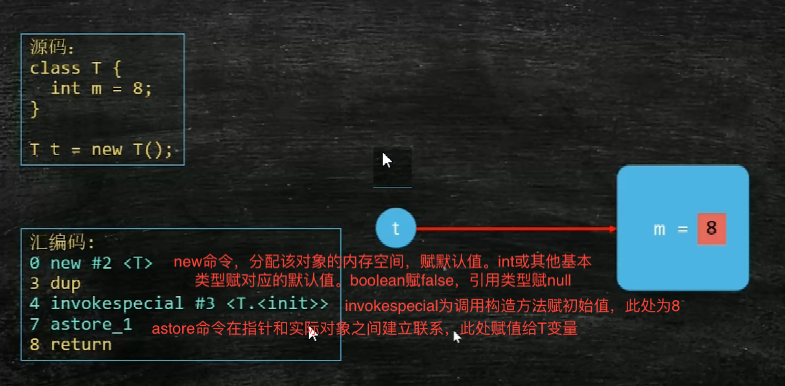
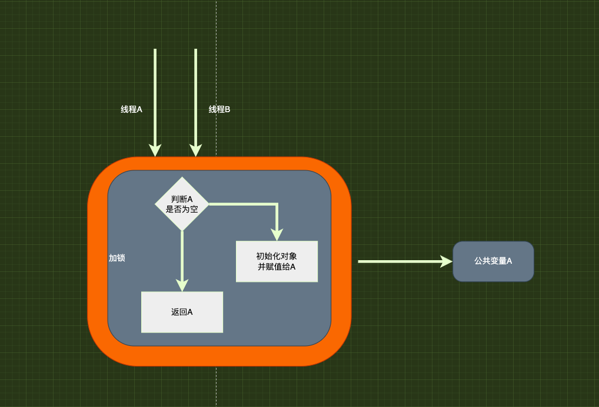
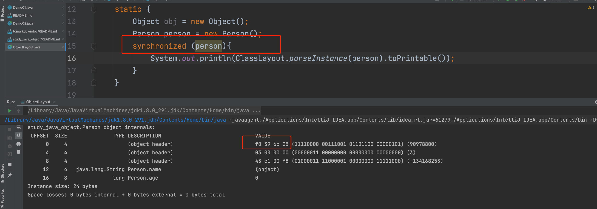
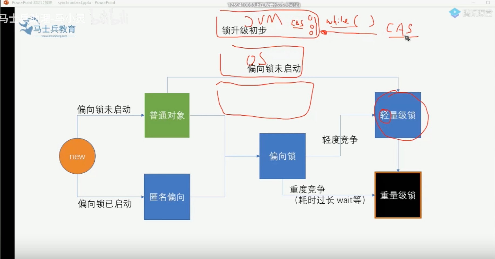

# 计算机的基本硬件组成

1. cpu：控制计算中心，用于逻辑运算处理
2. 内存：软件实际运行时基本数据及资源的存储地
3. 硬盘：程序在未运行时，以静态方式存在的地方

# 一个程序实际运行的过程

1. 在磁盘中找到程序的可执行文件
2. 将其load到内存中（这个过程会分配好程序运行的必要资源，包括基本的内存控件、访问I/O时分配文件句柄、访问网络需要分配端口号等），处于此状态的程序称之为进程。进程是一个静态概念，程序并未开始真正的运行
3. 由cpu找到程序中的main函数并开始执行
4. 在根据代码执行程序的过程中，产生的计算结果和需要的资源不断的在内存与cpu之间进行交换使用
5. 循环往复直到程序执行完毕

# cpu与内存间的缓存机制

> 由于cpu执行逻辑运算的过程中需从内存中加载初始化数据，并且中间计算出来的结果也需要存储到内存中。因此cpu与内存之间的信息交换是很频繁的。但是没次都从内存直接取数据是比较消耗时间的。因此提出了缓存的解决方案

缓存的基本原理如下：

- 无缓存：A没次直接从B取资源。A、B相距遥远
- 有缓存：在A、B之间建立缓冲区，A没次从缓冲区中取资源，由于A到缓冲区的时间<<A到B的时间，因此可以大幅提高效率

由于数据的物理存储可能是紧挨着的，例如：a、b、c三个变量都需要加载到cpu进行计算。因此为了更好的利用缓存机制，每次获取缓存的时候会将本次加载的目标数据周围的数据也一同加载到cpu。所加载到的所有数据椒"缓存行"
，缓存行的默认大小为64kb。会根据计算机的位数有所差异

目前主流的计算机架构设计的缓存为三级缓存：单核心内共用一级到二级缓存，多个核心共用三级缓存，多个cpu之间共用内存

# 缓存一致性问题

思考：缓存级数越多越好还是越少越好？ -> 取到最优解是最好的，空间与时间的最优解 当缓存级数越多，每一级之间要做到数据同步也需要开销

在处理缓存一致性的时候可以结合"缓存行"的点进行缓存数据的隔离，以提高性能

# java创建对象的完整过程



三部曲：

1. 分配内存空间赋默认值
2. 调用构造方法赋初始值
3. 建立关联关系

# 指令重排的依据及问题

1. 如何判断指令是否能够重排 判断的依据只有一个：单线程下保证最终一致性，即换了指令顺序后最终结果不能改变

```java
//这两句是可以重排的，重排后a、b的最终结果是不变的
int a=1;
        int b=2;

//这两句不可重排 变换后a的最终结果发生了改变
        int a=1;
        a=4;
```

2. 指令重排在多线程下的问题

由于指令重排，就有可能导致，在多线程的场景下，公共变成的线程可见性问题。 例如：
当线程A进入判断并初始化对象时，由于指令重排，对象初始化一半便复制给了变量A。此时线程B进入。由于判断直接拿到了不在锁范围内的A变量。导致B使用了一个初始化没有完整的对象



# 锁机制

java的最小单位一个字节

一个对象的基本分布


当一个对象被作为一个锁的时候，起对象的markword区域会有特殊标记


## 悲观锁

10000个坑位，我一个人上，我就怕其他人上的时候就跟我抢我这个坑位，故我先上锁，再办事儿

## 乐观锁

10000个坑位 ，我一个人上，我赌其他人上的时候不在这我这个坑位，故我不上锁

### 自旋锁

自旋锁是乐观锁的一种解决方案

#### 自旋aba问题

基本数值类型无影响 引用类型加版本号进行区分

版本号有2种

1. 数值类型
2. boolean类型

自旋过程CAS本身必须保持原子性

底层实现：缓存锁、总线锁； 操作系统层面：关中断

### 锁升级过程



偏向锁：偏向第一个线程的锁 轻量级锁：CAS，线程之间的同步由jvm进行处理 重量级锁：线程之间的同步由操作系统进行处理

偏向锁 -> 轻量级锁 -> 重量级锁
