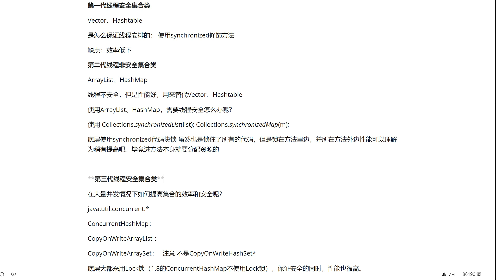
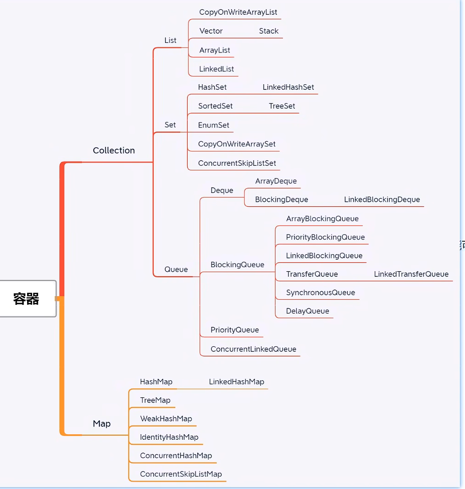

## java面向对象编程的三大特征：

1. 封装：封装隐藏了内部的实现机制，可以在不影响使用的情况下，任意改变内部的实现。只要接口调用方式和参数不变。调用方不必关心内部的实现逻辑。比如
   1. 集装箱
   2. 饮水机
   一个好的封装，可以让程序易于修改，并能增强代码的可维护性
   
2. 继承：在java中是父类和子类之间的关系。子类可以复用父类中已有的属性和方法。
   1. 继承可以增加代码的复用性，减少代码量

3. 多态：多态指的是类和类之间的关系。第一要有父类，继承父类。第二要有重写。第三要有父类引用指向子类对象。
   1. 多态的好处在于其能很好的实现程序的扩展

## ArrayList和LinkList的区别
1. ArrayList 底层数据接口使用数组，LinkList底层数据结构使用链表
2. 基于数组的访问元素效率高，插入删除效率低。基于链表的插入，删除效率高。访问效率低

## 高并发的集合有哪些问题

## jdk8有哪些新特性
1. 接口的默认方法，兼容lamda表达式，接口中可以有方法实现
2. lamda表达式，简化编码

## 接口和抽象方法的区别，分别适合在什么场景使用

## hashcode和equals如何使用

## java代理的几种实现方式

## ==和equals的区别

## java里的异常处理机制是怎么样的

## 重写和重载的区别

## String、StringBuffer、StringBuilder及其使用场景

## 怎么声明一个类不会被继承，什么场景下会用

## 自定义异常如何在生产中使用